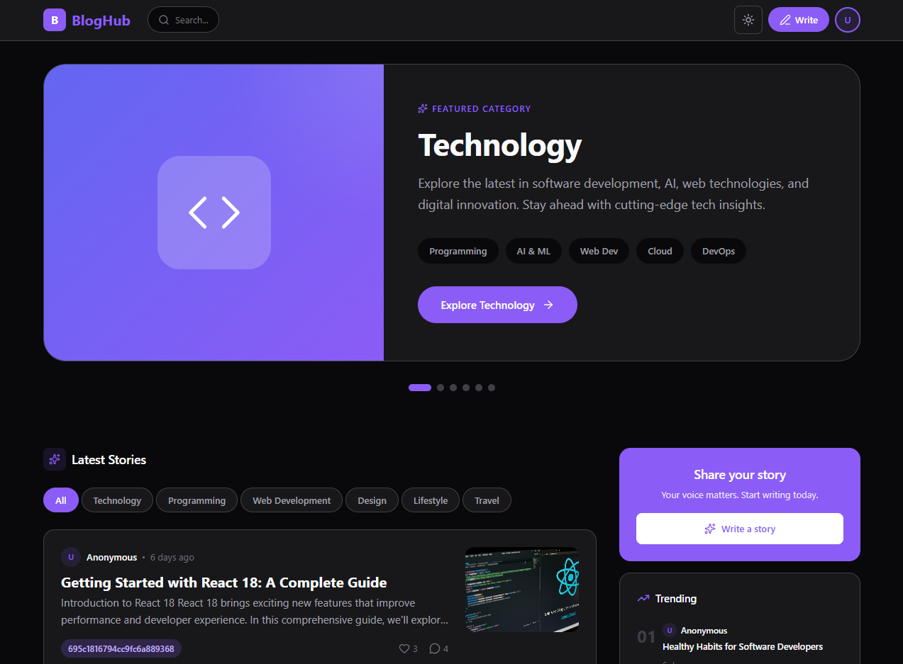
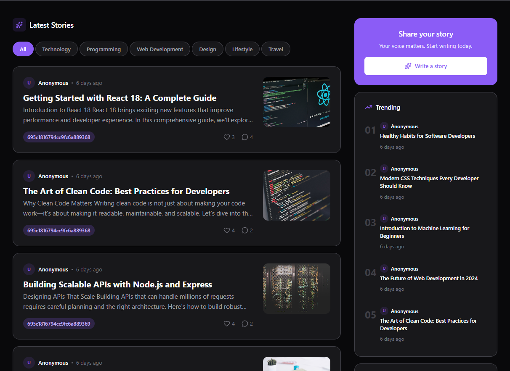
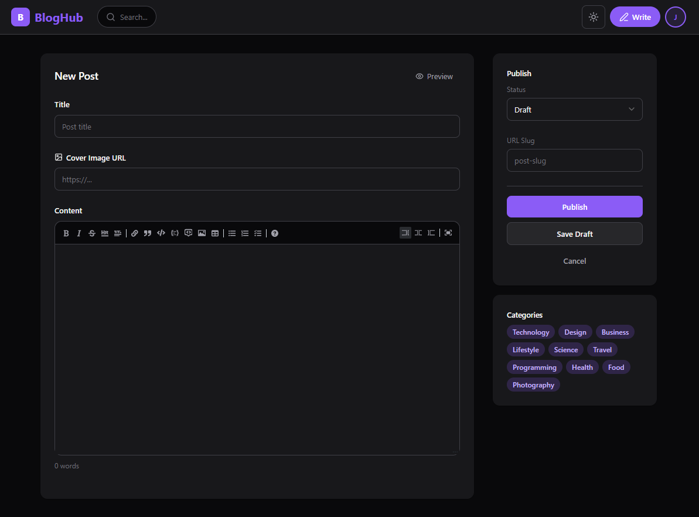
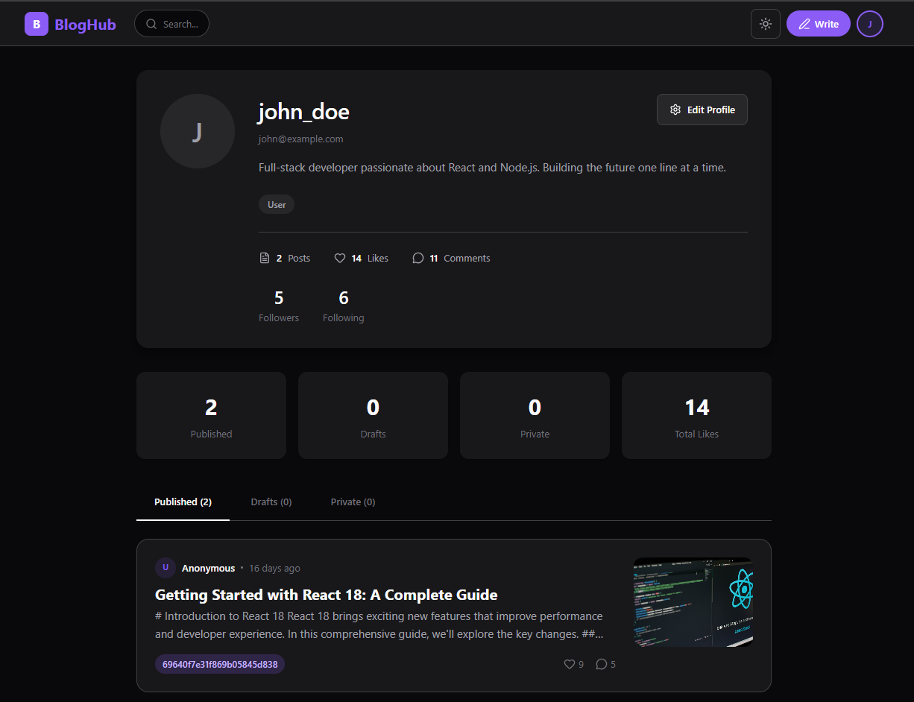
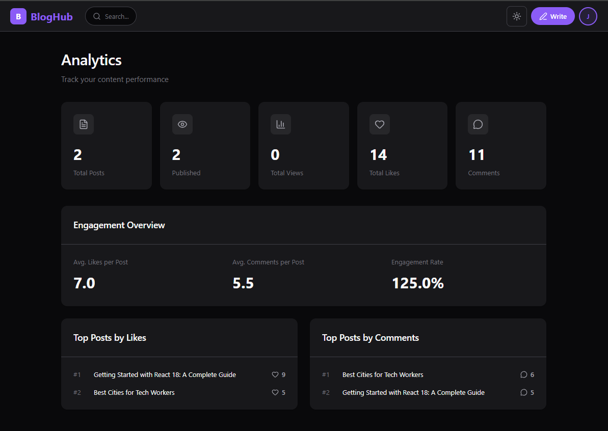

<p align="center">
  
</p>

<h1 align="center">BlogHub</h1>

<p align="center">
  <strong>A modern, full-stack blogging platform built with the MERN stack</strong>
</p>

<p align="center">
  <a href="#features">Features</a> •
  <a href="#screenshots">Screenshots</a> •
  <a href="#tech-stack">Tech Stack</a> •
  <a href="#getting-started">Getting Started</a> •
  <a href="#api-reference">API Reference</a> •
  <a href="#contributing">Contributing</a>
</p>

<p align="center">
  
  
  
  
</p>

---

## ✨ Features

**Content Creation**
- 📝 MDX Editor with live preview and syntax highlighting
- 🖼️ Cover image support for posts
- 🏷️ Categories and tags organization
- 📱 Fully responsive design

**User Experience**
- 🔐 Secure JWT authentication with refresh tokens
- 👤 User profiles with bio and avatar
- 👥 Follow/unfollow system
- ❤️ Like and comment on posts
- 💬 Nested comment replies
- 🔍 Full-text search

**Analytics & Admin**
- 📊 Performance dashboard with views, likes, and engagement metrics
- 👑 Admin panel for content management
- 📈 Post analytics and insights

**Developer Experience**
- ⚡ Vite for lightning-fast development
- 🎨 Styled Components with theme support
- 🌙 Light/Dark mode
- 🔄 React Query for efficient data fetching

---

## 📸 Screenshots

<details>
<summary><strong>View All Screenshots</strong></summary>

### Home Page
Category slideshow hero with featured topics and latest posts feed.


### Latest Posts
Browse and filter posts by category with trending sidebar.


### Post Detail
Clean, Medium-style reading experience with engagement features.


### Write Post
MDX editor with live preview, categories, and publishing options.


### User Profile
Profile page with user stats, bio, and published posts.


### Analytics Dashboard
Track your content performance with detailed metrics.


</details>

---

## 🛠️ Tech Stack

### Frontend
| Technology | Purpose |
|------------|---------|
| React 19 | UI Framework |
| Vite | Build Tool |
| React Router v7 | Routing |
| TanStack Query | Data Fetching |
| Styled Components | Styling |
| MDX Editor | Rich Text Editing |
| Lucide Icons | Icons |
| React Hot Toast | Notifications |

### Backend
| Technology | Purpose |
|------------|---------|
| Node.js | Runtime |
| Express.js | Web Framework |
| MongoDB | Database |
| Mongoose | ODM |
| JWT | Authentication |
| bcryptjs | Password Hashing |
| Express Validator | Input Validation |

---

## 🚀 Getting Started

### Prerequisites

- Node.js v18 or higher
- MongoDB (local installation or [MongoDB Atlas](https://www.mongodb.com/atlas))
- npm or yarn

### Installation

**1. Clone the repository**

```bash
git clone https://github.com/Purvesh-PJ/blogging_platform.git
cd blogging_platform
```

**2. Install dependencies**

```bash
# Install backend dependencies
cd backend
npm install

# Install frontend dependencies
cd ../client
npm install
```

**3. Environment Setup**

Create `.env` file in the `backend` directory:

```env
DB_URI=mongodb://127.0.0.1:27017/bloghub
PORT=5000
JWT_SECRET=your_super_secret_jwt_key_here
```

Create `.env` file in the `client` directory:

```env
VITE_API_URL=http://localhost:5000
```

**4. Seed Database (Recommended)**

Populate the database with sample data for testing:

```bash
cd backend
npm run seed
```

This creates:
- 15 users with profiles
- 22 posts across 10 categories
- 99 comments and 177 likes
- Analytics data for dashboard

**Test Accounts:**
| Role | Email | Password |
|------|-------|----------|
| User | john@example.com | password123 |
| Admin | admin@bloghub.com | admin123 |

### Running the Application

**Start the backend server:**

```bash
cd backend
npm run dev
```
> Server runs on http://localhost:5000

**Start the frontend (new terminal):**

```bash
cd client
npm run dev
```
> App runs on http://localhost:5173

---

## 📁 Project Structure

```
blogging_platform/
│
├── backend/
│   ├── config/              # Database configuration
│   ├── controllers/         # Request handlers
│   ├── middlewares/         # Auth & validation middleware
│   ├── models/              # Mongoose schemas
│   ├── routes/              # API route definitions
│   ├── services/            # Business logic layer
│   ├── index.js             # Server entry point
│   └── seed.js              # Database seeder
│
├── client/
│   ├── public/
│   │   └── screenshots/     # App screenshots
│   ├── src/
│   │   ├── components/      # Reusable UI components
│   │   │   ├── common/      # Shared components
│   │   │   └── layout/      # Layout components
│   │   ├── config/          # API configuration
│   │   ├── context/         # React Context providers
│   │   ├── pages/           # Page components
│   │   ├── services/        # API service functions
│   │   ├── styles/          # Theme and global styles
│   │   ├── App.jsx          # Root component
│   │   └── main.jsx         # Entry point
│   ├── index.html
│   └── vite.config.js
│
└── README.md
```

---

## 📡 API Reference

### Authentication

| Method | Endpoint | Description |
|--------|----------|-------------|
| POST | `/api/auth/signup` | Register new user |
| POST | `/api/auth/signin` | Login user |
| POST | `/api/auth/refreshToken` | Refresh access token |

### Posts

| Method | Endpoint | Description | Auth |
|--------|----------|-------------|------|
| GET | `/api/posts` | Get all posts | No |
| GET | `/api/posts/:id` | Get single post | No |
| POST | `/api/posts` | Create post | Yes |
| PUT | `/api/posts/:id` | Update post | Yes |
| DELETE | `/api/posts/:id` | Delete post | Yes |

### Users

| Method | Endpoint | Description | Auth |
|--------|----------|-------------|------|
| GET | `/api/users/getUser` | Get current user | Yes |
| PUT | `/api/users/setUser` | Update profile | Yes |
| GET | `/api/users/getUserPosts` | Get user's posts | Yes |
| POST | `/api/users/followUser` | Follow user | Yes |
| POST | `/api/users/unfollowUser` | Unfollow user | Yes |

### Categories

| Method | Endpoint | Description | Auth |
|--------|----------|-------------|------|
| GET | `/api/categories` | Get all categories | No |
| POST | `/api/categories` | Create category | Admin |
| POST | `/api/categories/attachCategories` | Attach to post | Yes |

### Interactions

| Method | Endpoint | Description | Auth |
|--------|----------|-------------|------|
| POST | `/api/comments` | Create comment | Yes |
| POST | `/api/comments/replies` | Reply to comment | Yes |
| POST | `/api/likes` | Like a post | Yes |
| DELETE | `/api/likes/:postId` | Unlike a post | Yes |

### Search & Analytics

| Method | Endpoint | Description | Auth |
|--------|----------|-------------|------|
| GET | `/api/search/:query` | Search posts | No |
| GET | `/api/analytics` | Get analytics | Yes |

---

## 📜 Available Scripts

### Backend

```bash
npm start        # Start production server
npm run dev      # Start development server (nodemon)
npm run seed     # Seed database with sample data
npm run lint     # Run ESLint
npm run format   # Format with Prettier
```

### Frontend

```bash
npm run dev      # Start development server
npm run build    # Build for production
npm run preview  # Preview production build
npm run lint     # Run ESLint
npm run format   # Format with Prettier
```

---

## 🤝 Contributing

Contributions are welcome! Please feel free to submit a Pull Request.

1. Fork the repository
2. Create your feature branch (`git checkout -b feature/amazing-feature`)
3. Commit your changes (`git commit -m 'Add some amazing feature'`)
4. Push to the branch (`git push origin feature/amazing-feature`)
5. Open a Pull Request

---

## 📄 License

This project is licensed under the MIT License - see the [LICENSE](LICENSE) file for details.

---

<p align="center">
  Made with ❤️ by <a href="https://github.com/Purvesh-PJ">Purvesh</a>
</p>
