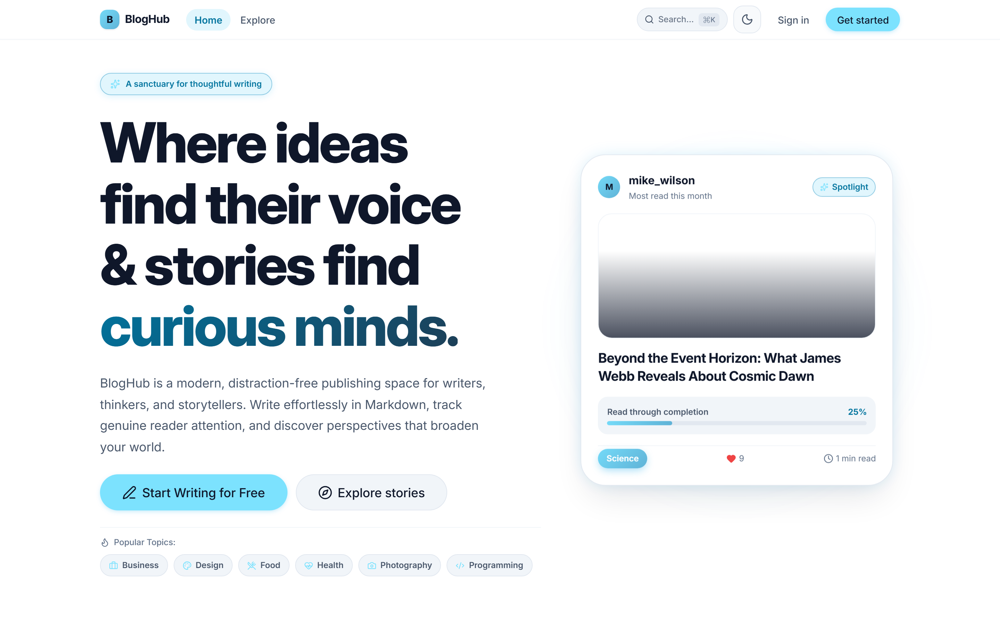
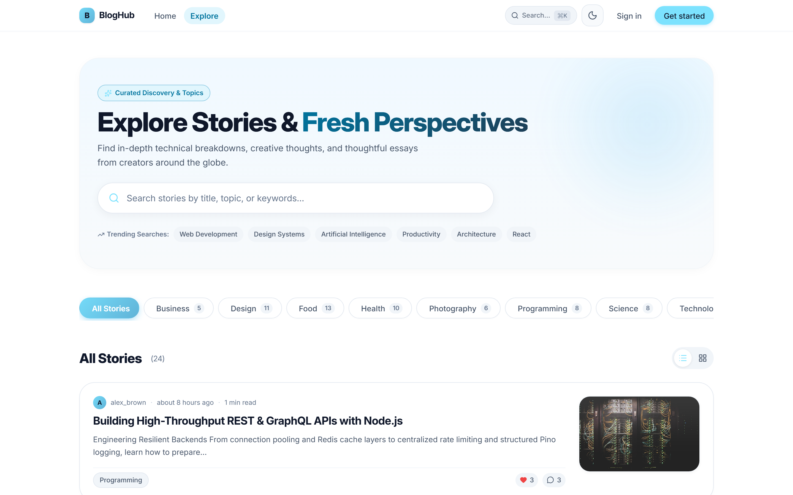
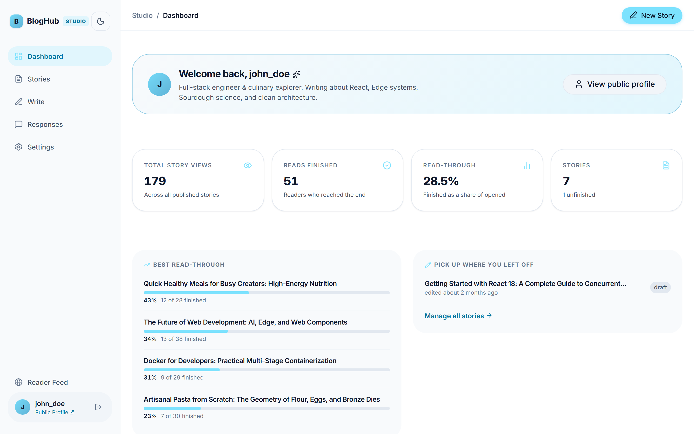
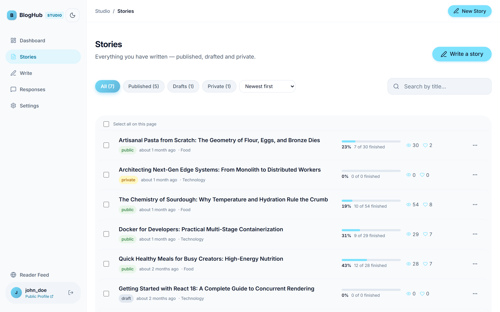
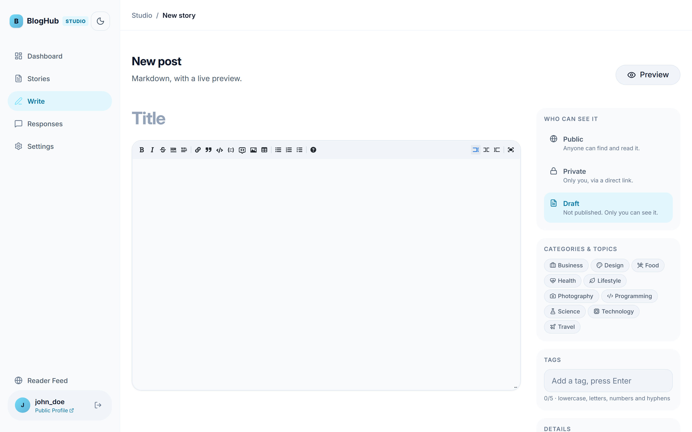

<p align="center">
  
</p>

<h1 align="center">BlogHub</h1>

<p align="center">
  <strong>A full-stack blogging platform — write in Markdown, publish, engage, measure.</strong>
</p>

<p align="center">
  <a href="#features">Features</a> ·
  <a href="#tech-stack">Tech stack</a> ·
  <a href="#quick-start">Quick start</a> ·
  <a href="#project-structure">Structure</a> ·
  <a href="#api">API</a> ·
  <a href="#documentation">Docs</a> ·
  <a href="#contributing">Contributing</a>
</p>

<p align="center">
  
  
  
  
  
  
</p>

---

## Overview

BlogHub is a MERN-stack publishing platform. It serves three audiences from one codebase:

- **Readers** browse a category-filtered feed, read Markdown articles, search, comment, like
  and follow authors.
- **Writers** compose in a Markdown editor with live preview, organise posts by category, and
  track views, reads and engagement on a personal analytics dashboard.
- **Administrators** manage posts, categories and users, and view site-wide analytics from a
  dedicated console.

The API exposes 51 endpoints across 12 resources; the client is an 18-route React SPA with
route-level code splitting and full light/dark theming.

> **Project status.** An end-to-end audit found 18 functional defects and 15 security
> findings; remediation closed all of the security findings and every defect that a request
> can reach — including the one that mattered most, where post visibility was never persisted
> so nothing published through the app ever reached the feed. A **61-test backend suite** and
> a **CI pipeline** now hold those fixes in place: lint, format, tests and a dependency audit
> run on every push.
>
> **Still open.** The client has no tests — CI proves it compiles, not that it behaves. Rate
> limiting is per-instance, so it does not survive horizontal scaling. There is no email
> verification or password reset. See
> [docs/product/roadmap.md](./docs/product/roadmap.md) and
> [docs/security/checklist.md](./docs/security/checklist.md).

---

## Features

| Area               | Capabilities                                                                                                                                                                                                    |
| ------------------ | --------------------------------------------------------------------------------------------------------------------------------------------------------------------------------------------------------------- |
| **Authoring**      | Markdown editor with live preview, auto-generated slugs, cover images, category assignment, enforced draft/private/public visibility                                                                            |
| **Reading**        | Paginated feed, trending list ranked on the last 14 days, full article view, title search with category filtering. Drafts are hidden from the public and readable by their author                               |
| **Social**         | Comments with one level of replies, likes that survive a reload and are unique per user per post at the database level, follow/unfollow, public author profiles                                                 |
| **Analytics**      | Per-author views, reads and read rate, top-performing posts; site-wide totals for administrators. Scoped so one member cannot read another's figures                                                            |
| **Administration** | Post management including drafts, category management, paginated user listing, suspend and restore, promote and demote, account deletion — all role-gated, with a guard against removing the last administrator |
| **Accounts**       | JWT authentication with separate access and refresh secrets, silent refresh, revocable sessions via `tokenVersion`, brute-force protection, profile editing, persisted preferences                              |
| **Platform**       | Light/dark themes, responsive from 375px, route-level code splitting, error boundary, health endpoints, security headers, rate limiting                                                                         |

Full catalogue with per-feature implementation status:
**[docs/product/features.md](./docs/product/features.md)**

---

## Screenshots

<details>
<summary><strong>View screenshots</strong></summary>

### Home

Hero, the trending list ranked over the last 14 days, and the feed. The spotlight card is a
real post, not a mock.


### Explore

Server-side search and category filtering, with a per-category count so no filter leads to an
empty page.



### Post

Focused reading view with a 680px measure and engagement controls. Markdown is sanitised
before it is rendered.


### Workspace — Dashboard

How the work is doing: views, reads finished, read-through, and the drafts to pick back up.



### Workspace — Stories

What has been written, and how to manage it. Filter, sort, search, publish, unpublish, delete
and bulk actions — all applied on the server, so a reload reproduces the same view.



### Editor

Markdown editing with live preview, categories, tags and publishing controls.



### Public profile

An author's public page with their published stories and counters.


</details>

---

## Tech stack

**Frontend**

| Technology             | Role                        |
| ---------------------- | --------------------------- |
| React 19               | UI                          |
| Vite 7                 | Build and dev server        |
| React Router 7         | Routing                     |
| TanStack Query 5       | Server state and caching    |
| styled-components 6    | Styling and theming         |
| Axios                  | HTTP with auth interceptors |
| `@uiw/react-md-editor` | Markdown authoring          |
| lucide-react           | Icons                       |
| react-hot-toast        | Notifications               |
| date-fns               | Date formatting             |

**Backend**

| Technology        | Role                      |
| ----------------- | ------------------------- |
| Node.js 18+       | Runtime                   |
| Express 4         | HTTP framework            |
| MongoDB 6+        | Database                  |
| Mongoose 7        | ODM                       |
| jsonwebtoken      | Access and refresh tokens |
| bcryptjs          | Password hashing          |
| express-validator | Input validation          |
| multer            | File uploads              |
| morgan            | Request logging           |

**Tooling** — ESLint 9 (flat config), Prettier 3, Vercel.

---

## Quick start

### Prerequisites

Node.js 18+, npm 9+, MongoDB 6+ (local or [Atlas](https://www.mongodb.com/atlas)).

### 1. Clone and configure

```bash
git clone https://github.com/Purvesh-PJ/blogging_platform.git bloghub
cd bloghub
cp .env.example .env
```

Both workspaces read a **single `.env` at the repository root** — do not create one inside
`backend/` or `client/`.

```env
NODE_ENV=development
PORT=4000
MONGO_DB_URI=mongodb://127.0.0.1:27017/bloghub
CLIENT_URL=http://localhost:3000
VITE_API_URL=http://localhost:4000
JWT_SECRET=replace_me
JWT_REFRESH_SECRET=replace_me_with_something_different
JWT_ACCESS_EXPIRES_IN=15m
JWT_REFRESH_EXPIRES_IN=7d
```

Generate secrets — you need **two different ones**, so a refresh token cannot be replayed as
an access token:

```bash
node -e "console.log(require('crypto').randomBytes(48).toString('hex'))"
```

Configuration is validated at boot: a missing secret, or a refresh secret identical to the
access secret, stops the server with a named error rather than failing later on a user's
first sign-in.

### 2. Install

There is no root `package.json` — install each workspace separately.

```bash
cd backend && npm install
cd ../client && npm install
```

### 3. Seed

```bash
cd backend && npm run seed
```

Creates 10 categories, 15 accounts and 99 stories — 84 public, 10 drafts and 5 private, so
the visibility rules have something real to be wrong about — plus comments, likes, views and
reads. The read events are what the trending ranking scores, so a freshly seeded database
produces a plausible ranking rather than an empty one.

> ⚠️ **The seeder deletes every document in every collection first.** Never run it against a
> database you care about.

| Role          | Email               | Password      |
| ------------- | ------------------- | ------------- |
| Member        | `john@example.com`  | `password123` |
| Administrator | `admin@bloghub.com` | `admin123`    |

> These are local demo credentials, published here on purpose so the seeded database is usable
> immediately. Any deployment reachable from the internet must change them — they are the
> first pair anyone would try.

Optional, but it gives you content to work with immediately.

### 4. Run

Two terminals:

```bash
cd backend && npm run dev     # API  → http://localhost:4000
cd client  && npm run dev     # App  → http://localhost:3000
```

Detailed instructions and installation troubleshooting:
**[docs/guides/getting-started.md](./docs/guides/getting-started.md)**

---

## Scripts

**`backend/`**

```bash
npm start            # run
npm run dev          # run with nodemon
npm test             # jest --runInBand, against an in-process MongoDB
npm run test:watch   # the same, in watch mode
npm run test:coverage
npm run seed         # reset and repopulate the database
npm run migrate      # repair an existing database in place (--dry to preview)
npm run migrate:dry  # show what migrate would change, and change nothing
npm run lint         # eslint .
npm run lint:fix     # eslint . --fix
npm run format       # prettier --write .
npm run format:check # prettier --check .
```

**`client/`**

```bash
npm run dev          # vite dev server, port 3000
npm run build        # production build → client/dist
npm run preview      # serve the built bundle
npm run lint         # eslint src
npm run lint:fix     # eslint src --fix
npm run format       # prettier --write .
npm run format:check # prettier --check .
```

> The backend suite is Jest + Supertest against an in-process MongoDB
> (`mongodb-memory-server`), so `npm test` needs no database of its own. **The client has no
> test runner** — that is the highest-value contribution available, and the tooling and build
> order are in [docs/guides/testing.md](./docs/guides/testing.md).

---

## Project structure

```
bloghub/
├── backend/            Express API — CommonJS
│   ├── config/         database connection, boot-time config validation
│   ├── controllers/    12 request handlers
│   ├── middlewares/    auth, scoping, validation, errors, logging
│   ├── models/         11 Mongoose schemas, 13 indexes
│   ├── routes/         12 routers
│   ├── services/       reusable persistence logic
│   ├── index.js        composition root
│   └── seed.js         sample dataset
│
├── client/             React SPA — ES modules
│   └── src/
│       ├── components/ layout · posts · ui primitives
│       ├── config/     the Axios instance and interceptors
│       ├── context/    authentication state
│       ├── guards/     route access rules
│       ├── pages/      11 pages + 4 admin pages
│       ├── services/   10 API clients
│       └── styles/     theme, tokens, global styles
│
├── docs/               technical documentation
├── .env.example        environment template
└── vercel.json         deployment configuration
```

Annotated tree, module boundaries and dependency rules:
**[docs/architecture/overview.md](./docs/architecture/overview.md)**

---

## Architecture

```
Browser ── React SPA ──▶ Express API ──▶ MongoDB
             │                │
   TanStack Query      routes → middleware → controllers → services → models
   Axios + interceptors
   styled-components
```

- **[Frontend architecture](./docs/architecture/frontend.md)** — providers,
  routing, state ownership, data flow
- **[Backend architecture](./docs/architecture/backend.md)** — request
  lifecycle, layering, error handling
- **[Database](./docs/reference/database.md)** — collections, relationships, indexes

---

## API

51 endpoints across 12 resources, plus `GET /health` and `GET /ready`. The router is mounted
at both `/` and `/api`; `/api` is canonical.

| Resource       | Base path            | Endpoints | Public |
| -------------- | -------------------- | --------- | ------ |
| Authentication | `/api/auth`          | 3         | 3      |
| Posts          | `/api/posts`         | 5         | 2      |
| Users          | `/api/users`         | 9         | 0      |
| Categories     | `/api/categories`    | 4         | 1      |
| Tags           | `/api/tags`          | 2         | 1      |
| Comments       | `/api/comments`      | 3         | 1      |
| Search         | `/api/search`        | 1         | 1      |
| Likes          | `/api/likes`         | 4         | 2      |
| Page views     | `/api/page-views`    | 4         | 4      |
| Analytics      | `/api/analytics`     | 5         | 3      |
| User activity  | `/api/user-activity` | 4         | 0      |
| Settings       | `/api/settings`      | 7         | 0      |

Rate limited to 300 requests per 15 minutes, and 10 **failed** auth attempts per 15 minutes.

Complete reference with authentication requirements, payloads and response shapes:
**[docs/reference/api.md](./docs/reference/api.md)**

Permission matrix by role:
**[docs/security/auth.md](./docs/security/auth.md)**

---

## Deployment

Deployed on **Vercel** as two builds from one repository — a serverless function for the API
and static assets for the client — with MongoDB Atlas as the database.

```bash
VITE_API_URL=/api   # production: same-origin, because vercel.json forwards /api/* only
```

Topology, build pipeline, release procedure, rollback and the known deployment issues:
**[docs/operations/deployment.md](./docs/operations/deployment.md)**

---

## Documentation

Full set in **[docs/](docs/README.md)** — 20 documents, each subject owned by exactly one of
them. Folders say what you came for:

| Folder                                  | You are here because          | Documents                                                                                                                                                                       |
| --------------------------------------- | ----------------------------- | ------------------------------------------------------------------------------------------------------------------------------------------------------------------------------- |
| **[guides/](docs/guides/)**             | I need to _do_ something      | [getting started](docs/guides/getting-started.md) · [development](docs/guides/development.md) · [code quality](docs/guides/code-quality.md) · [testing](docs/guides/testing.md) |
| **[reference/](docs/reference/)**       | I need to _look something up_ | [api](docs/reference/api.md) · [configuration](docs/reference/configuration.md) · [database](docs/reference/database.md) · [design system](docs/reference/design-system.md)     |
| **[architecture/](docs/architecture/)** | Why is it built this way      | [overview](docs/architecture/overview.md) · [frontend](docs/architecture/frontend.md) · [backend](docs/architecture/backend.md)                                                 |
| **[operations/](docs/operations/)**     | It's running / it broke       | [deployment & CI](docs/operations/deployment.md) · [runbook](docs/operations/runbook.md)                                                                                        |
| **[product/](docs/product/)**           | What it does, what's planned  | [features](docs/product/features.md) · [user flows](docs/product/user-flows.md) · [roadmap](docs/product/roadmap.md)                                                            |
| **[security/](docs/security/)**         | Identity and findings         | [auth & permissions](docs/security/auth.md) · [checklist](docs/security/checklist.md)                                                                                           |

**Start here:** [docs/README.md](docs/README.md) — index, single-source-of-truth map and
reading paths by role.

Findings carry stable IDs (`BUG-xx`, `GAP-xx`, `SEC-xx`) so documents and commits can
reference them precisely instead of restating them. How the docs are organised, and when to
grow the structure: [docs/documentation-guide.md](docs/documentation-guide.md).

---

## Contributing

Contributions are welcome. Before opening a pull request, read
[CONTRIBUTING.md](CONTRIBUTING.md) — it covers branch naming, Conventional Commits, the
review checklist and the definition of done.

```bash
git checkout -b feature/your-feature
# make the change
cd backend && npm run lint && npm run format:check
cd ../client && npm run lint && npm run format:check && npm run build
git commit -m "feat(scope): describe the change"
git push origin feature/your-feature
```

**The most valuable contribution right now is client-side tests.** The backend is covered by
61 integration tests; the client is covered by nothing but a lint and a build, so a component
can break at runtime and CI will still be green.
[docs/guides/testing.md](./docs/guides/testing.md) specifies the tooling and the order to
build it in.

After that, the tracked items in [roadmap.md](./docs/product/roadmap.md) each carry a stable ID,
a file reference and a proposed fix.

---

## Security

Found a vulnerability? **Do not open a public issue.** See [SECURITY.md](SECURITY.md) for
private reporting.

The known findings from the internal audit are published openly in
[docs/security/checklist.md](./docs/security/checklist.md).

---

## License

MIT — see [LICENSE](LICENSE).

---

<p align="center">
  Built by <a href="https://github.com/Purvesh-PJ">Purvesh</a>
</p>
