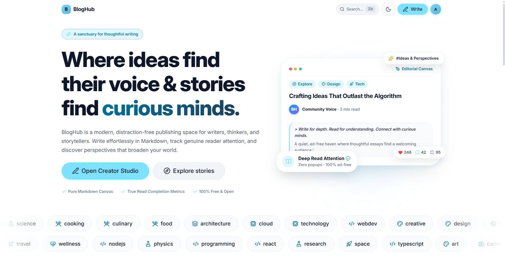
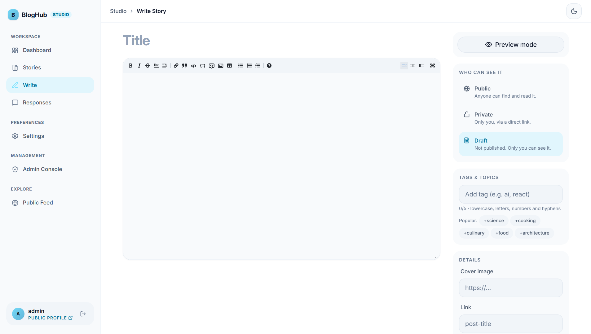
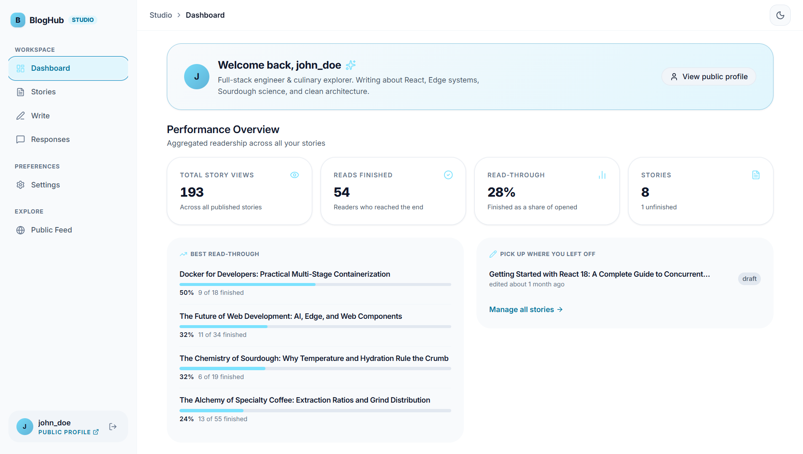
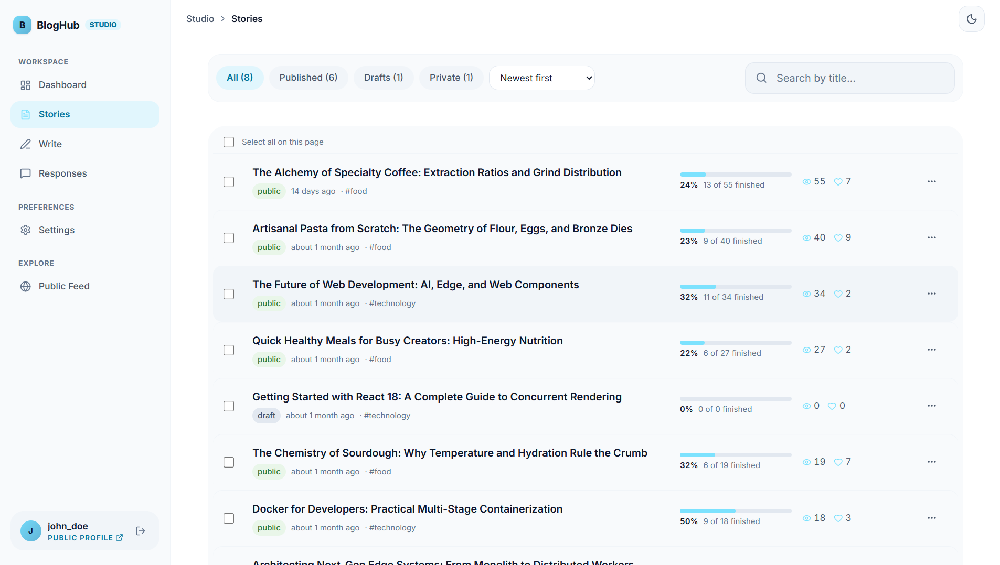
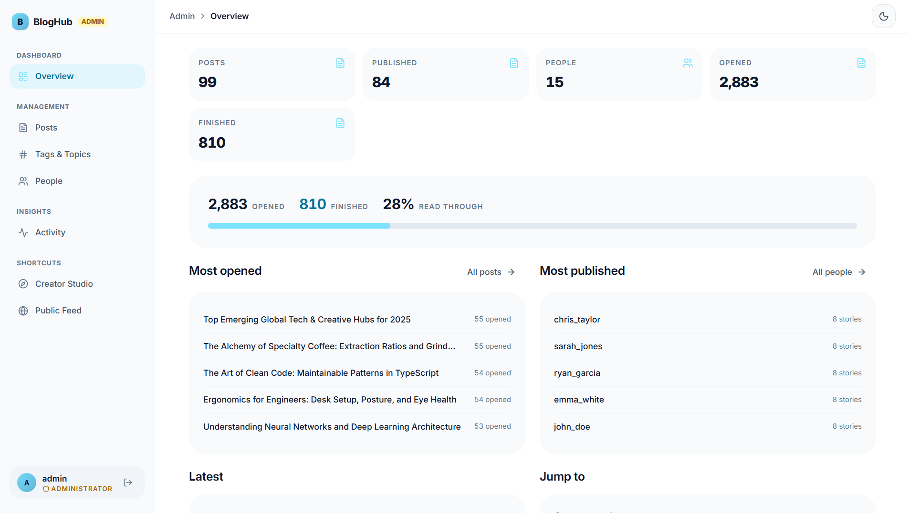
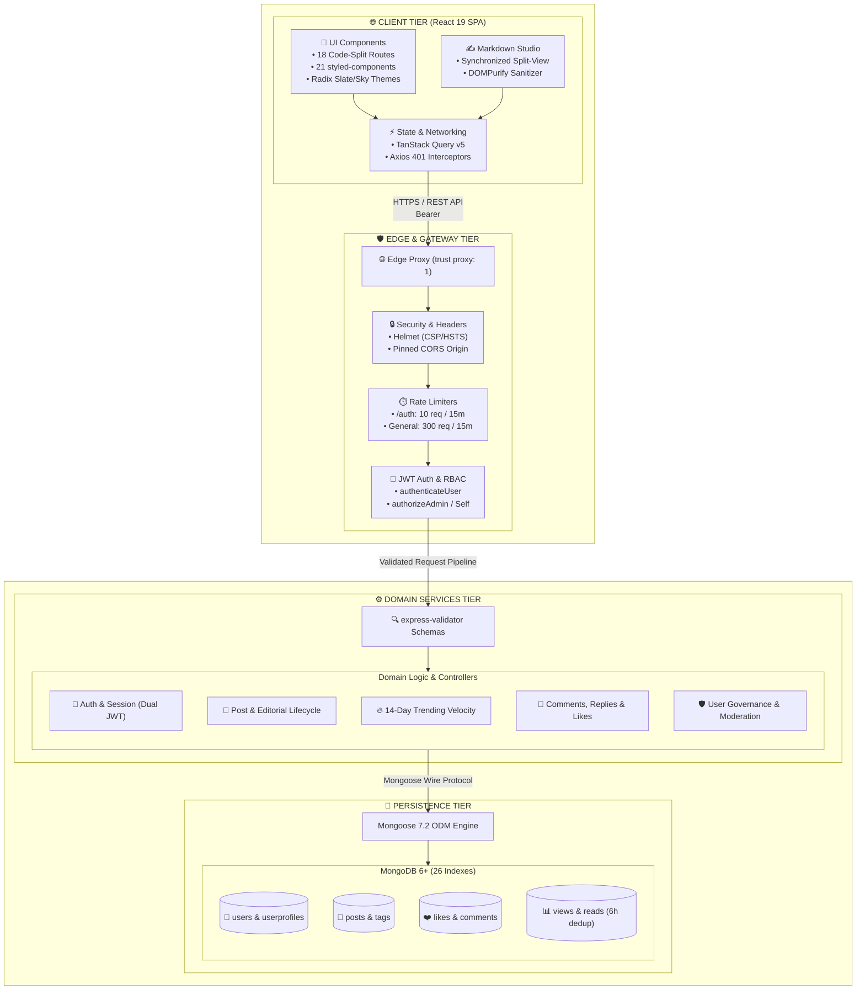

<div align="center">

# 📝 BlogHub

**An open-source, full-stack publishing platform engineered for deep reading, live Markdown authoring, read-through engagement analytics, and complete platform governance.**

<br/>

[](https://bloghub-gold.vercel.app/)
[](https://react.dev/)
[](https://nodejs.org/)
[](https://expressjs.com/)
[](https://www.mongodb.com/)
[](https://vitejs.dev/)
[](https://tanstack.com/query)
[](https://styled-components.com/)
[](https://jestjs.io/)
[](LICENSE)

<br/>

<p align="center">
  <a href="https://bloghub-gold.vercel.app/">🌐 <strong>Live Demo</strong></a> •
  <a href="#features">Features</a> •
  <a href="#screenshots">Screenshots</a> •
  <a href="#architecture">Architecture</a> •
  <a href="#tech-stack">Tech Stack</a> •
  <a href="#quick-start">Quick Start</a> •
  <a href="#demo-credentials">Demo Accounts</a> •
  <a href="#scripts">Scripts & Tests</a> •
  <a href="#documentation">Docs Hub</a>
</p>

</div>

---

<p align="center">
  <a href="https://bloghub-gold.vercel.app/">
    
  </a>
</p>

---

## 💡 What makes BlogHub different?

Traditional blogging software optimizes for superficial page impressions (clicks). **BlogHub is engineered around read-through rate and genuine reader engagement** — measuring not just who clicked an article, but who actually finished reading it.

<br/>

| 📖 Reader-Centric                                                                                                                                                         | ✍️ Modern Author Studio                                                                                                                                 | 🛡️ Platform Governance                                                                                                                                                       |
| :------------------------------------------------------------------------------------------------------------------------------------------------------------------------ | :------------------------------------------------------------------------------------------------------------------------------------------------------ | :--------------------------------------------------------------------------------------------------------------------------------------------------------------------------- |
| • Clean 680px typography reading measure<br/>• Sanitized Markdown rendering (DOMPurify)<br/>• 14-day dynamic trending algorithm<br/>• Threaded nested discussions & likes | • Split-pane live Markdown preview<br/>• Auto-derived custom SEO slugs<br/>• Cover image & topic taxonomy<br/>• Real-time read-rate analytics dashboard | • Full public/private story moderation<br/>• User management & role promotion<br/>• Instant session revocation (`tokenVersion`)<br/>• In-memory isolated integration testing |

---

<a id="screenshots"></a>

## 📸 Interface Tour & Screenshots

Below is the visual gallery across BlogHub's reading surfaces, editor studios, creator workspaces, and admin console.

<div align="center">

<table>
  <tr>
    <td width="50%" align="center">
      
      <br/><strong>🏠 Landing Page & Trending Feed</strong><br/>
      <sub>Featured hero, topic marquee, 14-day trending algorithm, and story feed (<code>/</code>)</sub>
    </td>
    <td width="50%" align="center">
      
      <br/><strong>📖 Focused Reading View</strong><br/>
      <sub>680px reading column, author byline, atomic likes, and threaded replies (<code>/post/:id</code>)</sub>
    </td>
  </tr>
  <tr>
    <td width="50%" align="center">
      
      <br/><strong>✍️ Markdown Authoring Studio</strong><br/>
      <sub>Synchronized split-view Markdown editor with live preview and cover URL (<code>/write</code>)</sub>
    </td>
    <td width="50%" align="center">
      
      <br/><strong>📊 Creator Analytics Workspace</strong><br/>
      <sub>Personal read-through rate bar, view-to-read conversions, and draft resume (<code>/dashboard</code>)</sub>
    </td>
  </tr>
  <tr>
    <td width="50%" align="center">
      
      <br/><strong>📚 Posts & Story Management</strong><br/>
      <sub>Server-filtered stories table with bulk actions and visibility toggles (<code>/stories</code>)</sub>
    </td>
    <td width="50%" align="center">
      
      <br/><strong>🛡️ Admin Moderation Workspace</strong><br/>
      <sub>Site-wide health metrics, story catalog moderation, and user management (<code>/admin</code>)</sub>
    </td>
  </tr>
</table>

</div>

---

<a id="features"></a>

## ✨ Core Capabilities

### 1. ✍️ Composition & Lifecycle

- **Synchronized Markdown Editor:** Split-screen writing with instant syntax-highlighted preview.
- **Enforced Visibility State Machine:** Secure server-side isolation between `draft`, `private`, and `public` states.
- **Slug Management:** Auto-generated URL slugs with custom edit overrides.
- **Cover Image & Tags:** Header artwork support with multi-category classification.

### 2. 📖 Reading & Social Features

- **Editorial Typography:** Tailored 680px reading column with seamless Light/Dark theming.
- **14-Day Trending Algorithm:** Dynamic ranking weighted by recent verified read completions.
- **Threaded Discussions:** Nested comment hierarchies with parent-child reply trees.
- **Idempotent Social Graph:** MongoDB compound unique indexes prevent duplicate likes or follow anomalies under high concurrency.

### 3. 📊 Engagement Analytics

- **Read-Through Conversion:** Visual metrics tracking viewer-to-reader completion ratios.
- **Visitor Deduplication:** Salted HMAC visitor hashing with 6-hour sliding windows to prevent artificial view inflation.
- **Author vs. Admin Analytics:** Private author workspaces vs. aggregate platform governance stats.

### 4. 🔐 Security & Identity

- **Dual-Token JWT:** Short-lived access tokens (15m) + refresh tokens (7d) with silent Axios interceptor renewal.
- **Instant Session Revocation:** Any credential change increments `tokenVersion`, immediately terminating active tokens across all devices.
- **Defense in Depth:** Helmet HTTP security headers, CORS origin pinning, input sanitization via express-validator, and DOMPurify XSS protection.

---

<a id="architecture"></a>

## 🏛️ Architecture

BlogHub is designed as a decoupled full-stack architecture: an **18-route React 19 SPA** interacting with a **stateless Express 4 API Gateway**, backed by an **indexed MongoDB cluster**.


```mermaid
flowchart TB
    subgraph TopRow[" "]
        direction LR
        subgraph ClientTier["🌐 CLIENT TIER (React 19 SPA)"]
            direction TB
            UI["🎨 UI Components\n• 18 Code-Split Routes\n• 21 styled-components\n• Radix Slate/Sky Themes"]
            Editor["✍️ Markdown Studio\n• Synchronized Split-View\n• DOMPurify Sanitizer"]
            ClientState["⚡ State & Networking\n• TanStack Query v5\n• Axios 401 Interceptors"]
            UI & Editor --> ClientState
        end

        subgraph GatewayTier["🛡️ EDGE & GATEWAY TIER"]
            direction TB
            Proxy["🌐 Edge Proxy (trust proxy: 1)"]
            SecMW["🔒 Security & Headers\n• Helmet (CSP/HSTS)\n• Pinned CORS Origin"]
            Rate["⏱️ Rate Limiters\n• /auth: 10 req / 15m\n• General: 300 req / 15m"]
            AuthMW["🔑 JWT Auth & RBAC\n• authenticateUser\n• authorizeAdmin / Self"]
            Proxy --> SecMW --> Rate --> AuthMW
        end
    end

    subgraph BottomRow[" "]
        direction LR
        subgraph ServicesTier["⚙️ DOMAIN SERVICES TIER"]
            direction TB
            Validators["🔍 express-validator Schemas"]

            subgraph DomainEngines["Domain Logic & Controllers"]
                direction TB
                AuthSvc["🔐 Auth & Session (Dual JWT)"]
                PostSvc["📰 Post & Editorial Lifecycle"]
                TrendSvc["🔥 14-Day Trending Velocity"]
                SocialSvc["💬 Comments, Replies & Likes"]
                AdminSvc["🛡️ User Governance & Moderation"]
            end
            Validators --> DomainEngines
        end

        subgraph PersistenceTier["🍃 PERSISTENCE TIER"]
            direction TB
            ODM["Mongoose 7.2 ODM Engine"]

            subgraph DBCollections["MongoDB 6+ (26 Indexes)"]
                direction TB
                C_Users[("👤 users & userprofiles")]
                C_Posts[("📰 posts & tags")]
                C_Social[("❤️ likes & comments")]
                C_Metrics[("📊 views & reads (6h dedup)")]
            end
            ODM --> DBCollections
        end
    end

    ClientState -->|"HTTPS / REST API\nBearer <accessToken>"| Proxy
    AuthMW -->|"Validated Request Pipeline"| Validators
    DomainEngines -->|"Mongoose Wire Protocol"| ODM
```

---

<a id="tech-stack"></a>

## 🛠️ Tech Stack

<div align="center">

| Layer           | Primary Tech                   | Key Packages & Tooling                                                                                                   |
| :-------------- | :----------------------------- | :----------------------------------------------------------------------------------------------------------------------- |
| **Frontend**    | **React 19.2** (Vite 7)        | **TanStack Query 5**, **styled-components 6**, **React Router 7**, **Axios**, **@uiw/react-md-editor**, **lucide-react** |
| **Backend**     | **Node.js 18+** (Express 4)    | **Mongoose 7**, **jsonwebtoken**, **bcryptjs**, **express-validator**, **helmet**, **express-rate-limit**, **multer**    |
| **Database**    | **MongoDB 6.0+** (Local/Atlas) | 9 Collections, 26 Declared Unique & Compound Indexes, Atomic Updates                                                     |
| **Testing**     | **Jest & Vitest**              | **mongodb-memory-server** (In-process DB), **Supertest**, **React Testing Library**                                      |
| **CI/CD & Ops** | **GitHub Actions & Vercel**    | Automated Linting, Prettier Format Checks, 198 Tests, Dependency Audits                                                  |

</div>

---

<a id="quick-start"></a>

## 🚀 Quick Start

Get BlogHub up and running locally in 4 simple steps:

### 📋 Prerequisites

- **Node.js**: `18.0.0` or higher ([Download Node.js](https://nodejs.org/))
- **MongoDB**: `6.0+` (Local daemon or [MongoDB Atlas](https://www.mongodb.com/atlas))

---

### Step 1: Clone & Configure `.env`

```bash
# 1. Clone the repository
git clone https://github.com/Purvesh-PJ/blogging_platform.git bloghub
cd bloghub

# 2. Copy the environment template to root
cp .env.example .env
```

Both workspaces read a **single `.env` located at the root directory**:

```env
NODE_ENV=development
PORT=4000
MONGO_DB_URI=mongodb://127.0.0.1:27017/bloghub
CLIENT_URL=http://localhost:3000
VITE_API_URL=http://localhost:4000
JWT_SECRET=replace_with_a_secure_random_string_min_32_chars
JWT_REFRESH_SECRET=replace_with_a_different_secure_random_string
JWT_ACCESS_EXPIRES_IN=15m
JWT_REFRESH_EXPIRES_IN=7d
```

> 💡 **Generate unique keys:** `node -e "console.log(require('crypto').randomBytes(48).toString('hex'))"`

---

### Step 2: Install Dependencies

```bash
# Install backend dependencies
cd backend && npm install

# Install client dependencies
cd ../client && npm install
```

---

### Step 3: Seed Database (Optional)

Populate sample users, topics, draft/public stories, and engagement events:

```bash
cd backend && npm run seed
```

> ⚠️ _Note: The seeder purges existing collections before inserting seed data._

---

<a id="demo-credentials"></a>

### 🔑 Demo Credentials

| Role                | Email Address       | Password      | Permissions Scope                                                       |
| :------------------ | :------------------ | :------------ | :---------------------------------------------------------------------- |
| **Member (Author)** | `john@example.com`  | `password123` | Story creation, live Markdown editor, workspace analytics, settings     |
| **Administrator**   | `admin@bloghub.com` | `admin123`    | Platform dashboard, story moderation, user suspension & role governance |

---

### Step 4: Run Development Servers

Start backend and client servers in separate terminals:

```bash
# Terminal 1 — Start Express API (Port 4000)
cd backend && npm run dev

# Terminal 2 — Start React SPA (Port 3000)
cd client && npm run dev
```

Visit **[`http://localhost:3000`](http://localhost:3000)** in your browser.

---

<a id="project-structure"></a>

## 📂 Project Structure

```
bloghub/
├── .github/workflows/ci.yml    # CI: Lint · Format · 198 Tests · Build · Audit
├── .env.example                # Single root environment configuration template
├── CONTRIBUTING.md             # Contribution guidelines & PR workflow
├── CODE_OF_CONDUCT.md          # Community conduct standards
├── LICENSE                     # MIT License
├── README.md                   # Repository landing page
├── vercel.json                 # Vercel serverless deployment configuration
│
├── backend/                    # Express 4 REST API (CommonJS)
│   ├── config/                 # db.js (MongoDB), env.js (Boot validation)
│   ├── controllers/            # 12 HTTP request/response controllers
│   ├── middlewares/            # JWT auth, role authorization, errorHandler, rateLimiter
│   ├── models/                 # 9 Mongoose schemas (User, Post, Comment, Tag, Like, etc.)
│   ├── routes/                 # 11 Express router modules mounted under /api
│   ├── services/               # Reusable domain services (postService, accountService)
│   ├── tests/                  # 125 integration tests (Jest + mongodb-memory-server)
│   ├── validators/             # express-validator schema rule sets
│   ├── index.js                # Server entry point & composition root
│   └── package.json
│
├── client/                     # React 19 SPA (Vite + ES Modules)
│   ├── public/screenshots/     # UI preview assets & screenshot gallery
│   ├── src/
│   │   ├── components/         # ui/ (21 design primitives), posts/, layout/, marketing/
│   │   ├── config/             # api.js (Axios client), markdown.js (DOMPurify rules)
│   │   ├── context/            # AuthContext.jsx & authState singleton
│   │   ├── guards/             # ProtectedRoute.jsx, AdminRoute.jsx
│   │   ├── hooks/              # useCurrentUser, useReading, useTags, useDraftRecovery
│   │   ├── pages/              # 12 Reader/Author pages + admin/ (6 screens)
│   │   ├── services/           # 10 API service clients & queryKeys.js
│   │   ├── styles/             # ThemeProvider & theme/ (Design tokens, Light/Dark)
│   │   ├── App.jsx             # Code-split routing table & Suspense boundaries
│   │   └── main.jsx            # Provider composition tree
│   ├── vite.config.js          # Vite config, dev proxy & Rollup chunk splitting
│   └── package.json
│
└── docs/                       # Complete Stage 3 Technical Documentation Suite
```

---

<a id="scripts"></a>

## 🧪 Scripts & Tests

### Backend Commands (`cd backend`)

| Command                                   | Description                                                                   |
| :---------------------------------------- | :---------------------------------------------------------------------------- |
| `npm run dev`                             | Start API server in watch mode with nodemon                                   |
| `npm test`                                | Run **125 Jest integration tests** in-process against `mongodb-memory-server` |
| `npm run test:coverage`                   | Generate full backend code coverage report                                    |
| `npm run seed`                            | Populate database with demo users, stories, and metrics                       |
| `npm run migrate`                         | Execute database migrations (`--dry` to preview changes)                      |
| `npm run lint` / `npm run lint:fix`       | Execute ESLint 9 code analysis & automated fixes                              |
| `npm run format:check` / `npm run format` | Verify or format code with Prettier 3                                         |

### Client Commands (`cd client`)

| Command                                   | Description                                                   |
| :---------------------------------------- | :------------------------------------------------------------ |
| `npm run dev`                             | Launch Vite development server on `http://localhost:3000`     |
| `npm test`                                | Run **73 Vitest unit & component tests** in jsdom environment |
| `npm run build`                           | Compile optimized production bundle to `client/dist`          |
| `npm run preview`                         | Locally preview the compiled production build                 |
| `npm run lint` / `npm run lint:fix`       | Check or fix client source code with ESLint 9                 |
| `npm run format:check` / `npm run format` | Check or format client files with Prettier 3                  |

---

<a id="documentation"></a>

## 📚 Documentation Hub

BlogHub maintains an exhaustive, industry-grade documentation suite in **[`docs/`](docs/README.md)** organized by the **Diátaxis framework**:

<div align="center">

| Section                   | Key Documents                                                                                                                                                                                                                                                           | Summary                                                                                                                                                                                                                                    |
| :------------------------ | :---------------------------------------------------------------------------------------------------------------------------------------------------------------------------------------------------------------------------------------------------------------------- | :----------------------------------------------------------------------------------------------------------------------------------------------------------------------------------------------------------------------------------------- |
| **🏛️ Architecture**       | **[System Overview](docs/architecture/overview.md)**<br/>**[Walkthrough](docs/architecture/walkthrough.md)**<br/>**[Frontend](docs/architecture/frontend.md)** • **[Backend](docs/architecture/backend.md)**<br/>**[ADRs (Decisions)](docs/architecture/decisions.md)** | • Monorepo layout & workspace boundaries<br/>• End-to-end request lifecycle tour<br/>• Provider trees, query caching & Express pipeline<br/>• Architectural Decision Records (ADR-001 to ADR-006)                                          |
| **📖 Guides**             | **[Getting Started](docs/guides/getting-started.md)**<br/>**[Development](docs/guides/development.md)**<br/>**[Testing Guide](docs/guides/testing.md)**<br/>**[Troubleshooting](docs/guides/troubleshooting.md)**<br/>**[Code Quality](docs/guides/code-quality.md)**   | • Step-by-step setup & verification<br/>• File placement rules & coding standards<br/>• Test pyramid & in-memory runner guide<br/>• Common local errors & diagnostic tree<br/>• ESLint flat configs & Prettier standards                   |
| **📐 Reference**          | **[API Contract](docs/reference/api.md)**<br/>**[Database & ERD](docs/reference/database.md)**<br/>**[Configuration](docs/reference/configuration.md)**<br/>**[Design System](docs/reference/design-system.md)**                                                        | • 51-endpoint catalog & schemas<br/>• Mongoose models, indexes & Mermaid ERD<br/>• Environment variable dictionary<br/>• 21 UI primitives & Light/Dark tokens                                                                              |
| **⚙️ Operations**         | **[Deployment & CI/CD](docs/operations/deployment.md)**<br/>**[Operations Runbook](docs/operations/runbook.md)**                                                                                                                                                        | • Vercel serverless topology & CI/CD pipeline<br/>• Health probes, incident triage & logging                                                                                                                                               |
| **🎯 Product & Security** | **[Features](docs/product/features.md)** • **[User Flows](docs/product/user-flows.md)**<br/>**[Roadmap](docs/product/roadmap.md)**<br/>**[Auth & RBAC](docs/security/auth.md)**<br/>**[Security Checklist](docs/security/checklist.md)**                                | • Complete capability matrix by persona<br/>• State machine & interaction sequence diagrams<br/>• Bug/Gap backlog & release phases<br/>• Dual JWT token lifecycle & session revocation<br/>• Security audit findings (`SEC-xx`) & defenses |

</div>

---

## 🤝 Contributing

Contributions are welcome! Please follow these steps:

1. Fork the Project
2. Create your Feature Branch (`git checkout -b feature/AmazingFeature`)
3. Commit your Changes (`git commit -m 'feat: add amazing feature'`)
4. Verify Tests & Formatting (`npm test` and `npm run format:check`)
5. Push to the Branch (`git push origin feature/AmazingFeature`)
6. Open a Pull Request

Review **[CONTRIBUTING.md](CONTRIBUTING.md)** and **[CODE_OF_CONDUCT.md](CODE_OF_CONDUCT.md)** for detailed contribution guidelines.

---

## 📄 License

Distributed under the **MIT License**. See **[`LICENSE`](LICENSE)** for details.

---

<p align="center">
  Crafted with modern web standards and architectural discipline.
</p>
