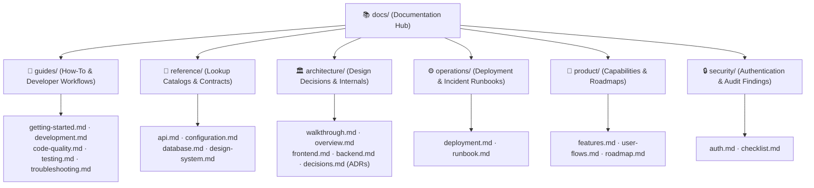

# BlogHub Documentation

Technical documentation for BlogHub — a MERN blogging platform with authoring, social
interaction, analytics and an admin console.

Every document below owns exactly one subject and cross-references rather than repeats.

---

## Layout

How this structure is chosen and when to grow it:
[documentation-guide.md](documentation-guide.md).

---

## Index

### guides/ — how to do things

| Document                                        | Contents                                                     |
| ----------------------------------------------- | ------------------------------------------------------------ |
| [getting-started.md](guides/getting-started.md) | Prerequisites, install, run, seed, verify                    |
| [development.md](guides/development.md)         | Where files go, how to write them, how they are reviewed     |
| [code-quality.md](guides/code-quality.md)       | ESLint, Prettier, the TypeScript position, dependency health |
| [testing.md](guides/testing.md)                 | Strategy, tooling and conventions for every level            |
| [troubleshooting.md](guides/troubleshooting.md) | Common local development issues, port conflicts, CORS, Atlas |

### reference/ — look things up

| Document                                       | Contents                                                    |
| ---------------------------------------------- | ----------------------------------------------------------- |
| [api.md](reference/api.md)                     | Complete endpoint catalogue and API design rules            |
| [configuration.md](reference/configuration.md) | Complete environment variable reference                     |
| [database.md](reference/database.md)           | Collections, relationships, indexes, integrity              |
| [design-system.md](reference/design-system.md) | Tokens, themes, primitives, typography, colour, iconography |

### architecture/ — why it is built this way

| Document                                      | Contents                                                      |
| --------------------------------------------- | ------------------------------------------------------------- |
| [walkthrough.md](architecture/walkthrough.md) | The five-minute version: tiers, layers, naming, key decisions |
| [overview.md](architecture/overview.md)       | System shape, annotated tree, dependency rules                |
| [frontend.md](architecture/frontend.md)       | Providers, routing, state ownership, data flow                |
| [backend.md](architecture/backend.md)         | Request lifecycle, layering, error handling                   |
| [decisions.md](architecture/decisions.md)     | Architecture Decision Records (ADRs: ADR-001 to ADR-006)      |

### operations/ — running it

| Document                                  | Contents                                  |
| ----------------------------------------- | ----------------------------------------- |
| [deployment.md](operations/deployment.md) | Vercel topology, release, rollback, CI/CD |
| [runbook.md](operations/runbook.md)       | Monitoring, logging, troubleshooting      |

### product/ — what it does

| Document                               | Contents                                                 |
| -------------------------------------- | -------------------------------------------------------- |
| [features.md](product/features.md)     | Capability catalogue with per-feature status             |
| [user-flows.md](product/user-flows.md) | Step-by-step journeys, including failure branches        |
| [roadmap.md](product/roadmap.md)       | Defect and gap backlog (`BUG-xx`, `GAP-xx`), phased plan |

### security/

| Document                              | Contents                                             |
| ------------------------------------- | ---------------------------------------------------- |
| [auth.md](security/auth.md)           | Token lifecycle, roles, permission matrix            |
| [checklist.md](security/checklist.md) | Findings (`SEC-xx`), hardening and review checklists |

---

## Single source of truth

Each subject has one owning document. To write about one of these, edit the owner and link to
it — do not restate it.

| Subject                                   | Owner                                                          |
| ----------------------------------------- | -------------------------------------------------------------- |
| Feature catalogue and status              | [product/features.md](product/features.md)                     |
| Product journeys                          | [product/user-flows.md](product/user-flows.md)                 |
| Defect and gap backlog                    | [product/roadmap.md](product/roadmap.md)                       |
| A quick tour of the whole thing           | [architecture/walkthrough.md](architecture/walkthrough.md)     |
| Repository tree and dependency rules      | [architecture/overview.md](architecture/overview.md)           |
| Data model and indexes                    | [reference/database.md](reference/database.md)                 |
| Endpoint reference                        | [reference/api.md](reference/api.md)                           |
| Design tokens and the primitive catalogue | [reference/design-system.md](reference/design-system.md)       |
| UI rules, drift and agent guidance        | [guides/development.md](guides/development.md#design-language) |
| File placement and code conventions       | [guides/development.md](guides/development.md)                 |
| Install and run instructions              | [guides/getting-started.md](guides/getting-started.md)         |
| Local troubleshooting and FAQ             | [guides/troubleshooting.md](guides/troubleshooting.md)         |
| Architectural decision records (ADRs)     | [architecture/decisions.md](architecture/decisions.md)         |
| Environment variables                     | [reference/configuration.md](reference/configuration.md)       |
| Deployment and CI                         | [operations/deployment.md](operations/deployment.md)           |
| Production runbook and triage             | [operations/runbook.md](operations/runbook.md)                 |
| Token lifecycle and permissions           | [security/auth.md](security/auth.md)                           |
| Security findings                         | [security/checklist.md](security/checklist.md)                 |

## Issue identifiers

Findings carry stable IDs so documents reference them precisely instead of duplicating the
description. Use them in commit messages and pull request titles.

| Prefix   | Meaning                            | Owner                                          |
| -------- | ---------------------------------- | ---------------------------------------------- |
| `BUG-xx` | Implemented behaviour is incorrect | [product/roadmap.md](product/roadmap.md)       |
| `GAP-xx` | Capability is absent               | [product/roadmap.md](product/roadmap.md)       |
| `SEC-xx` | Security weakness                  | [security/checklist.md](security/checklist.md) |

---

## Current state

An end-to-end audit in August 2026 found 28 functional defects, 18 capability gaps and 15
security findings. Remediation closed **every security finding** and **every defect**, each
verified against a running server.

| Area                                                             | Status                                         |
| ---------------------------------------------------------------- | ---------------------------------------------- |
| Core journeys — publish, read, edit, engage, moderate, configure | ✅ Working                                     |
| Security findings                                                | ✅ 15 of 15 closed                             |
| Database indexes                                                 | ✅ 20 declared across 9 collections            |
| Health endpoints, security headers, rate limiting                | ✅ In place                                    |
| Session revocation, account deletion, view deduplication         | ✅ Done                                        |
| Backend tests                                                    | ✅ 125 integration tests, run in CI            |
| CI pipeline                                                      | ✅ Lint · format · test · build · audit        |
| Client tests                                                     | ⚠️ 73 tests; editor and workspace uncovered    |
| Branch protection                                                | ❌ CI reports, but nothing requires it to pass |
| Avatar upload                                                    | ✅ Works; bytes live in MongoDB, not object storage ([GAP-17](product/roadmap.md#gap-17)) |

Read [product/roadmap.md](product/roadmap.md) and
[security/checklist.md](security/checklist.md) before deploying. The next work is branch
protection — CI reports on every push, but nothing requires it to pass, so everything above is
built on a gate that does not yet block.

---

## Reading paths

**New contributor** → [getting started](guides/getting-started.md) →
[architecture walkthrough](architecture/walkthrough.md) →
[development](guides/development.md)

**Working on the API** → [backend](architecture/backend.md) →
[api](reference/api.md) → [database](reference/database.md)

**Working on the UI** → [frontend](architecture/frontend.md) →
[design system](reference/design-system.md)

**Shipping a release** → [configuration](reference/configuration.md) →
[deployment](operations/deployment.md) → [security checklist](security/checklist.md)

**Triaging production** → [runbook](operations/runbook.md)

**Deciding what to work on** → [roadmap](product/roadmap.md)

---

## Conventions

- Every document opens with a **Scope** line stating what it owns and excludes.
- Statements describe the code as it exists today. Unbuilt work is labelled and carries a
  `GAP-xx` reference.
- Code paths are relative to the repository root (`backend/index.js`).
- Endpoints omit the mount prefix; see
  [reference/api.md](reference/api.md#base-url).
- When behaviour changes, update the owning document in the same pull request.
