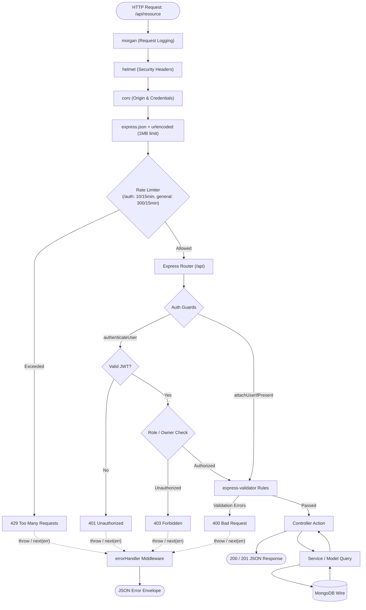

# Backend Architecture

> **Scope:** the internal design of the Express API — composition, request lifecycle,
> layering, error handling, cross-cutting concerns.
> **Excludes:** the endpoint catalogue ([reference/api.md](../reference/api.md)), the data
> model ([database.md](../reference/database.md)), token and permission mechanics
> ([security/auth.md](../security/auth.md)).

---

## Stack

| Concern          | Choice             | Version                              |
| ---------------- | ------------------ | ------------------------------------ |
| Runtime          | Node.js            | Unpinned — no `engines`, no `.nvmrc` |
| Framework        | Express            | 4.18                                 |
| ODM              | Mongoose           | 8.24                                 |
| Authentication   | jsonwebtoken       | 9.0                                  |
| Password hashing | bcryptjs           | 2.4                                  |
| Validation       | express-validator  | 7.0                                  |
| Security headers | helmet             | 8.3                                  |
| Rate limiting    | express-rate-limit | 8.6                                  |
| Uploads          | multer             | 1.4 LTS                              |
| Request logging  | morgan             | 1.10                                 |
| CORS             | cors               | 2.8                                  |
| Configuration    | dotenv             | 16.4                                 |

CommonJS throughout.

---

## Composition root

`backend/index.js` wires the application in a fixed order, and the order matters:

```js
1  dotenv.config({ path: '../.env' })       // configuration first
2  assertEnv()                              // fail fast on a misconfigured deployment
3  connectDB()                              // skipped under NODE_ENV=test
4  app.use(logger)                          // morgan sees every request
5  app.use(helmet())                        // security headers
6  app.use(cors(...))                       // credentials only when CLIENT_URL is set
7  app.use(express.urlencoded({ limit: '1mb' }))
8  app.use(express.json({ limit: '1mb' }))
9  app.get(['/health','/ready'], ...)        // outside the rate limiter
10 router.use(generalLimiter)                // 300 / 15 min
11 router.use('/auth', authLimiter)          // 10 failed / 15 min
12 router.use('/<resource>', <resource>Routes)
13 app.use('/api', router)                  // mounted once
14 app.use(errorHandler)                     // terminal — must be last
15 app.listen(PORT) unless running on Vercel
16 module.exports = app                      // serverless handler export
```

### Configuration validation

`config/env.js` runs before anything else. It requires `JWT_SECRET` everywhere and
`CLIENT_URL` in production, enforces a 32-character minimum secret in production, and refuses
to boot if `JWT_REFRESH_SECRET` equals `JWT_SECRET`. A misconfigured deployment now fails at
boot rather than on a user's first sign-in ([SEC-10](../security/checklist.md#sec-10)).

### A single mount

The router is mounted once, at `/api`.

It used to be mounted at `/` as well, so every endpoint had two addresses. That is not a
convenience — it doubles the surface to secure, it means a path-based rule can protect one
address and miss the other, and it makes "what is the API's base URL" unanswerable. The bare
mount was removed, and `config/api.js` now appends `/api` when the configured base does not
already carry it, so an old `VITE_API_URL` keeps working without the second mount existing.

### Serverless-aware startup

```js
const shouldListen = process.env.NODE_ENV !== "test" && !process.env.VERCEL;
if (shouldListen) app.listen(PORT);
module.exports = app;
```

Locally the process listens; on Vercel the export is invoked per request, and under Jest
Supertest drives the app directly. Binding a port in either of those cases is at best useless
and at worst a leaked handle that keeps the test runner alive.

### Health endpoints

`GET /health` reports liveness and uptime. `GET /ready` additionally pings MongoDB and
answers 503 when the connection is not usable. Both are mounted directly on the app, before
the rate limiter, so probes are never throttled, and both reveal nothing beyond status — a
health endpoint is a reconnaissance target.

---

## Database connection

`config/db.js` resolves the URI from `MONGODB_URI`, `MONGO_DB_URI` or `DB_URI`, exits with a
clear message when none is set, registers `error` and `disconnected` listeners, and closes on
`SIGINT`.

`connectDB()` is **not awaited** — requests arriving before the connection is established are
buffered by Mongoose. It is skipped entirely under `NODE_ENV=test` so a test harness can own
the connection.

> On serverless the connection is re-established per cold start with no pooling across
> invocations. A cached-connection pattern is the standard remedy — see
> [operations/deployment.md](../operations/deployment.md#serverless-considerations).

---



---

## Layers

### `routes/`

Eleven routers declaring paths and their middleware chain. No logic.

```js
router.get("/", AuthUser.attachUserIfPresent, PostControllers.getBlogs);
router.post("/", AuthUser.authenticateUser, PostControllers.postBlogs);
```

`settings.routes.js` applies `router.use(authenticateUser)` to guard every path in the file —
the right pattern when a whole resource is authenticated.

### `middlewares/`

| Middleware                       | Responsibility                                                                                                                                                                                                                     |
| -------------------------------- | ---------------------------------------------------------------------------------------------------------------------------------------------------------------------------------------------------------------------------------- |
| `authenticateUser`               | Verifies the bearer token, rejects a non-`access` type, then loads the account to confirm it still exists and its `tokenVersion` matches. `req.user = { id, _id, roles }`, with roles read from the record rather than the payload |
| `attachUserIfPresent`            | Same population, but never rejects — for public routes whose response varies for a signed-in viewer                                                                                                                                |
| `authorizeAdmin`                 | Requires `admin` in `req.user.roles`                                                                                                                                                                                               |
| `authorizeSelfOrAdmin(param)`    | Requires `req.params[param]` to be the caller, unless admin. An absent optional parameter means "me"                                                                                                                               |
| `validate`                       | Terminates an `express-validator` chain, collecting failures into one 400                                                                                                                                                          |
| `validateObjectId(name, source)` | Rejects a malformed or non-string id before it reaches a query                                                                                                                                                                     |
| `asyncHandler(fn)`               | Wraps an async handler so a rejection reaches `errorHandler` instead of becoming an unhandled rejection                                                                                                                            |
| `uploadAvatar`                   | Multer, memory storage, single file, 2 MB cap, image MIME allowlist                                                                                                                                                                |
| `errorHandler`                   | Terminal error middleware. Reports the status an error carries and translates Mongoose/multer faults to 4xx                                                                                                                        |
| `logger`                         | Morgan — `dev` in development, `combined` otherwise, silent under test                                                                                                                                                             |

### `controllers/`

Twelve modules exporting one function per endpoint. A controller reads `req.params`,
`req.query`, `req.body` and `req.user`; validates what the route did not; calls a service or
model; selects the status code; shapes the JSON.

The identity idiom `req.user ? req.user.id || req.user._id || req.user : null` still appears
in older handlers. It is defensive against historical shapes of `req.user`; since
`authenticateUser` always sets both `id` and `_id`, `req.user.id` alone is sufficient.
Handlers touched during remediation use the simpler form.

### `services/`

Four modules. A service exists when logic is reused across controllers, or spans more than one
collection:

| Service           | Function        | Steps                                                                                                                                          |
| ----------------- | --------------- | ---------------------------------------------------------------------------------------------------------------------------------------------- |
| `postService`     | `createPost`    | Create → load the author → push onto `User.posts` → delete the post again if the author is missing                                             |
|                   | `updatePost`    | Validate required fields → `findByIdAndUpdate` with validators                                                                                 |
| `commentService`  | `createComment` | Create → load the post → push onto `Post.comments` → delete the comment again if the post is missing                                           |
| `accountService`  | `purgeAccount`  | Delete the account's posts, its own comments, likes, views, reads, profile and settings, plus everything other people left on its posts → pull its post ids out of every `Tag.posts` and its own id out of every follower and following list → recompute the follower counters from the trimmed arrays → delete the account |
| `trendingService` | `getTrendingPosts` | Aggregate views, likes, comments and reads over a 14-day window, apply the minimum-views floor, score and rank                              |

Services take plain values, never `req` or `res`, and signal failure by throwing. The
compensating deletes are a manual substitute for the transactions this codebase does not use.

`purgeAccount` is the clearest case for the layer: a member deleting themselves and an admin
deleting them must mean the same thing. With the logic in one place they cannot drift into two
definitions of "deleted", one of which leaves data behind.

### `models/`

Nine Mongoose schemas with constraints and twenty declared indexes alongside them — see
[database.md](../reference/database.md).

---

## Response contract

Intended:

```jsonc
{ "success": true,  "message": "…", "data": { }, "pagination": { } }
{ "success": false, "message": "…", "error": "MachineCode" }
```

Applied almost everywhere. `GET /users/getUser` is the notable exception — it returns its
record under a `User` key rather than `data` — and a few handlers add a sibling key beside
`data` (`count`, `counts`, `postId`, `affected`, `trendedBy`, `counted`). Each variation
forces the client to special-case unwrapping. The per-endpoint shape is marked in
[reference/api.md](../reference/api.md).

---

## Error handling

**`asyncHandler` plus a typed `AppError`.** A controller states the failure and returns; it
does not catch:

```js
router.get(
  "/:id",
  validateObjectId("id"),
  asyncHandler(PostControllers.getSinglePost),
);

const post = await Post.findById(req.params.id);
if (!post) throw notFound("Post not found");
```

`utils/AppError.js` exports the class and the helpers `badRequest`, `unauthorized`, `forbidden`,
`notFound` and `conflict`, so the status code is chosen where the failure is understood rather
than by a `catch` block guessing later. `errorHandler` honours `err.status`, translates Mongoose
and multer faults into 4xx, and withholds stack traces outside development.

`asyncHandler` is what makes this safe: an `async` handler that rejects without it produces an
unhandled rejection and a hung request, because Express 4 does not await handlers.

**Migration is complete.** All twelve controller modules use this pattern. A local `catch`
now appears only where an error is being _translated_ rather than swallowed — verifying a
token in `auth.controllers.js`, and turning a duplicate-key collision into a 409 in
`like.controllers.js`.

### Status codes

| Code      | Meaning here                                                                   |
| --------- | ------------------------------------------------------------------------------ |
| 200 / 201 | Success / created                                                              |
| 400       | Validation failure, invalid identifier                                         |
| 401       | Missing, malformed, expired or wrong-type token; bad credentials               |
| 403       | Authenticated but not permitted                                                |
| 404       | Not found — also returned for a non-public post, so existence is not confirmed |
| 409       | Conflict — duplicate account, duplicate like, a tag still in use               |
| 429       | Rate limited                                                                   |
| 500       | Unhandled failure                                                              |
| 501       | Endpoint exists, capability not implemented (`PUT /settings/security`)         |

---

## Cross-cutting concerns

### Authentication and authorisation

Stateless bearer tokens with separate secrets per token type. Enforced at three levels: route
middleware (`authorizeAdmin`), parameter scoping (`authorizeSelfOrAdmin`), and resource
ownership inside the controller. Full detail in
[security/auth.md](../security/auth.md).

### Input validation

Declarative, in `validators/`, one module per area (`auth`, `content`, `user`). Chains are
declared on the route and a single `validate` middleware turns any failure into a 400 with
field-level errors, so no controller begins by re-checking its own inputs.

`validateObjectId(name, source)` guards every identifier before it reaches Mongoose — a
malformed id is a 400, not a 500 from a cast error. It matches a 24-character hex string rather
than calling `mongoose.isValid`, which also accepts any 12-character string and would happily
treat a short password as an id.

Rules that differ between create and update come from a **factory**, `postRules(partial)`, not
from mapping `.optional()` over a shared array. express-validator chains are mutable: calling
`.optional()` modifies the chain in place, so deriving the update rules that way would have
quietly made every field optional on create as well.

`search.controllers.js` escapes regex metacharacters before building its query, preventing a
ReDoS through the search path.

### Rate limiting

Two limiters, both from `express-rate-limit`: a general one at 300 requests per 15 minutes and
an auth-specific one at 10. The auth limiter sets `skipSuccessfulRequests`, so a legitimate user
is never locked out by their own successful sign-ins.

`app.set('trust proxy', 1)` is what makes either of them work. Behind Vercel's proxy every
request arrives from the same address, so without it all traffic shares one bucket — the limiter
locks out the whole world at once while rate-limiting nobody in particular. With it, `req.ip` is
the real client, which is also what the visitor key for view deduplication is built from.

The store is per-instance, so limits are approximate across serverless instances. A shared store
(Redis, Upstash) would make them exact; that is the known remaining gap.

### File uploads

`middlewares/upload.js` — `multer.memoryStorage()`, a 2MB cap and a MIME allowlist. **No
filename is taken from user input**, which is what closes the path-traversal risk in the
previous inline configuration ([SEC-05](../security/checklist.md#sec-05)).

Memory rather than disk because a serverless filesystem is read-only and per-invocation:
anything written there is unreachable by the next request. The validated buffer is stored on the
profile document (`UserProfile.image = { data: Buffer, contentType }`) and served back from its
own endpoint, `GET /users/:id/avatar`, with an `ETag` so the browser can cache it — rather than
base64-encoded into every `getUser` response ([BUG-07](../product/roadmap.md#bug-07),
[BUG-27](../product/roadmap.md#bug-27)). Avatar upload therefore works on Vercel with no
external service.

That is the right trade for this project and the wrong one at scale: image bytes inflate every
document read that populates a profile, and MongoDB is not a CDN. Object storage is the proper
destination ([GAP-17](../product/roadmap.md#gap-17)).

### Logging

Morgan for request lines; `console.error` with a `[handler]` prefix elsewhere. No correlation
ids, no levels, no structure — [operations/runbook.md](../operations/runbook.md#part-2--logging).

---

## Architectural decisions

| Decision                                        | Rationale                                                                                                                                                 | Trade-off                                                                                               |
| ----------------------------------------------- | --------------------------------------------------------------------------------------------------------------------------------------------------------- | ------------------------------------------------------------------------------------------------------- |
| Layered MVC-with-services                       | Familiar, low ceremony                                                                                                                                    | The service layer is optional in practice, so responsibility drifts into controllers                    |
| JWT plus a `tokenVersion` counter               | No session store to run, but sessions are still revocable — sign-out, a password change, a suspension or a demotion invalidate every token already issued | One extra account read per authenticated request, which is the same read authorisation already needs    |
| Separate secret per token type                  | A refresh token cannot be replayed as an access token                                                                                                     | Two secrets to manage                                                                                   |
| Mongoose over the raw driver                    | Schemas, population, validation                                                                                                                           | Strict mode silently drops undeclared fields — the root cause of [BUG-05](../product/roadmap.md#bug-05) |
| Referenced documents plus denormalised counters | Fast reads without joins                                                                                                                                  | Counters drift; no transaction keeps both sides in step                                                 |
| `asyncHandler` plus a typed `AppError`          | One `catch`, in the error middleware; a controller states the failure and stops                                                                           | A rejection that escapes `asyncHandler` is still an untyped 500                                         |
| 404 rather than 403 for non-public content      | Does not confirm a draft exists                                                                                                                           | Slightly less informative for legitimate owners                                                         |

---

## Extending the backend

1. `models/<resource>.model.js` — schema, constraints, **indexes**.
2. `services/<resource>Service.js` — only if multi-step or reused.
3. `controllers/<resource>.controllers.js` — one function per endpoint.
4. `routes/<resource>.routes.js` — paths and middleware chain.
5. Register in `index.js`: `router.use('/<resource>', <resource>Routes)`.
6. Add the matching `client/src/services/<resource>Service.js`.

Follow [reference/api.md](../reference/api.md#rules-for-new-endpoints) and the dependency
rules in [overview.md](overview.md#dependency-rules).
