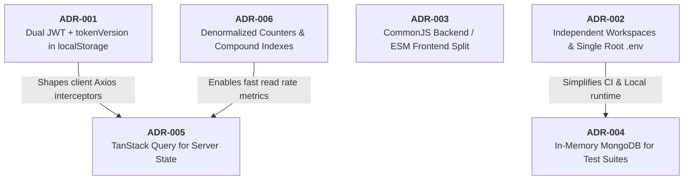

# Architecture Decision Records (ADRs)

> **Scope:** historical and current architecture decision records (ADRs) capturing the context,
> alternatives, rationale, and consequences of key technical choices across BlogHub.
> **Excludes:** low-level implementation details ([backend.md](backend.md), [frontend.md](frontend.md)).

---

## Decision Relationship Map

---

## Index of Records

| ID          | Title                                                             | Status   | Date    |
| :---------- | :---------------------------------------------------------------- | :------- | :------ |
| **ADR-001** | Dual-Token JWT with `tokenVersion` in `localStorage`              | Accepted | 2026-08 |
| **ADR-002** | Independent Workspaces with Single Root `.env`                    | Accepted | 2026-08 |
| **ADR-003** | CommonJS (Backend) and ES Modules (Frontend) Split                | Accepted | 2026-08 |
| **ADR-004** | In-Memory MongoDB (`mongodb-memory-server`) for Integration Tests | Accepted | 2026-08 |
| **ADR-005** | TanStack Query 5 for Server State with Plain Axios Services       | Accepted | 2026-08 |
| **ADR-006** | Compound Unique Indexes and Denormalized Social Counters          | Accepted | 2026-08 |

---

## ADR-001: Dual-Token JWT with `tokenVersion` in `localStorage`

### Context

BlogHub requires stateless authentication that functions seamlessly across local development, SPA hosting on CDNs, and serverless API execution on Vercel. We needed a mechanism that supports short-lived credentials, automatic silent refresh, and instant global revocation (e.g. on password change, account compromise, or administrative action).

### Decision

1. Issue short-lived `accessToken` (15m, signed with `JWT_SECRET`, `type: access`).
2. Issue long-lived `refreshToken` (7d, signed with `JWT_REFRESH_SECRET`, `type: refresh`).
3. Maintain an integer `tokenVersion` on the `User` model. Both token types are stamped with it, so any increment invalidates every outstanding access **and** refresh token immediately.
4. Store tokens in browser `localStorage` under `"auth-storage"` managed by an `authState` singleton module.

### Alternatives Considered

- **HttpOnly Cookies with CSRF Tokens**: Provides strong XSS mitigation, but complicates cross-origin deployment topologies (requiring strict `SameSite`, `Domain`, and `CORS` credential configuration across differing domains).
- **Server-Side Redis Session Store**: Adds stateful infrastructure overhead and latency for serverless invocations.

### Consequences

- **Positive**: No session store to run; instant revocation and demotion via `tokenVersion`; seamless serverless operation.
- **Trade-off**: `localStorage` is vulnerable to XSS, so strict sanitization of rendered Markdown (`rehype-sanitize`, in `client/src/config/markdown.js`) is mandatory ([SEC-13](../security/checklist.md#sec-13)). And revocation is not free: `authenticateUser` reads the account on every authenticated request to compare `tokenVersion` and re-read roles, which is one indexed lookup per request ([SEC-15](../security/checklist.md#sec-15)).

---

## ADR-002: Independent Workspaces with Single Root `.env`

### Context

The repository houses both the Express backend and React SPA. Developers and CI pipelines require simplicity without overhead from heavy monorepo tooling (Turborepo, Nx, Lerna, or npm workspaces).

### Decision

1. Maintain separate `backend/package.json` and `client/package.json`. No root `package.json`.
2. Maintain a single `.env` file at the repository root. `backend/index.js` loads `../.env` via `dotenv`. Vite reads `VITE_*` variables from the root via Vite configuration.
3. Validate all configuration at startup in `backend/config/env.js`.

### Consequences

- **Positive**: Clean isolation of dependencies; zero risk of frontend bundler pulling backend modules; unified environment variable management.
- **Trade-off**: Requires separate `cd backend && npm install` and `cd client && npm install` during initial setup.

---

## ADR-003: CommonJS (Backend) and ES Modules (Frontend) Split

### Context

The backend codebase utilizes Node.js with Express 4, Mongoose 8, and standard CommonJS (`require`/`module.exports`). The frontend utilizes modern Vite 7 and React 19 which natively use ES Modules (`import`/`export`).

### Decision

Retain CommonJS in `backend/` without transpilations (Babel/TypeScript) to preserve zero-build-step server execution, while using ES Modules natively in `client/` for Vite tree-shaking and lightning-fast HMR.

### Consequences

- **Positive**: Backend starts instantly without a build step (`node index.js`); frontend benefits from Vite bundling and Rollup chunk splitting.
- **Trade-off**: Syntax differences across workspaces; shared code (e.g. validator rules) cannot be naively imported without a shared package build step.

---

## ADR-004: In-Memory MongoDB for Integration Tests

### Context

Automated backend integration tests with Jest + Supertest require real database semantics (compound indexes, aggregation pipelines, unique constraints, atomic operators) without requiring a running MongoDB daemon or polluting production/local databases.

### Decision

Use `mongodb-memory-server` to spin up an isolated, in-process MongoDB instance for each test run (`jest --runInBand`).

### Consequences

- **Positive**: Tests run anywhere (local machines, GitHub Actions CI) with zero external setup; test isolation is guaranteed by wiping every collection in an `afterEach`, so a failure leaves its state inspectable.
- **Trade-off**: In-memory binary download on first test run; tests must run serially (`--runInBand`) to avoid database state collision.

---

## ADR-005: TanStack Query 5 for Server State

### Context

Client components require caching, background revalidation, optimistic updates, and loading/error states for remote API resources.

### Decision

1. Adopt **TanStack Query 5** (`@tanstack/react-query`) as the single source of truth for server state.
2. Standardize all cache keys in `client/src/services/queryKeys.js`.
3. Use plain React `useState` for local UI state (modals, dropdowns, forms) without global Redux or Zustand stores.

### Consequences

- **Positive**: Eliminates thousands of lines of boilerplate state code; automatic cache invalidation on mutations; built-in stale-while-revalidate UX.
- **Trade-off**: Developers must adhere strictly to `queryKeys.js` naming conventions to avoid silent cache desynchronization.

---

## ADR-006: Compound Unique Indexes and Denormalized Counters

### Context

Social actions (likes, follows, views, reads) must be idempotent, performant, and prevent race conditions (e.g. double likes or duplicate view counters) under high concurrent load.

### Decision

1. Enforce business rules at the MongoDB schema level using **unique compound indexes**:
   - `Like`: `{ post: 1, user: 1 }` (unique)
   - `UserProfile`: `followers` / `followings` arrays with `$addToSet` and `$pull`
2. Maintain denormalized counters (`postCount`, `followersCount`, `followingsCount`) on `UserProfile` updated atomically alongside graph operations.

### Consequences

- **Positive**: Eliminates double-like bugs and race conditions; profile lookups require 0 aggregation joins; sub-millisecond reader responses.
- **Trade-off**: Mutations require dual updates (array item + counter) handled in atomic service helpers.
