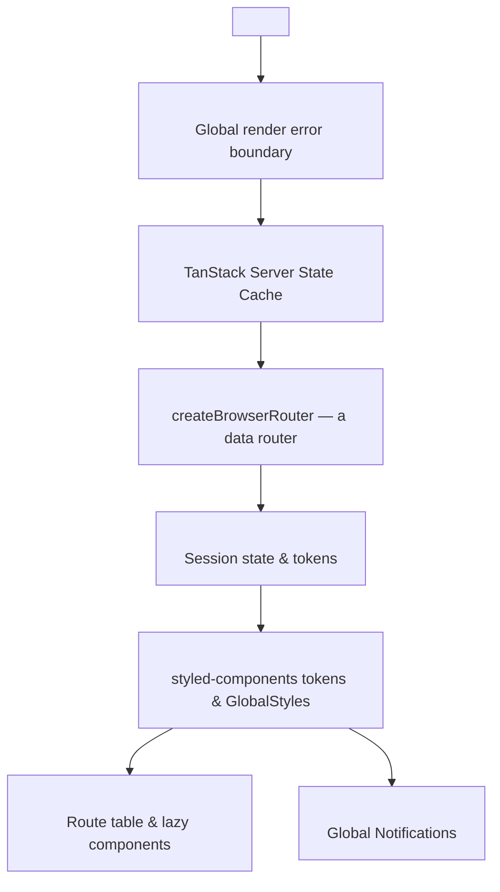
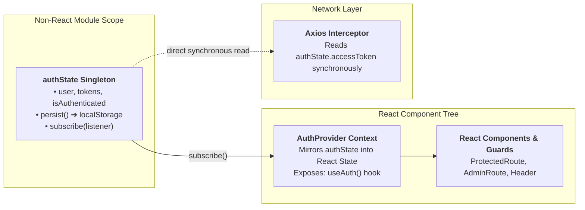
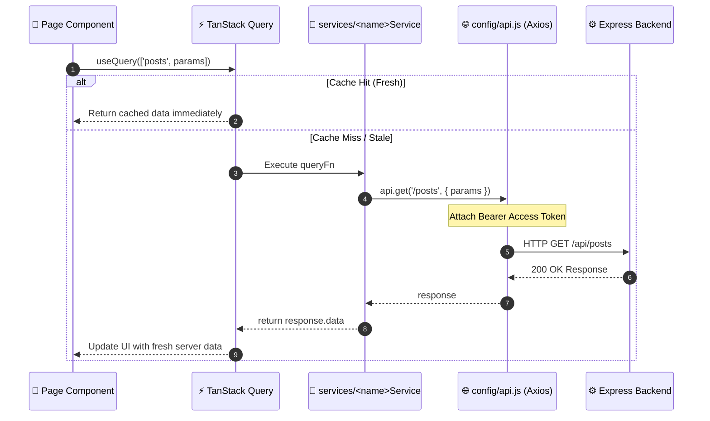

# Frontend Architecture

> **Scope:** the internal design of the React client — provider composition, routing, state
> ownership, data fetching, styling integration, performance.
> **Excludes:** tokens and component specifications
> ([reference/design-system.md](../reference/design-system.md)), journeys
> ([product/user-flows.md](../product/user-flows.md)), the repository tree
> ([overview.md](overview.md)).

---

## Stack

| Concern          | Choice                 | Version |
| ---------------- | ---------------------- | ------- |
| UI library       | React                  | 19.2    |
| Build tool       | Vite                   | 7.2     |
| Routing          | React Router           | 7.11    |
| Server state     | TanStack Query         | 5.90    |
| HTTP client      | Axios                  | 1.13    |
| Styling          | styled-components      | 6.2     |
| Markdown editor  | `@uiw/react-md-editor` | 4.0     |
| Icons            | lucide-react           | 0.562   |
| Notifications    | react-hot-toast        | 2.6     |
| Dates            | date-fns               | 4.1     |
| Headless UI      | `@radix-ui/react-*`    | dialog, dropdown-menu, select, tabs, avatar |
| Typeface         | `@fontsource-variable/inter` | 5.3 |

Forms are controlled by hand with `useState`; no form library is installed. `@radix-ui/themes`
is **not** a dependency — only the individual headless primitives are, and the themes package
was removed because it was never given a stylesheet or a provider, so everything built on it
rendered unstyled.

---



`ErrorBoundary` sits directly inside `StrictMode`, above every other provider, so a failure in
any of them still renders a recovery screen. `AuthProvider` sits above `ThemeProvider` because
guards consume auth and theming consumes nothing.

**It is a data router, not `BrowserRouter`.** `main.jsx` builds a `createBrowserRouter` with a
single catch-all route that renders `<App />`, whose `<Routes>` declaration is unchanged. The
reason for the swap is `useBlocker`, which the editor needs to stop an in-app navigation from
discarding unsaved work and which is only available under a data router.

### Query client defaults

```js
{ staleTime: 5 * 60 * 1000, retry: 1, refetchOnWindowFocus: false }
```

Suitable for a content site where posts change slowly. Anything that must be live overrides
`staleTime` at the call site.

---

## Routing

`client/src/App.jsx` declares two trees — public/member under `Layout`, admin under
`AdminRoute → AdminLayout`. The full route table is in
[product/user-flows.md](../product/user-flows.md#route-map).

### Lazy loading

Every page is code-split. Pages use **named** exports, so a helper adapts them to the default
export `React.lazy` expects:

```js
const lazyPage = (importFn, name) =>
  lazy(() => importFn().then((module) => ({ default: module[name] })));
```

A single `Suspense` boundary renders a centred `Spinner` during chunk loading.

### Guards

```jsx
// ProtectedRoute
if (!isAuthenticated)
  return <Navigate to="/login" state={{ from: location }} replace />;

// AdminRoute — additionally
if (!isAdmin()) return <Navigate to="/" replace />;
```

`state.from` lets `Login` return the user where they were headed; `replace` keeps the
redirect out of history.

**Guards are UX, not security.** Every protected resource is independently enforced by the
API — see [security/auth.md](../security/auth.md#enforcement-layers).

---

## State ownership

Four kinds of state, each with one home. Putting state in the wrong layer is the most common
review comment on this codebase.

| Kind               | Owner                       | Examples                                             |
| ------------------ | --------------------------- | ---------------------------------------------------- |
| **Server state**   | TanStack Query              | posts, tags, comments, analytics, users              |
| **Session state**  | `authState` + `AuthContext` | user, tokens, `isAuthenticated`                      |
| **Theme state**    | `ThemeProvider`             | light/dark mode                                      |
| **Local UI state** | `useState` in the component | form fields, open modals, active tab, carousel index |

No Redux, Zustand or Jotai, and none is needed.

### Authentication state



**Why the singleton exists:** the Axios interceptor is not a React component and cannot call
`useAuth()`. It needs the current token synchronously on every request. A module-scope object
provides that; the subscription keeps React in step.

Initialisation reads `localStorage` at module load, so a refresh restores the session before
first render — no authenticated flash of the signed-out UI.

Trade-off: tokens in `localStorage` are readable by any script on the origin —
[SEC-08](../security/checklist.md#sec-08).

---

## Data flow



### Service layer

Ten modules, each a plain object of async functions:

```js
export const postService = {
  getPosts: async (params = {}) => (await api.get("/posts", { params })).data,
  getAllPosts: async (params = {}) =>
    (await api.get("/posts", { params: { ...params, all: "true" } })).data,
  getPost: async (id) => (await api.get(`/posts/${id}`)).data,
  createPost: async (postData) => (await api.post("/posts", postData)).data,
};
```

No React, no caching, no reshaping. They return `response.data` and stop, which is why pages
handle the inconsistent server envelopes described in
[backend.md](backend.md#response-contract).

### The Axios instance

`client/src/config/api.js` is the only place an instance is created.

```
baseURL = withApiPrefix(import.meta.env.VITE_API_URL ?? 'http://localhost:4000')
          → appends '/api' unless the configured value already ends with it,
            so an existing .env keeps working after the bare mount was removed

request interceptor   → Authorization: Bearer <authState.accessToken>

response interceptor  → 401 and not yet retried
                          → POST /auth/refreshToken via bare axios (no recursion)
                          → success: store the token, replay the request
                          → failure: logout + hard redirect to /login
```

The `_retry` flag guarantees at most one refresh per failed request. Concurrent 401s each
trigger their own refresh; a shared in-flight promise would coalesce them.

### Query keys

Every key is declared in `services/queryKeys.js` and built by a factory function; nothing
spells one out at a call site.

| Factory                          | Key                              | Used by                       |
| -------------------------------- | -------------------------------- | ----------------------------- |
| `posts.feed(params)`             | `['posts', params]`              | Home, Search                  |
| `posts.trending(params)`         | `['trendingPosts', params]`      | Home                          |
| `posts.moderation(params)`       | `['allPosts', params]`           | Admin Dashboard, Admin Posts  |
| `posts.detail(id)`               | `['post', id]`                   | PostDetail, WritePost (edit)  |
| `posts.mine(params)`             | `['myPosts', params]`            | Stories, Dashboard, Responses |
| `posts.byAuthor(id, page)`       | `['authorPosts', id, page]`      | UserProfile                   |
| `comments.forPost(postId)`       | `['postComments', postId]`       | PostDetail, Responses         |
| `tags.all`                       | `['tags']`                       | Search, WritePost, Admin Tags |
| `search(term)`                   | `['search', term]`               | Search                        |
| `currentUser()`                  | `['currentUser']`                | Header, Settings              |
| `settings.all`                   | `['userSettings']`               | Settings                      |
| `profiles.detail(userId)`        | `['publicProfile', userId]`      | UserProfile                   |
| `profiles.ownDetails()`          | `['userProfileDetails']`         | Settings                      |
| `profiles.following(userId)`     | `['isFollowing', userId]`        | UserProfile                   |
| `analytics.mine()`               | `['myAnalytics']`                | Dashboard, Stories            |
| `analytics.forPost(postId)`      | `['postAnalytics', postId]`      | Stories                       |
| `analytics.viewsForPost(postId)` | `['postViews', postId]`          | PostDetail                    |
| `analytics.reading()`            | `['readingActivity']`            | Dashboard                     |
| `analytics.site()`               | `['adminAnalytics']`             | Admin Dashboard               |
| `analytics.forUser(userId)`      | `['personAnalytics', userId]`    | Admin PersonActivity          |
| `admin.users(page)`              | `['admin-users', page]`          | Admin Users                   |
| `admin.activity(page)`           | `['adminActivity', page]`        | Admin Activity                |
| `admin.moderationLog(page)`      | `['adminModerationLog', page]`   | Admin Activity                |

Convention: resource name first, then identifiers, general to specific. Each group also
exposes `all`, so a mutation can invalidate the whole family without knowing which
parameterised variants happen to be cached.

**`['myPosts', params]` carries its parameters in the key**, because filtering, sorting, paging
and searching all happen on the server. Two different filters are two different results, so
they must be two different cache entries; leaving the parameters out would serve the wrong page
from cache and make the tab counts lie.

`['posts']` and `['allPosts']` hold **genuinely different data** — the public feed versus the
moderation view. Two keys for two datasets is correct; merging them would be wrong
([BUG-13](../product/roadmap.md#bug-13)).

`admin-users` is kebab-case while everything else is camelCase — inconsistent, worth
normalising.

### Mutations

Mutations invalidate rather than patch:

```js
useMutation({
  mutationFn: (data) => commentService.createComment(data),
  onSuccess: () => queryClient.invalidateQueries(["post", id]),
  onError: (error) => toast.error(error.response?.data?.message ?? "Failed"),
});
```

Simple and always correct, at the cost of a refetch. No optimistic updates are used.

---

## Component organisation

```
components/
├── layout/     Header, Footer, Layout, AdminLayout, WorkspaceLayout, PageShell,
│               Editorial, ThemeToggle, SkipLink, ErrorBoundary
├── marketing/  HeroIllustration, Topics (exports TopicMarquee) — landing page only
├── posts/      PostCard, PostCardSkeleton, PostDetailSkeleton, AuthorByline
├── stats/      ReadRateBar
└── ui/         21 token-driven primitives + a barrel index
```

| Tier                                      | May import                          | Must not                                          |
| ----------------------------------------- | ----------------------------------- | ------------------------------------------------- |
| `ui/`                                     | styled-components, other primitives | services, context, router, anything domain-shaped |
| `posts/`, `stats/`, `marketing/` (domain) | `ui/`, router links, formatting     | fetch data                                        |
| `layout/`                                 | `ui/`, `context/`, router           | contain page logic                                |
| `pages/`                                  | everything above, plus `services/`  | be imported by anything but `App.jsx`             |

Pages own the data; components below receive props.

### The line between `ui/` and a domain component

The rule is what the component is allowed to know. A `ui/` primitive knows about shape and
state — it can be a button, a chip, a dropdown, a table — and knows nothing about posts,
authors or analytics. A domain component knows what the thing _is_, and is built out of
primitives.

`StatTile` lives in `ui/` because it renders a label, a number and an optional trend, and does
not care whether the number is views or users. `ReadRateBar` lives in `stats/` because it knows
what a read rate is, what counts as good, and how to say so. Both are used by the workspace
dashboard; only one of them would make sense in a different product.

This mattered in practice: the same card, badge, table and dropdown had been rewritten inside
several pages, each drifting slightly. Folding them back into `ui/` means one definition of a
disabled state, one focus ring, and — since the interactive ones wrap Radix — one correct
keyboard and screen-reader behaviour instead of five approximations.

### Styled components live with their component

Each page defines its styled components at module scope above the component function. This
keeps a screen self-contained at the cost of very long files — `Home.jsx` exceeds 1,000
lines, most of it styling. Splitting the largest pages into a directory with a `styles.js` is
queued in the [roadmap](../product/roadmap.md#phase-5--scale-and-polish).

### Error boundary

`components/layout/ErrorBoundary.jsx` is the only class component — React has no hook
equivalent. It catches render-phase errors; it does **not** catch errors in event handlers or
async code, which mutation `onError` callbacks handle. It currently reports nowhere; wiring
it to an error tracker is the highest-value frontend observability work available
([runbook](../operations/runbook.md#frontend-errors)).

---

## Performance

| Technique              | Where                         | Effect                                                                                                |
| ---------------------- | ----------------------------- | ----------------------------------------------------------------------------------------------------- |
| Route code splitting   | `App.jsx`                     | Only the visited route's chunk downloads                                                              |
| Manual vendor chunks   | `vite.config.js`              | `vendor`, `radix`, `markdown-preview`, `syntax-highlight` and `editor` cache separately               |
| Read/write code split  | `PostDetail` vs `WritePost`   | Reading a post loads the renderer (126 kB gz), not the editor (was 376 kB gz)                         |
| Deferred highlighting  | `config/markdown.js`          | `rehype-prism-plus` (225 kB gz) is fetched only for a post that contains a fenced code block          |
| Cacheable avatars      | `GET /users/:id/avatar`       | Served with an ETag instead of base64 inside every `getUser` response                                 |
| Lazy private shells    | `App.jsx`                     | The workspace and admin layouts are not in the bundle a signed-out visitor downloads                  |
| Query caching          | `main.jsx`                    | Five-minute freshness, no focus refetch                                                               |
| Conditional queries    | `WritePost`, `useCurrentUser` | `enabled:` avoids a pointless fetch — and, for `useCurrentUser`, a 401 on every anonymous page load   |
| Server-side filtering  | `Stories`, `Search`           | Filter, sort and search are query parameters, so the browser never holds a list it then hides most of |
| Memoised theme         | `ThemeProvider`               | Not rebuilt every render                                                                              |
| Self-hosted variable font | `main.jsx`                 | Inter ships with the bundle rather than being fetched from a third party at runtime                   |
| Server-side pagination | `postService`                 | The feed no longer downloads every post with all comments populated                                   |

**Current constraint:** the landing feed requests one page and does not paginate further
([GAP-07](../product/roadmap.md#gap-07)). `ui/Pagination` exists and `/stories` uses it; wiring
it into `/search` is the remaining piece.

### Chunk budget

Measured from `npm run build`. The two large chunks are both on the read path and both
deliberate: the renderer is what displays an article, and highlighting is fetched separately
because most posts have no code in them.

| Chunk              | Raw    | gzip   | Loaded when                                   |
| ------------------ | ------ | ------ | --------------------------------------------- |
| `vendor`           | 479 kB | 147 kB | Always — but only re-downloaded on an upgrade |
| `index`            | 344 kB | 98 kB  | Always                                        |
| `radix`            | 191 kB | 59 kB  | Always                                        |
| `markdown-preview` | 408 kB | 126 kB | Opening a post, or the editor                 |
| `syntax-highlight` | 626 kB | 225 kB | Only a post containing a fenced code block    |
| `editor`           | 75 kB  | 25 kB  | Only `/write` and `/edit/:id`                 |

`syntax-highlight` is the largest single item in the build and buys code colouring; if it ever
needs to go, `refractor` registering every Prism language is the reason it is that size, and
registering a shortlist is the lever.

---

## Adding to the frontend

**A page** — `pages/<Name>.jsx` with a named export; register in `App.jsx` via `lazyPage`
inside the right guard; fetch with `useQuery`; handle loading, empty and error.

**An API call** — add the function to the matching `services/<resource>Service.js`. Never
call `axios` directly.

**A primitive** — see
[guides/development.md](../guides/development.md#adding-to-it).
