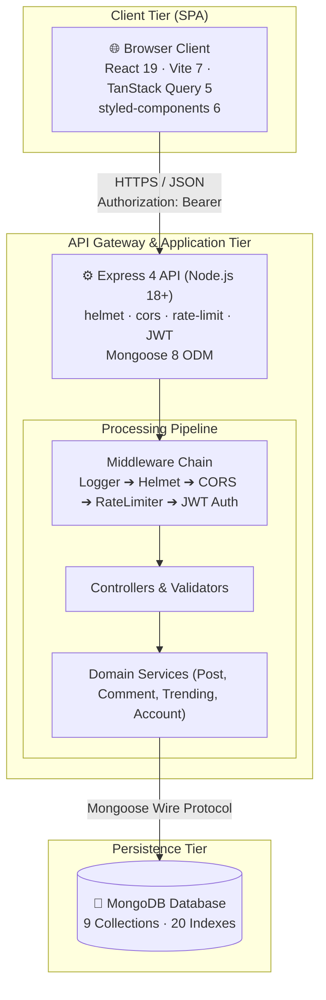
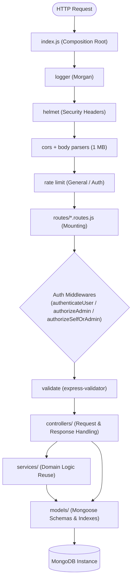
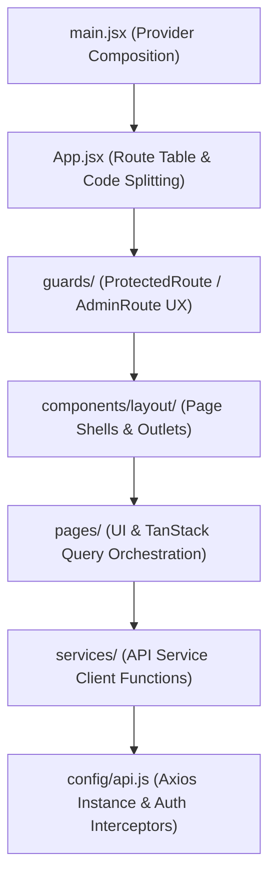

# Architecture Overview

> **Scope:** the repository as a whole — system shape, annotated tree, workspace boundaries,
> module responsibilities and the dependency rules between them.
> **Excludes:** the internals of each side ([frontend.md](frontend.md),
> [backend.md](backend.md), [database.md](../reference/database.md)) and file-placement conventions
> ([guides/development.md](../guides/development.md)).

---

## System shape

A **three-tier application in a single repository** with two independently installed
workspaces.



There is **no root `package.json`** and no workspace manager. `backend/` and `client/` are
installed and scripted separately.

---

## Repository tree

```
bloghub/
│
├── backend/                       # Express API · CommonJS
│   ├── config/
│   │   ├── db.js                  # Mongoose connection, events, graceful shutdown
│   │   └── env.js                 # boot-time configuration validation
│   ├── controllers/               # 12 modules — request/response only
│   ├── middlewares/
│   │   ├── authenticateUser.js    # JWT verification + account check, optional auth, admin gate
│   │   ├── authorizeSelfOrAdmin.js# scopes a :userId route to its owner
│   │   ├── asyncHandler.js        # routes a rejected promise to the error middleware
│   │   ├── validate.js            # terminates a validator chain; validateObjectId
│   │   ├── upload.js              # avatar upload — memory storage, type and size limits
│   │   ├── errorHandler.js        # terminal error middleware, maps errors to statuses
│   │   └── logger.js              # morgan, format switched by NODE_ENV
│   ├── models/                    # 9 Mongoose schemas, 20 declared indexes
│   ├── routes/                    # 11 routers — paths, guards, validators, nothing else
│   ├── services/                  # domain logic reused across controllers:
│   │   │                          #   postService, commentService,
│   │   │                          #   accountService (purge), trendingService (scoring)
│   ├── utils/                     # AppError, regex escaping, visitor keying
│   ├── validators/                # express-validator chains, one module per area
│   ├── tests/                     # 10 suites, jest + supertest against in-memory MongoDB
│   ├── scripts/
│   │   ├── seed.js                # sample dataset, guarded against remote targets
│   │   └── migrate.js             # non-destructive repair of an existing database
│   ├── index.js                   # composition root
│   └── package.json
│
├── client/                        # React SPA · ES modules
│   ├── public/screenshots/
│   ├── src/
│   │   ├── components/
│   │   │   ├── layout/            # Header, Footer, Layout, AdminLayout,
│   │   │   │                      #   WorkspaceLayout, PageShell, Editorial,
│   │   │   │                      #   ThemeToggle, SkipLink, ErrorBoundary
│   │   │   ├── marketing/         # HeroIllustration, Topics (TopicMarquee) — landing only
│   │   │   ├── posts/             # PostCard, AuthorByline, skeletons
│   │   │   ├── stats/             # ReadRateBar
│   │   │   └── ui/                # 21 token-driven primitives + barrel
│   │   ├── config/
│   │   │   ├── api.js             # the single Axios instance, interceptors, avatarUrl
│   │   │   └── markdown.js        # sanitisation schema, deferred highlighting loader
│   │   ├── context/AuthContext.jsx# authState singleton + provider + hook
│   │   ├── guards/                # ProtectedRoute, AdminRoute
│   │   ├── hooks/                 # useCurrentUser, useTags, useDebounced,
│   │   │                          #   useDraftRecovery, useReading
│   │   ├── pages/                 # 12 pages + admin/ (6) + auth/ (shell)
│   │   ├── services/              # 10 API clients + queryKeys.js (cache key registry)
│   │   ├── styles/                # ThemeProvider + theme/ (tokens, mixins, light, dark)
│   │   ├── test/                  # render helper + vitest setup (helpers, not tests)
│   │   ├── utils/                 # text helpers, topic icon map
│   │   ├── App.jsx                # route table, lazy loading
│   │   └── main.jsx               # provider tree
│   ├── eslint.config.js
│   ├── index.html
│   ├── jsconfig.json              # editor support; no tsconfig — the project is all JS
│   ├── vite.config.js             # dev proxy, manual chunks, vitest config
│   └── package.json
│
├── docs/
├── .github/workflows/ci.yml       # lint · format · test · build · audit
├── .gitattributes                 # `* text=auto eol=lf` — keeps CRLF out of the tree
├── .env                           # local secrets — git-ignored
├── .env.example
├── LICENSE
├── README.md
└── vercel.json
```

---

## Workspace boundaries

| Property      | `backend/`                   | `client/`                           |
| ------------- | ---------------------------- | ----------------------------------- |
| Module system | CommonJS                     | ES modules                          |
| Language      | JavaScript                   | JavaScript + JSX                    |
| Runtime       | Node.js 18+                  | Browser                             |
| Entry point   | `index.js`                   | `src/main.jsx`                      |
| Build step    | None                         | Vite → `client/dist`                |
| Install       | `cd backend && npm install`  | `cd client && npm install`          |
| Test runner   | Jest + Supertest (125 tests) | Vitest + Testing Library (73 tests) |

The two share no code. Their only contract is the HTTP API
([reference/api.md](../reference/api.md)).

---



Detail in [backend.md](backend.md).

## Frontend layers



Detail in [frontend.md](frontend.md).

---

## Dependency rules

The invariants that keep the layering meaningful. A pull request that breaks one should be
sent back.

**Backend**

1. `routes/` may import `controllers/` and `middlewares/` — never `models/`.
2. `controllers/` may import `services/` and `models/` — never `routes/`.
3. `services/` may import `models/` — never `req`/`res`.
4. `models/` import only `mongoose`.
5. Only `index.js`, `config/*` and the auth code read `process.env`.

**Frontend**

1. `pages/` may import `services/`, `components/`, `context/`, `styles/`.
2. `components/ui/` imports only styled-components and other primitives.
3. `services/` import only `config/api`.
4. Only `config/api.js` constructs an Axios instance.
5. Nothing imports from `pages/` except `App.jsx`.

---

## Configuration files

| File                    | Consumed by     | Purpose                                          |
| ----------------------- | --------------- | ------------------------------------------------ |
| `.env`                  | Both workspaces | Local configuration; git-ignored                 |
| `.env.example`          | Humans          | Committed template                               |
| `vercel.json`           | Vercel          | Two builds, API routing, SPA fallback            |
| `client/vite.config.js` | Vite            | Port 3000, `envDir: '../'`, manual chunks        |
| `client/jsconfig.json`  | Editors         | JSX hints. There is no `tsconfig.json`           |
| `*/eslint.config.js`    | ESLint 9        | Flat config per workspace                        |
| `*/.prettierrc`         | Prettier        | Formatting per workspace                         |

Both workspaces read the **single root `.env`** — the backend resolves it explicitly, Vite is
pointed at it with `envDir: '../'`. Reference:
[reference/configuration.md](../reference/configuration.md).

---

## Known structural weaknesses

Honest list. Each is a deliberate trade-off or an open item, not an oversight.

| Observation                                 | Consequence                                                                                                                                            |
| ------------------------------------------- | ------------------------------------------------------------------------------------------------------------------------------------------------------ |
| No root `package.json`                      | Every command runs from a subdirectory; CI installs twice                                                                                              |
| `services/` covers four of twelve resources | The rest of the controllers talk to models directly, so the layer is a convention applied where logic is shared, not a rule                            |
| Page components run 400–1,000+ lines        | Styled components are co-located with page logic; the largest files are hard to review                                                                 |
| Avatars are stored in MongoDB               | Fine at a 2 MB cap and now served with an ETag, but object storage is the right home ([GAP-17](../product/roadmap.md#gap-17))                          |
| `syntax-highlight` is 225 kB gzipped        | The largest chunk in the build. Loaded only for a post containing code; shrinking it means registering a shortlist of languages instead of all of them |
| Partial client coverage                     | 125 backend and 73 client tests in CI; the editor and the creator workspace are still uncovered ([GAP-11](../product/roadmap.md#gap-11))               |
| No branch protection                        | CI reports on every push but nothing requires it to pass                                                                                               |

### Closed since the last revision

| Was                                                       | Now                                                                                            |
| --------------------------------------------------------- | ---------------------------------------------------------------------------------------------- |
| Router mounted at both `/` and `/api`                     | Mounted once, at `/api`                                                                        |
| `tsconfig.json` alongside `jsconfig.json`                 | `tsconfig.json` removed — the project has no TypeScript, and it shadowed `jsconfig.json`       |
| An `@/*` alias declared but unresolvable                  | Removed rather than wired; every import is relative                                            |
| Five controllers catching errors locally                  | All twelve use `asyncHandler`; a local `catch` now only appears where an error is _translated_ |
| Cache keys written as literals at each call site          | One registry in `services/queryKeys.js`                                                        |
| The tag query duplicated across five files                | One `useTags` hook                                                                             |
| `seed.js` at the backend root, `migrate.js` in `scripts/` | Both in `scripts/`                                                                             |
| `likes.routes.js` / `page-views.routes.js`                | Renamed to match their controllers — every pair is now `<resource>.<layer>.js`                 |
