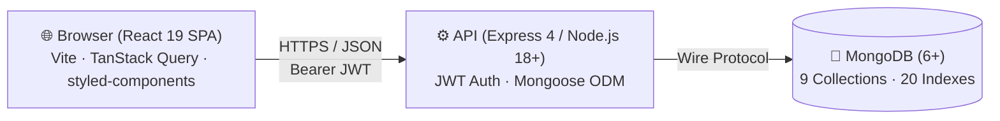
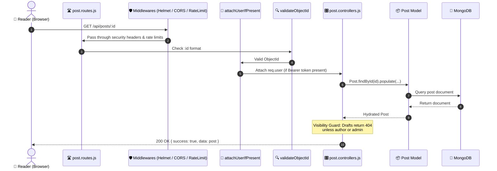
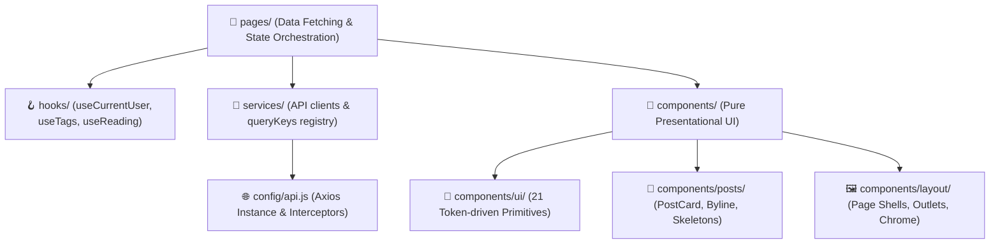

# Walkthrough

> **Scope:** the short version — what the system is, how it is layered, and the rules that
> decide where any given file goes. Written to be read top to bottom in about five minutes,
> or talked through out loud.
> **Excludes:** per-file detail ([overview.md](overview.md)), the internals of each side
> ([frontend.md](frontend.md), [backend.md](backend.md)).

---

## In one paragraph

BlogHub is a blogging platform built around read-through rate rather than page views — the
question it answers is not "how many people opened this" but "how many finished it". It is a
**React single-page application** talking to an **Express REST API** over JSON, backed by
**MongoDB**. One repository, two independently installed workspaces, one CI pipeline. About
200 automated tests, and a documented reason for every structural decision below.

---

## The three tiers

**Why a SPA and not server rendering.** The reading experience is the product, and most of
the surface is authenticated and interactive — an editor, a workspace, an admin console. SEO
on public posts is the cost, and it is [tracked as an open
gap](../product/roadmap.md#gap-16) rather than pretended away.

---

## Request path, end to end

Following one request tells you most of the architecture. A reader opens a story:

Every layer has one job, and the boundary is enforceable by reading a file: a route with an
`if` in it, or a controller with a `try`/`catch` that swallows, is out of place.

---

## Backend layers

| Layer          | Answers                                  | Never does                         |
| -------------- | ---------------------------------------- | ---------------------------------- |
| `routes/`      | What path, behind which guards           | Business logic                     |
| `middlewares/` | Who is asking, is the input well-formed  | Know about a specific resource     |
| `controllers/` | Read the request, shape the response     | Catch errors it is not translating |
| `services/`    | Logic shared by more than one controller | Touch `req` or `res`               |
| `models/`      | Shape, constraints and indexes           | Contain application rules          |
| `validators/`  | Is this input acceptable                 | Query the database                 |
| `utils/`       | Pure helpers with no I/O                 | Import a model                     |

**Errors travel by throwing.** `AppError` carries the status; `asyncHandler` forwards the
rejection; `errorHandler` maps it — including Mongoose's `CastError`, `ValidationError` and
duplicate-key errors, so a caller's typo reports as 400 and a genuine fault as 500. All twelve
controllers work this way. A local `catch` appears only where an error is being _translated_
rather than swallowed — verifying a token, or turning a duplicate-key collision into a 409.

**`services/` is applied, not mandated.** Four exist — post creation and slug resolution,
comment linking, account purge, trending scoring — because each is used by more than one
caller or is genuinely intricate. A controller that only reads one collection calls the model
directly rather than being wrapped for symmetry's sake.

---

## Frontend layers

**One rule decides most placements:** _does it fetch?_ Pages fetch. Components render what
they are given. The two exceptions are layout components rendered on every page — the header
and footer — which fetch through a shared hook so they cost no extra request.

**No component calls `axios`.** Every request goes through `services/`, which is the only
place a URL appears. That is what made the frontend-to-backend audit mechanical: one script
could match every service method against every route.

**Cache keys live in one file.** `services/queryKeys.js`. Keys used to be string literals at
each call site, and a key is only useful if two places spell it identically — a typo would not
throw, it would silently leave the header showing a stale name after a save.

---

## Naming, so you can find anything

| Where                                                             | Pattern                 | Example                    |
| ----------------------------------------------------------------- | ----------------------- | -------------------------- |
| Backend resource layers (routes, controllers, models, validators) | `<resource>.<layer>.js` | `post.controllers.js`      |
| Backend helpers (services, middlewares, utils, config)            | `camelCase.js`          | `trendingService.js`       |
| React components                                                  | `PascalCase.jsx`        | `PostCard.jsx`             |
| Hooks, services, utilities                                        | `camelCase.js`          | `useCurrentUser.js`        |
| Tests                                                             | beside what they test   | `text.js` → `text.test.js` |

Every backend route file has a controller of the same name. That was not true of two of them
until recently, which is exactly the kind of drift the convention exists to prevent.

---

## Where the interesting decisions are

Things worth being asked about, and the short answer to each:

**Sessions are revocable.** JWTs are stateless, so signing out normally only makes the browser
forget. Every account carries a `tokenVersion` that both tokens are stamped with and every
request checks — so sign-out, a password change, or an administrator suspending an account
invalidates existing tokens immediately rather than at expiry. Refresh tokens are signed with
a separate secret and carry a `type` claim, so one can never be presented as the other.

**Trending is explainable.** `views + likes×3 + comments×5 + finished reads×5`, over a 14-day
window, with a minimum-views floor. When too little has happened to rank anything it returns
the newest posts and _says so_ (`trendedBy: 'latest'`) rather than calling them trending.

**View counts are de-duplicated.** Tracking is open to anonymous readers, so a visitor key —
account id when signed in, a salted hash of the address when not — folds repeat requests
inside a six-hour window. Without it, holding down refresh would make every figure meaningless.

**Reading a post does not download the editor.** The renderer and the editor are separate
chunks, and syntax highlighting is fetched only for a post that contains code. That is a
66% cut on the core action — the numbers are in [frontend.md](frontend.md#chunk-budget).

**Avatars are a resource, not a payload.** Served with an ETag from their own endpoint instead
of base64-encoded into a JSON response the header requests on every page.

---

## What is deliberately not built

Naming these is more useful than being asked and having to think:

- **Password reset and email verification** — both need an email provider; neither is stubbed
  out pretending to work.
- **Two-factor authentication** — the endpoint exists and answers **501**, because it
  previously accepted the payload, silently discarded it, and reported success.
- **Notifications, image CDN, SEO metadata, a real audit log** — all tracked in
  [the roadmap](../product/roadmap.md) with a priority.

---

## Verification

| Command                      | What it proves                                           |
| ---------------------------- | -------------------------------------------------------- |
| `cd backend && npm test`     | 125 integration tests over a real in-process MongoDB     |
| `cd client && npm test`      | 73 tests: services, interceptors, helpers, admin screens |
| `cd client && npm run build` | The bundle compiles, and its chunk budget                |
| `.github/workflows/ci.yml`   | All of the above on every push and pull request          |

The backend tests are integration tests on purpose: they drive the real Express app through
Supertest and assert against the real database, so schema constraints, unique indexes and
ownership queries are covered rather than mocked past.
