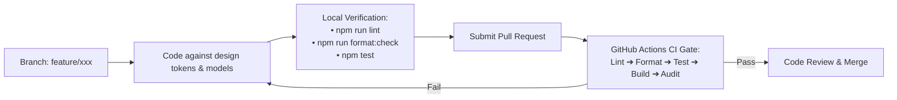

# Conventions

> **Scope:** where a new file belongs, how to write the code inside it, how to work within the
> design language, and how it all gets reviewed. Merges what were separate folder-structure, coding-standards and code-review
> documents, because a review checklist that restates the standards is duplication.
> **Excludes:** the repository tree
> ([architecture/overview.md](../architecture/overview.md)), tool configuration
> ([code-quality.md](code-quality.md)), API contract rules
> ([reference/api.md](../reference/api.md)), and the design vocabulary itself
> ([reference/design-system.md](../reference/design-system.md)).

Formatting is not a matter of opinion here — Prettier decides it, and it is never a review
comment.



---

# Part 1 — Where files go

## Backend

| You are adding                   | Location               | File name                      | Export                                                                                 |
| -------------------------------- | ---------------------- | ------------------------------ | -------------------------------------------------------------------------------------- |
| A collection                     | `backend/models/`      | `<resource>.model.js`          | `mongoose.model('Name', Schema)`                                                       |
| Handlers for a resource          | `backend/controllers/` | `<resource>.controllers.js`    | Named `exports.<action>`                                                               |
| Paths for a resource             | `backend/routes/`      | `<resource>.routes.js`         | The `router`                                                                           |
| Multi-step or reused persistence | `backend/services/`    | `<resource>Service.js`         | Named async functions                                                                  |
| Something on every request       | `backend/middlewares/` | `<concern>.js`                 | The middleware function                                                                |
| A validation rule set            | `backend/validators/`  | `<area>.validators.js`         | Named arrays of `express-validator` chains, or a factory when create and update differ |
| Infrastructure wiring            | `backend/config/`      | `<concern>.js`                 | Named setup functions                                                                  |
| A test                           | `backend/tests/`       | `<area>.test.js`               | —                                                                                      |
| A one-off script                 | `backend/scripts/`     | `<verb>.js` + a package script | —                                                                                      |

New resources are registered in `index.js`:

```js
router.use("/widgets", widgetRoutes);
```

**Naming:** models, controllers and routes are singular (`post.model.js`,
`post.controllers.js`, `post.routes.js`); multi-word resources are kebab-case
(`page-view.controllers.js`); services are camelCase (`postService.js`); model names are
singular PascalCase.

> Existing exceptions: `likes.routes.js` is plural, and `commentServices.js` is plural while
> `postService.js` is singular. Follow the convention for new files; do not propagate the
> exceptions.

## Frontend

| You are adding              | Location                          | File name              | Export                          |
| --------------------------- | --------------------------------- | ---------------------- | ------------------------------- |
| A route-level screen        | `client/src/pages/`               | `<Name>.jsx`           | Named                           |
| An admin screen             | `client/src/pages/admin/`         | `<Name>.jsx`           | Named, `Admin` prefix           |
| A generic primitive         | `client/src/components/ui/`       | `<Name>.jsx`           | Named + add to `index.js`       |
| A domain component          | `client/src/components/<domain>/` | `<Name>.jsx`           | Named                           |
| Page chrome or a shell      | `client/src/components/layout/`   | `<Name>.jsx`           | Named                           |
| A route access rule         | `client/src/guards/`              | `<Name>Route.jsx`      | Named                           |
| Calls to a backend resource | `client/src/services/`            | `<resource>Service.js` | Named object of async functions |
| Global client state         | `client/src/context/`             | `<Name>Context.jsx`    | Provider + `use<Name>` hook     |
| A design token              | `client/src/styles/theme/`        | existing files         | Named                           |
| A reusable hook             | `client/src/hooks/`               | `use<Name>.js`         | Named                           |
| A pure helper               | `client/src/utils/`               | `<domain>.js`          | Named                           |

`hooks/` and `utils/` now exist (`useDebounced`, `useDraftRecovery`, `useCurrentUser`,
`useReading`; `text.js`). The rule that created them still applies: extract at the **second**
consumer, not the first.

**Naming:** components are PascalCase `.jsx` with named exports; non-component modules are
camelCase `.js`; hooks take a `use` prefix; boolean props take `is`/`has`; styling props take
a `$` prefix. `App.jsx` is the only default export, because `React.lazy` requires one.

## Which component tier?

```
Is it a whole screen behind a route?      → pages/
Does it wrap the page (header, sidebar)?  → components/layout/
Does it know a domain concept?            → components/<domain>/
Generic, styling-only, reusable anywhere? → components/ui/ + export from index.js
```

The test is **what the component is allowed to know**. `StatTile` is a primitive: a label, a
number, an optional trend, and no opinion about whether the number is views or users.
`ReadRateBar` is a domain component: it knows what a read rate is and what counts as a good one.
Both appear on the workspace dashboard; only one would make sense in a different product.

Before writing a new primitive, check `components/ui/index.js` — there are 21, and the ones that
are interactive wrap Radix so keyboard and screen-reader behaviour comes for free.

The tier determines what the file may import:

| Tier        | May import                          | Must never import                             |
| ----------- | ----------------------------------- | --------------------------------------------- |
| `ui/`       | styled-components, other primitives | services, context, router, any domain concept |
| `<domain>/` | `ui/`, router links, formatting     | services — data arrives as props              |
| `layout/`   | `ui/`, `context/`, router           | page components                               |
| `pages/`    | everything above, plus `services/`  | another page                                  |

A primitive that needs to fetch is not a primitive.

## Where things must not go

| Temptation                           | Why not                                              | Instead                                         |
| ------------------------------------ | ---------------------------------------------------- | ----------------------------------------------- |
| Logic in `routes/`                   | Routes are a wiring table; logic there is untestable | `controllers/` or `services/`                   |
| `req`/`res` in `services/`           | Couples persistence to HTTP                          | Plain values in and out; throw on failure       |
| A direct `axios` call in a component | Bypasses the auth and refresh interceptors           | Add a service function                          |
| A raw hex or px value in a page      | Breaks theming and both-mode support                 | A theme token                                   |
| A shared component in `pages/`       | Nothing but `App.jsx` may import a page              | `components/` at the right tier                 |
| A `.env` inside a workspace          | Both read the root `.env`                            | Add the key to the root file and `.env.example` |
| A second Axios instance              | Two auth paths, two refresh behaviours               | `client/src/config/api.js`                      |

## Design language

The vocabulary itself — tokens, colour roles, the primitive catalogue, typography, iconography
— is reference material and lives in
[reference/design-system.md](../reference/design-system.md). What follows is how to work
within it.

### Adding to it

**A token** — add to `tokens.js` (mode-independent) or to _both_ theme files (mode-dependent).
A key in only one theme is an undefined value in the other.

**A primitive** — `components/ui/<Name>.jsx`, named export, add to `index.js`, document its
props above it.

**A variant** — extend the variant map inside the component, never at the call site.

**When to promote** — a one-off stays a local styled component in the file that needs it, built
from tokens. It moves into `ui/` on the **second** use. Promoting on the first produces
primitives shaped around a single caller.

**Never** — inline a raw colour, spacing value, radius, icon size or z-index in a page or
component.

### Known drift

The honest state, so nobody assumes a clean slate. None of it blocks; all of it is what the
checklist exists to stop growing.

| Drift                                                   | Count | Note                                                                                                                                                                   |
| ------------------------------------------------------- | ----- | ---------------------------------------------------------------------------------------------------------------------------------------------------------------------- |
| Inline `style={{}}` for layout, with raw px             | 75    | Mostly `marginTop` and one-off flex rows. `Container.jsx` exports `Flex` and `Box` that do this properly and are still used **zero** times                             |
| Raw px in `gap` / `padding` / `margin` in styled blocks | 118   | Should be `theme.spacing.*`                                                                                                                                            |
| Raw `font-size`                                         | 25    | Against 184 correct uses of the type mixins — 88% adoption                                                                                                             |
| `density` tokens                                        | 1     | Only `Select` reads them, so the "two rhythms" idea is a token, not a system. Applying it means threading a density prop through the table, row and control primitives |

**Closed so far:** every hardcoded hex outside `ErrorBoundary` and the hero illustration now
resolves to a token; the two `Editorial` gradients became `gradients.brand` and a new
`gradients.inkDeep`; all **55** ad-hoc `size={n}` icon props moved onto the five-step scale
(they were spread across nine values — 10, 12, 13, 14, 15, 16, 17, 18, 36); the twelve copies
of the dialog action row became `Modal.Footer`; and three claims that the code had long since
contradicted — the accent colour, the icon sizing rule and the density presets — were
corrected rather than left to mislead.

**Still open, and why:** the remaining 75 inline styles and 118 raw spacing values are
mechanical but touch a large surface with no visual change to show for it, so they are worth
doing in a pass of their own rather than folded into unrelated work. Nothing on the list is a
defect; each is a place where a future edit could drift further.

Highest-value item if you are picking one up: `Flex`/`Box` exported and unused while 75 inline
styles do the same job. It is also the most mechanical.

### For an agent working in this repository

**Do not invent a value.** Every colour, space, radius, icon size, shadow and duration already
exists in `client/src/styles/theme/`. If you are about to type a number or a hex, find the
token instead. If none fits, say so — that is a design decision and it belongs to a person, not
to a plausible-looking guess.

**Do not invent a component.** Check the primitive catalogue first. A hand-rolled dropdown or
dialog will be missing focus management and ARIA that `ui/` already has, and it will not look
like the rest of the application.

**Do not invent data.** This applies to the visual layer as much as the API layer: no
placeholder counts, no sample usernames, no fake chart values, no hardcoded "popular topics".
If a screen needs data no endpoint provides, that is a gap to report, not to fill with text
that looks real. The footer's topic list, the landing marquee and several admin figures were
each fixed for exactly this reason — all three displayed invented content convincingly enough
that nobody noticed.

**Match the file you are in.** Comment density, naming and structure vary by area; the
surrounding code is the specification.

**When a rule and the surrounding code disagree,** the rule wins for new code, and the
disagreement is recorded in [Known drift](#known-drift) rather than spread further.

---

## Import order

Separate groups with a blank line:

```js
// 1. external packages
// 2. internal modules — services, context, config
// 3. components
// 4. styles and assets
```

Backend files follow the same idea with `require`: packages, models, services, middleware.

---

# Part 2 — How to write it

## JavaScript

| Rule          | Detail                                                                        |
| ------------- | ----------------------------------------------------------------------------- |
| Module system | CommonJS in `backend/`, ES modules in `client/`. Never mix within a workspace |
| Declarations  | `const` by default, `let` when reassignment is real, never `var`              |
| Async         | `async`/`await`; no raw `.then()` chains in new code                          |
| Equality      | `===` and `!==` always                                                        |
| Strings       | Single quotes; template literals for interpolation                            |

### Preferred idioms

```js
const { postId, message } = req.body;                      // destructure at the top
const username = post.user?.username ?? 'Anonymous';       // optional chaining
if (!post) return res.status(404).json({ ... });           // early return
const [posts, total] = await Promise.all([...]);           // parallelise
```

### Avoid

```js
// ✗ an unawaited async map — the handler returns before the writes land
categories.map(async (cat) => { await Category.findOne({ name: cat }); });
// ✓
await Promise.all(categories.map(async (cat) => { … }));

// ✗ a defensive chain that hides a real contract
const userId = req.user ? req.user.id || req.user._id || req.user : null;
// ✓ authenticateUser guarantees the shape
const userId = req.user.id;

// ✗ writing a field the schema does not declare — Mongoose discards it silently
await UserSettings.updateOne({ user }, { theme: 'dark' });   // if theme is undeclared
```

The first two shipped as real defects ([BUG-11](../product/roadmap.md#bug-11)); the third was
the root cause of [BUG-05](../product/roadmap.md#bug-05).

## Backend shapes

### Controller

```js
exports.getPost = async (req, res) => {
  try {
    const post = await Post.findById(req.params.id).populate(
      "user",
      "username",
    );

    if (!post) {
      return res
        .status(404)
        .json({ success: false, message: "Post not found", error: "NotFound" });
    }

    return res
      .status(200)
      .json({ success: true, message: "Post found", data: post });
  } catch (error) {
    console.error("[getPost]", error);
    return res
      .status(500)
      .json({ success: false, message: "An internal error occurred" });
  }
};
```

One exported function per endpoint. Always `return` the response call. Identity is
`req.user.id`. Choose the specific status code. Never leak an internal message. Prefix the
log with the handler name.

### Service

```js
exports.createPost = async (
  userId,
  { title, slug, content, imageURL, visibility },
) => {
  if (!userId) throw new Error("userId is required");
  const post = await Post.create({
    user: userId,
    title,
    slug,
    content,
    imageURL,
    visibility,
  });
  await User.updateOne({ _id: userId }, { $push: { posts: post._id } });
  return post;
};
```

Plain values in and out; never touch `req` or `res`; throw on failure.

### Model

```js
const PostSchema = new mongoose.Schema(
  {
    user: { type: mongoose.Schema.Types.ObjectId, ref: "User", required: true },
    title: { type: String, required: true, trim: true },
    visibility: {
      type: String,
      enum: ["draft", "private", "public"],
      default: "draft",
    },
  },
  { timestamps: true },
);

PostSchema.index({ visibility: 1, createdAt: -1 });
```

Always `timestamps`. Constraints in the schema, not only the controller. **Declare every
field the application writes.** Declare every index the queries need.

## Frontend shapes

```jsx
export function PostList() {
  const [filter, setFilter] = useState("all");

  const { data, isLoading, error } = useQuery({
    queryKey: ["posts"],
    queryFn: () => postService.getPosts(),
  });

  if (isLoading) return <Loading text="Loading posts…" />;
  if (error) return <Card>Could not load posts.</Card>;

  const posts = data?.data ?? [];
  if (posts.length === 0) return <Card>No posts yet.</Card>;

  return <PageWrapper>{/* … */}</PageWrapper>;
}
```

Order: hooks → derived values → handlers → early returns → JSX.

Rules: function components with hooks (`ErrorBoundary` is the only class, and that is a React
constraint); named exports; loading, error and empty handled explicitly in that order; styled
components at module scope, never inside the component; transient `$` props; stable list keys;
clean up every subscription and timer.

### Data fetching

```jsx
const mutation = useMutation({
  mutationFn: postService.createPost,
  onSuccess: () => {
    toast.success("Post created");
    queryClient.invalidateQueries({ queryKey: ["posts"] });
  },
  onError: (error) =>
    toast.error(error.response?.data?.message ?? "Something went wrong"),
});
```

Never `useEffect` + `useState` for server data. Key by resource then identifier. Guard
dependent queries with `enabled`. Always define `onError`.

## Naming

| Kind                 | Convention              | Example                   |
| -------------------- | ----------------------- | ------------------------- |
| Variable, function   | camelCase               | `postCount`, `createPost` |
| Component, model     | PascalCase              | `PostCard`, `UserProfile` |
| Constant             | SCREAMING_SNAKE_CASE    | `AUTH_STORAGE_KEY`        |
| Boolean              | `is` / `has` / `should` | `isLoading`               |
| Handler              | `handle` prefix         | `handleSubmit`            |
| Handler prop         | `on` prefix             | `onToggle`                |
| Environment variable | SCREAMING_SNAKE_CASE    | `JWT_SECRET`              |

Say what a thing is. `data`, `info`, `obj`, `temp` are not names.

## Comments

Comment the **why**, never the **what**.

```js
// ✓
// Escape regex metacharacters — an unescaped query lets a user build a catastrophically
// backtracking pattern and stall the event loop.
const sanitized = query.replace(/[.*+?^${}()|[\]\\]/g, "\\$&");
```

Delete commented-out code. Tag deliberate temporary work as `// TODO(BUG-01): …`.

## Security practice

- The acting user comes from the verified token, never from the request.
- Authorise the resource, not just the request.
- Validate and constrain every input reaching a query.
- Project queries — no password hash, no private email in a public payload.
- No secret in source, logs or the client bundle. `VITE_`-prefixed values ship to the browser.
- Escape anything interpolated into a regex.

---

# Part 3 — Review

## Author responsibilities

1. Self-review the diff in the pull request view.
2. Run the checks:
   ```bash
   cd backend && npm run lint && npm run format:check
   cd ../client && npm run lint && npm run format:check && npm run build
   ```
3. Keep it focused — one concern per pull request; formatting-only changes go separately.
4. Say **how you verified it**. "Should work" is not verification.
5. Update the owning document — see the [SSOT map](../README.md#single-source-of-truth).

| Lines changed | Expectation                                                       |
| ------------- | ----------------------------------------------------------------- |
| < 100         | Ideal                                                             |
| 100–400       | Fine with a clear description                                     |
| > 400         | Split it, unless it is a move or a reformat — say so in the title |

## Reviewer responsibilities

Turnaround within one working day. Prefix every comment by severity:

| Prefix        | Meaning                  | Blocks         |
| ------------- | ------------------------ | -------------- |
| `blocking:`   | Must change before merge | Yes            |
| `question:`   | Needs clarification      | Until answered |
| `suggestion:` | Better, but your call    | No             |
| `nit:`        | Trivial preference       | No             |
| `praise:`     | This is good — say so    | No             |

Approving with outstanding `suggestion:` and `nit:` comments is normal.

## Checklist

Correctness first — style is already automated.

**Correctness**

- [ ] Does it do what the description says?
- [ ] Are not-found, unauthorised, empty and network-error paths handled?
- [ ] Is every async operation awaited? Any unawaited `map(async …)`?

**Security** — anything here is `blocking:` by default

- [ ] Acting user from `req.user`, never from the body or a path parameter?
- [ ] Should the route be authenticated?
- [ ] Is resource **ownership** checked, not just authentication?
- [ ] Is a `:userId` parameter scoped with `authorizeSelfOrAdmin`?
- [ ] Are queries projected — no hash, no private email?
- [ ] Is anything interpolated into a regex escaped?

**Data**

- [ ] Does a new query path have an index?
- [ ] Are new schema fields **declared**? Mongoose drops undeclared fields silently
- [ ] Are list endpoints paginated with a capped limit?
- [ ] Do denormalised fields stay consistent, and what if one write fails?
- [ ] Any N+1 queries in a loop?

**API contract**

- [ ] Correct status code — 404 missing, 403 forbidden, 409 conflict, 501 unimplemented?
- [ ] Does the response use the envelope?
- [ ] Is [reference/api.md](../reference/api.md) updated?

**Frontend**

- [ ] Loading, error and empty states handled with `Skeleton` / `EmptyState` / `ErrorState`?
- [ ] Server state in React Query rather than `useState` + `useEffect`?
- [ ] Do mutations invalidate what they changed?
- [ ] All values from theme tokens — no raw colour, spacing, icon size or z-index?
- [ ] Icons sized from `theme.iconSize.*` in CSS, not a `size={n}` prop?
- [ ] Anything clickable at `radii.full`; cards and panels at `lg` / `xl`?
- [ ] Behaviour — opening, focus, selection — from a Radix-backed primitive, never hand-rolled?
- [ ] Works in both themes and at 375px, 768px and 1440px?
- [ ] Keyboard operable with a visible focus ring?
- [ ] Accessible names present — a visible label passed as `label`, icon-only as `aria-label`?
- [ ] Styling props `$`-prefixed transient props?
- [ ] Nothing on screen invented — no placeholder counts, sample names or fake values?
- [ ] Stable list keys?

**Architecture**

- [ ] Right layer — see [dependency rules](../architecture/overview.md#dependency-rules)
- [ ] Does a service touch `req`/`res`? Does a `ui/` primitive fetch?
- [ ] Is duplicated logic on its _second_ occurrence, not a speculative first?

**Maintainability**

- [ ] Do names say what things are?
- [ ] Comments explain _why_?
- [ ] No commented-out code, no stray `console.log`, no dead exports?
- [ ] TODOs tagged with a tracking ID?

## What blocks a merge

**Always** — a security defect; silent data loss; a breaking API change with no migration
path; committed secrets; failing lint, format or build; the acting user read from
client-supplied input.

**By default, negotiable with a written reason** — no index on a new query path; an
unpaginated list endpoint; a missing UI error state; documentation not updated.

**Never** — naming preferences; formatting; alternative approaches of equal merit; work
explicitly deferred and tracked with an ID.

## Special cases

| Change                          | Extra scrutiny                                                                                                        |
| ------------------------------- | --------------------------------------------------------------------------------------------------------------------- |
| Authentication or authorisation | Two reviewers; trace every attacker path                                                                              |
| Schema change                   | Migration for existing documents; index implications. **Adding a unique index to a collection with duplicates fails** |
| Dependency addition             | Needed? Maintained? Bundle cost? Duplicates something installed?                                                      |
| Deployment or `vercel.json`     | Rollback plan; verify on a preview deployment                                                                         |
| Reformat                        | Verify the diff is _only_ formatting; add the SHA to `.git-blame-ignore-revs`                                         |
| Documentation                   | Check the [SSOT map](../README.md#single-source-of-truth) for duplication                                             |

---

## Git

### Commit messages

```
<type>(<scope>): <subject>
```

`feat` · `fix` · `refactor` · `perf` · `style` · `docs` · `test` · `build` · `chore`

Imperative, lowercase, no trailing period, reference the tracking ID:

```
fix(posts): persist visibility on create and update (BUG-01)
feat(auth): add password reset flow (GAP-01)
```

### Branches

```
feature/<short-description>
fix/<short-description>
docs/<short-description>
```

---

## Definition of done

- [ ] Behaves as specified, including failure paths
- [ ] Loading, empty and error states handled (UI)
- [ ] Correct status codes and the response envelope (API)
- [ ] Indexes added for any new query path
- [ ] No new lint errors; formatting clean
- [ ] No secrets, no stray `console.log`, no commented-out code
- [ ] The owning document updated
- [ ] Self-reviewed against the checklist above
