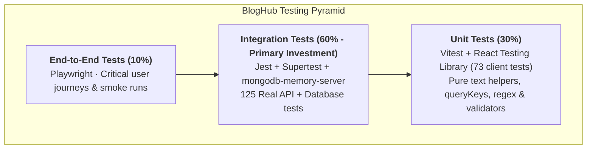
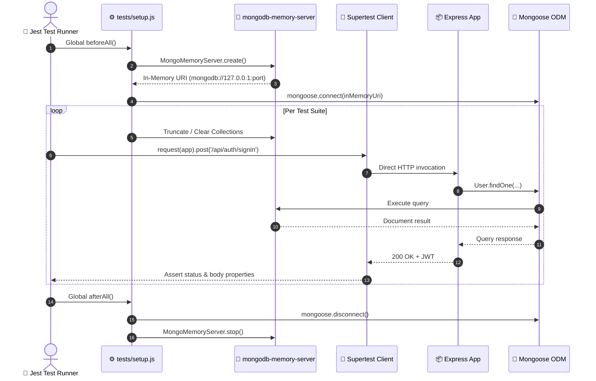

# Testing

> **Scope:** the whole testing story — current state, strategy, tooling, and conventions for
> each level. Merged from four separate documents that each described a different imagined
> suite; what is written here as installed is installed, and what is written as proposed is
> proposed.
> **Excludes:** CI wiring
> ([operations/deployment.md](../operations/deployment.md#part-2--cicd)), lint and format
> ([code-quality.md](code-quality.md)).

---

## Current state

The backend has a working suite: **125 tests across ten files**, run by Jest against a real
MongoDB that `mongodb-memory-server` starts in-process. They are integration tests — Supertest
drives the actual Express app over HTTP and the assertions read the real database — which is
deliberate, and the reason is in [Pyramid](#pyramid) below.

The client has **73 tests** under Vitest in jsdom.

| Workspace  | Runner                                   | Tests | Command    |
| ---------- | ---------------------------------------- | ----- | ---------- |
| `backend/` | Jest + Supertest + mongodb-memory-server | 125   | `npm test` |
| `client/`  | Vitest + Testing Library (jsdom)         | 73    | `npm test` |

| File                 | Tests | Covers                                                                                                      |
| -------------------- | ----- | ----------------------------------------------------------------------------------------------------------- |
| `auth.test.js`       | 9     | Registration, sign-in, refresh, revocation via `tokenVersion`, suspended accounts                           |
| `post.test.js`       | 11    | CRUD, draft visibility, ownership, validation, the slug's unique index                                      |
| `comment.test.js`    | 6     | Posting, ownership on delete, the post's visibility rule, pagination                                        |
| `workspace.test.js`  | 14    | The author's own lists — stories, responses, stats — and their scoping                                      |
| `trending.test.js`   | 10    | The scoring formula, the window, the minimum-views floor, the `latest` fallback                             |
| `admin.test.js`      | 10    | Role checks, suspension, promotion, deletion, the last-admin guard                                          |
| `social.test.js`     | 14    | Likes and their unique index under concurrency, replies and their nesting, following                        |
| `profile.test.js`    | 17    | The public profile endpoint, its privacy rules, and the author-filtered feed                                |
| `discovery.test.js`  | 25    | Search across title, body, tags and authors; view/read de-duplication; the analytics and activity endpoints |
| `moderation.test.js` | 9     | The administrator's listing — visibility filter, title search, paging, visibility counts, bulk actions      |

`--runInBand` matters and is in the script: parallel workers sharing one in-memory MongoDB
interfere with each other. `tests/setup.js` starts and stops the server and truncates
collections between tests; `tests/env.js` supplies the secrets, so no `.env` is needed.

<a id="client"></a>

### Client

| File                   | Tests | Covers                                                                                                                              |
| ---------------------- | ----- | ----------------------------------------------------------------------------------------------------------------------------------- |
| `services.test.js`     | 18    | Every service's URL and parameters, with `api` mocked — the layer where a dropped argument silently changes which record is fetched |
| `api.test.js`          | 10    | The axios interceptors: token attachment, the single refresh-and-replay, and each of the five ways a refresh can fail               |
| `text.test.js`         | 14    | Markdown stripping, excerpts, and both reading-time estimates                                                                       |
| `UserProfile.test.jsx` | 9     | That the profile page asks for the person in the URL rather than the signed-in account, and pages their stories from the server     |
| `admin.test.jsx`       | 22    | Every admin screen — posts moderation, category management, user promotion/suspension, bulk actions                                 |

Two jsdom limits are worth knowing before adding to the admin file. Radix drives its menus
and dialogs from pointer capture, which jsdom does not implement — `src/test/setup.js` stubs
it, and without those stubs a click on a dropdown trigger hangs rather than failing. And
opening a dialog _from_ a dropdown item recurses into a stack overflow, because the menu
returns focus to its trigger while the dialog traps it; that path is deliberately not driven,
and the test that would have covers what it can instead.

`src/test/render.jsx` mounts a screen with the providers `main.jsx` supplies — query client,
auth, theme and a memory router — with retries off and no cache carried between tests, so a
component that fails a request shows its error state on the first attempt.

There is also `smoke.js`-style end-to-end verification worth doing by hand before a release:
boot the real server against an in-process MongoDB and walk the changed flows over HTTP. The
Jest suite drives Express through Supertest, which never opens a socket — a live run is what
caught [BUG-24](../product/roadmap.md#bug-24), where the unit test agreed with the wrong
definition of an edit.

Every one of these runs on each push and pull request — see
[Part 2 · CI/CD](../operations/deployment.md#part-2--cicd).

### What is not covered

Being honest about the gaps matters more than the count:

- **No client tests.** CI lints and builds the client, which catches syntax and import errors
  but nothing about behaviour. The tooling choice below (Vitest + Testing Library) is a
  recommendation, not something installed.
- **No end-to-end tests.** The flows have been driven by hand against a running app, including
  a headless-browser sweep of every page; that verification is not repeatable in CI.
- **Coverage is not enforced.** `npm run test:coverage` reports, but no threshold gates a
  merge.

## Pyramid





| Level       | Share | Count target | Runtime budget |
| ----------- | ----- | ------------ | -------------- |
| Unit        | ~60%  | 120–180      | < 10s          |
| Integration | ~30%  | 50–80        | < 60s          |
| End-to-end  | ~10%  | 8–15         | < 5min         |

**Integration deserves the heaviest early investment.** Nearly every defect in this codebase
lived at the controller-to-database seam — an undeclared schema field, a dropped property, a
wrong status code. Unit tests with mocked models would have proved nothing, because the units
are thin and the mistakes are in how the layers connect.

---

## Tooling

| Level                      | Tool                                    | Rationale                                                                                                                     |
| -------------------------- | --------------------------------------- | ----------------------------------------------------------------------------------------------------------------------------- |
| Backend unit + integration | **Jest** + **Supertest** — _installed_  | The app exports without listening, so Supertest drives it directly                                                            |
| Backend test database      | **mongodb-memory-server** — _installed_ | Real Mongoose semantics in process — essential, since strict-mode field dropping is only observable against a real connection |
| Frontend unit + component  | **Vitest** + **React Testing Library**  | Vitest reuses the existing Vite config                                                                                        |
| API mocking in the client  | **MSW**                                 | Intercepts at the network layer, so `services/` and the Axios interceptors run for real                                       |
| End-to-end                 | **Playwright**                          | Cross-browser, auto-waiting, good tracing                                                                                     |

The backend half of this is already done. What remains is the client:

```bash
cd client
npm install --save-dev vitest @testing-library/react @testing-library/jest-dom \
  @testing-library/user-event jsdom msw

npm install --save-dev --save-exact @playwright/test
npx playwright install --with-deps
```

```jsonc
// backend/package.json — present
"test": "jest --runInBand",
"test:watch": "jest --watch --runInBand",
"test:coverage": "jest --coverage --runInBand"

// client/package.json — proposed
"test": "vitest run",
"test:e2e": "playwright test"
```

`index.js` skips `connectDB()` under `NODE_ENV=test`, so the harness owns the connection and
points Mongoose at the in-memory server instead.

---

## Principles

1. **Test behaviour, not implementation.** A test that breaks on a rename without a behaviour
   change is a liability.
2. **One reason to fail per test.**
3. **Arrange, act, assert** — in that order, visibly separated.
4. **Independent.** No ordering dependency, no shared mutable state.
5. **Deterministic.** Fix the clock, seed randomness, never touch the network. A flaky test
   trains people to ignore failures.
6. **Fast at the bottom.** If the unit suite is slow, nobody runs it.
7. **A bug fix ships with a regression test** named for its tracking ID.

```js
describe('POST /posts', () => {
  it('creates a post with the requested visibility', …);   // behaviour
  it('returns 401 without an access token', …);            // failure path
  it('persists visibility on update (BUG-01)', …);         // regression
});
```

---

## Layout

```
backend/tests/
├── setup.js          in-memory MongoDB, env, per-test cleanup
├── factories.js      makeUser, makeAdmin, tokenFor, makePost
├── unit/
└── integration/

client/src/
├── setupTests.js
├── mocks/handlers.js
├── test/renderWithProviders.jsx
├── services/__tests__/
└── components/ui/__tests__/
```

Backend tests are centralised and mirror the source tree; client tests sit beside the code
they cover.

---

## Unit tests

Exercise one module with collaborators replaced. No network, filesystem or database.

| In scope                                             | Out of scope                           |
| ---------------------------------------------------- | -------------------------------------- |
| `backend/services/` with models mocked               | Anything hitting MongoDB → integration |
| `backend/middlewares/` with faked `req`/`res`        | Full route chains → integration        |
| Pure helpers — slug generation, analytics arithmetic | Controllers → integration              |
| `client/src/services/` with Axios mocked             | Pages that fetch → integration         |
| `client/src/components/ui/` primitives               | Multi-component flows → E2E            |

Rule of thumb: if replacing the collaborator makes the test meaningless, it is not a unit
test.

### Middleware — the easiest high-value target

```js
const mockRes = () => {
  const res = {};
  res.status = jest.fn().mockReturnValue(res);
  res.json = jest.fn().mockReturnValue(res);
  return res;
};

describe("authenticateUser", () => {
  beforeEach(() => {
    process.env.JWT_SECRET = "test-secret";
  });

  it("populates req.user from a valid access token", () => {
    const token = jwt.sign(
      { user: "abc123", roles: ["user"], type: "access" },
      "test-secret",
    );
    const req = { headers: { authorization: `Bearer ${token}` } };
    const next = jest.fn();

    authenticateUser(req, mockRes(), next);

    expect(next).toHaveBeenCalled();
    expect(req.user).toEqual({ id: "abc123", _id: "abc123", roles: ["user"] });
  });

  it("rejects a refresh token (SEC-06)", () => {
    const token = jwt.sign({ user: "abc123", type: "refresh" }, "test-secret");
    const res = mockRes();
    authenticateUser(
      { headers: { authorization: `Bearer ${token}` } },
      res,
      jest.fn(),
    );
    expect(res.status).toHaveBeenCalledWith(401);
  });

  it.each([
    ["no header", {}],
    ["wrong scheme", { authorization: "Basic abc" }],
    ["malformed token", { authorization: "Bearer not-a-jwt" }],
  ])("rejects with 401 when there is %s", (_label, headers) => {
    const res = mockRes();
    authenticateUser({ headers }, res, jest.fn());
    expect(res.status).toHaveBeenCalledWith(401);
  });
});
```

### Client components

Test what a user perceives — visible text, roles, disabled state — never internal state or
class names.

```jsx
const renderWithTheme = (ui) => render(<ThemeProvider>{ui}</ThemeProvider>);

it("is disabled and shows a loading label while loading", () => {
  renderWithTheme(<Button isLoading>Publish</Button>);
  const button = screen.getByRole("button");
  expect(button).toBeDisabled();
  expect(button).toHaveTextContent("Loading...");
});
```

Every component reading `theme.*` must be wrapped in `ThemeProvider` — a bare render throws
on the first token lookup.

Query priority: `getByRole` → `getByLabelText` → `getByText` → `getByTestId` last. Never
query by class name; styled-components generates them.

---

## Integration tests

The level that matters most here.

| Real                                                 | Replaced                                 |
| ---------------------------------------------------- | ---------------------------------------- |
| The Express app including every middleware           | MongoDB server → `mongodb-memory-server` |
| Routing, validation, controllers, services           |                                          |
| Mongoose schemas, casting, **strict-mode behaviour** |                                          |
| JWT signing and verification                         |                                          |

### Harness

```js
// backend/tests/setup.js
let mongo;

beforeAll(async () => {
  process.env.NODE_ENV = "test";
  process.env.JWT_SECRET = "test-secret";
  process.env.JWT_REFRESH_SECRET = "test-refresh-secret";

  mongo = await MongoMemoryServer.create();
  await mongoose.connect(mongo.getUri());
});

afterEach(async () => {
  const { collections } = mongoose.connection;
  await Promise.all(Object.values(collections).map((c) => c.deleteMany({})));
});

afterAll(async () => {
  await mongoose.connection.dropDatabase();
  await mongoose.connection.close();
  await mongo.stop();
});
```

Clear collections **after** each test, not before — failures leave inspectable state.

### Factories

```js
exports.makeUser = async (overrides = {}) => {
  const password = overrides.password ?? "password123";
  const user = await User.create({
    username: overrides.username ?? `user-${unique()}`,
    email: overrides.email ?? `user-${unique()}@example.com`,
    password: await bcrypt.hash(password, 10),
    roles: overrides.roles ?? ["user"],
  });
  await UserProfile.create({ user: user._id });
  return { user, password };
};

exports.tokenFor = (user) =>
  jwt.sign(
    { user: user.id, roles: user.roles, type: "access" },
    process.env.JWT_SECRET,
    { expiresIn: "15m" },
  );
```

Never reuse `backend/seed.js` — it targets the real database and wipes every collection.

### Authorisation — the highest-value suite

```js
it("returns 403 when another member tries to update a post", async () => {
  const { user: author } = await makeUser();
  const { user: stranger } = await makeUser();
  const post = await makePost(author);

  const res = await request(app)
    .put(`/posts/${post._id}`)
    .set("Authorization", `Bearer ${tokenFor(stranger)}`)
    .send({ title: "Hijacked", slug: post.slug, content: "x" });

  expect(res.status).toBe(403);
});

it("lets an administrator update any post", async () => {
  /* … expects 200 */
});
it("returns 401 without a token", async () => {
  /* … expects 401 */
});
```

### Regression suite

One test per closed defect. These lock in the Phase 1 work:

```js
it("persists visibility on create (BUG-01)", async () => {
  const created = await request(app)
    .post("/posts")
    .set("Authorization", `Bearer ${tokenFor(user)}`)
    .send({ title: "x", slug: "x", content: "x", visibility: "public" });

  const fetched = await request(app).get(`/posts/${created.body.postId}`);
  expect(fetched.body.data.visibility).toBe("public");
});

it("hides drafts from anonymous callers (SEC-01)", async () => {
  await makePost(user, { visibility: "draft", title: "Secret draft" });
  const res = await request(app).get("/posts");
  expect(res.body.data.map((p) => p.title)).not.toContain("Secret draft");
});

it("rejects a refresh token as an access token (SEC-06)", async () => {
  /* … 401 */
});
it("requires authentication to create a category (SEC-02)", async () => {
  /* … 401 */
});
it("persists user settings (BUG-05)", async () => {
  /* … reads back dark */
});
```

### Client integration

Component or page plus its real service layer, with MSW intercepting the network — this
exercises the Axios instance and both interceptors, including the refresh path that no unit
test can reach.

```jsx
export function renderWithProviders(ui, { route = "/" } = {}) {
  const queryClient = new QueryClient({
    defaultOptions: { queries: { retry: false } },
  });
  return render(
    <QueryClientProvider client={queryClient}>
      <MemoryRouter initialEntries={[route]}>
        <AuthProvider>
          <ThemeProvider>{ui}</ThemeProvider>
        </AuthProvider>
      </MemoryRouter>
    </QueryClientProvider>,
  );
}
```

Mirror the nesting from `main.jsx`, and disable retries so a failure assertion does not wait.
Set `onUnhandledRequest: 'error'` on the MSW server so a forgotten mock fails loudly.

### Conventions

| Rule                                                            | Reason                                             |
| --------------------------------------------------------------- | -------------------------------------------------- |
| Assert the status code **and** the body shape                   | A 200 with the wrong body is still a defect        |
| Assert what is **absent** — no `password`, no draft, no `email` | Exposure bugs are invisible to positive assertions |
| Test the failure path for every endpoint                        | 401, 403, 404, 409 are the contract too            |
| Never reach a real database or the network                      | Guard on `NODE_ENV === 'test'`                     |

---

## End-to-end tests

Build these **last**. Slowest, most brittle, most expensive to maintain — reserve them for
journeys where full-stack confidence justifies the cost.

### Coverage — ten journeys, no more

| #   | Journey                                                          | Priority |
| --- | ---------------------------------------------------------------- | -------- |
| 1   | Register → sign in → land on the feed                            | Critical |
| 2   | Sign in → write → publish → the post is readable and on the feed | Critical |
| 3   | Read a post → comment → the comment appears                      | Critical |
| 4   | Edit an existing post → the change is visible                    | High     |
| 5   | Delete a post → it disappears from My Posts                      | High     |
| 6   | Like a post → reload → the like persists                         | High     |
| 7   | Search → open a result                                           | Medium   |
| 8   | Admin signs in → deletes a post from the console                 | High     |
| 9   | A member is redirected away from `/admin`                        | Critical |
| 10  | Toggle the theme → reload → it persists                          | Low      |

Journeys 2 and 6 are the user-visible face of [BUG-01](../product/roadmap.md#bug-01) and
[BUG-03](../product/roadmap.md#bug-03) — both now fixed, and exactly the regressions worth
locking down.

### Environment

E2E needs a **dedicated database** it may destroy, plus a guard:

```js
if (!process.env.MONGO_DB_URI?.includes("_e2e")) {
  throw new Error("Refusing to run: MONGO_DB_URI is not an e2e database");
}
```

The guard is not optional — the seeder clears every collection it can reach.

### Rules

| Rule                                              | Reason                                                      |
| ------------------------------------------------- | ----------------------------------------------------------- |
| Query by role, label or text — never by CSS class | styled-components regenerates class names every build       |
| Never `waitForTimeout`                            | Playwright auto-waits; a fixed sleep is too short or wasted |
| Each test creates its own data, timestamped       | Parallel-safe                                               |
| No conditional logic in a test                    | An `if` means two tests                                     |
| Journeys only                                     | Edge cases belong in integration tests, 100× faster         |
| Never run against production                      | The suite writes and deletes real records                   |

Use page objects so a UI change breaks one file, not twelve. Reuse a signed-in
`storageState` per role rather than signing in through the UI in every test — the session
lives in `localStorage["auth-storage"]`, which Playwright persists. Add `.auth/` to
`.gitignore`; those files contain real tokens.

---

## Coverage

A signal, not a goal. `npm run test:coverage` reports it; nothing gates on it yet. Ratchet
upward rather than starting at a number nobody can meet.

| Area                        | Target                                 |
| --------------------------- | -------------------------------------- |
| `backend/middlewares/`      | 95% — small, critical, easy            |
| `backend/services/`         | 90%                                    |
| `backend/controllers/`      | 80%                                    |
| `client/src/services/`      | 80%                                    |
| `client/src/components/ui/` | 70%                                    |
| `client/src/pages/`         | 50% — cover logic, leave layout to E2E |
| Overall                     | 70%                                    |

---

## What to build first

Do not chase the targets in one pass. This order maximises defects caught per hour.

Steps 1 to 3 are **done** — the harness, the auth and authorisation surface, and a regression
test for each closed `BUG-xx` and `SEC-xx` that a request can reach. The remaining order,
which still maximises defects caught per hour:

1. **Client** — MSW handlers, `services/`, `ui/` primitives, auth context and guards. This is
   the largest untested surface, and CI currently proves only that it compiles.
2. **End-to-end** — three journeys to start: publish, engage, admin delete.
3. **A coverage threshold**, ratcheted from wherever `npm run test:coverage` reports today.

---

## What not to test

- Framework behaviour — Express routing, Mongoose casting, React rendering
- Third-party libraries
- styled-components output — assert behaviour, not CSS
- Exact copy strings — assert role and presence, not wording
