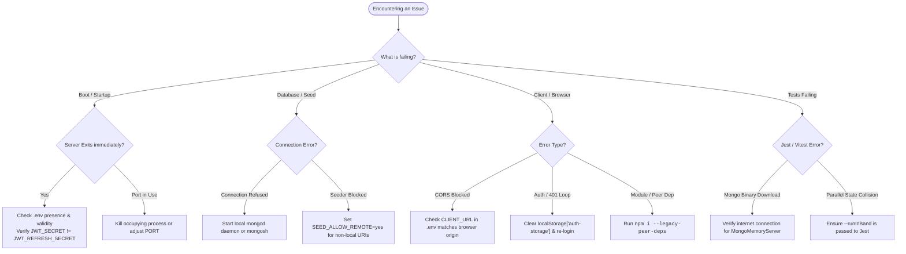

# Developer Troubleshooting Guide

> **Scope:** common developer issues, error messages, symptoms, and concrete step-by-step
> resolution instructions for local development and testing.
> **Excludes:** production incident triage and operational alerts ([operations/runbook.md](../operations/runbook.md)).

---

## Diagnostic Decision Tree



---

## Common Issues & Solutions

### 1. Boot Failures & Configuration Errors

#### Symptom: `FATAL CONFIGURATION ERROR: JWT_SECRET is required`

- **Cause:** The backend process did not find a `.env` file at the repository root, or `JWT_SECRET` is blank.
- **Fix:**
  1. Ensure you copied `.env.example` to `.env` in the **root** directory (`d:\repos\bloghub\.env`), not inside `backend/`.
  2. Verify that `JWT_SECRET` has a non-empty string value.

#### Symptom: `FATAL CONFIGURATION ERROR: JWT_REFRESH_SECRET must differ from JWT_SECRET in production`

- **Cause:** `JWT_REFRESH_SECRET` and `JWT_SECRET` have the exact same value.
- **Fix:** Generate two distinct random hex keys:
  ```bash
  node -e "console.log(require('crypto').randomBytes(48).toString('hex'))"
  ```
  Set one as `JWT_SECRET` and the other as `JWT_REFRESH_SECRET`.

#### Symptom: `Error: listen EADDRINUSE: address already in use :::4000` (or `:::3000`)

- **Cause:** Another instance of BlogHub (or another application) is already running on port 4000 or 3000.
- **Fix:**
  - On Windows (PowerShell):
    ```powershell
    Get-Process -Id (Get-NetTCPConnection -LocalPort 4000).OwningProcess | Stop-Process -Force
    ```
  - Or change `PORT=4001` in `.env` and `VITE_API_URL=http://localhost:4001`.

---

### 2. Database Connection & Seeding

#### Symptom: `MongooseServerSelectionError: connect ECONNREFUSED 127.0.0.1:27017`

- **Cause:** MongoDB service is not running locally.
- **Fix:**
  1. Start MongoDB service (`net start MongoDB` on Windows, or `brew services start mongodb-community` on macOS).
  2. Alternatively, use a free cloud instance on [MongoDB Atlas](https://www.mongodb.com/atlas) and update `MONGO_DB_URI` in `.env`.

#### Symptom: `Seeder refused to run against non-local database`

- **Cause:** `npm run seed` was executed with a remote MongoDB URI (e.g. Atlas) without the safety override. The seeder deletes all collections before repopulating.
- **Fix:** If you are certain you want to wipe and seed the remote target:
  ```bash
  SEED_ALLOW_REMOTE=yes npm run seed
  ```

---

### 3. Client & Frontend Issues

#### Symptom: `Cross-Origin Request Blocked (CORS)`

- **Cause:** The backend CORS allowed origin does not match the frontend's actual URL.
- **Fix:**
  1. Verify `CLIENT_URL` in `.env` matches your browser URL exactly (e.g., `http://localhost:3000` without trailing slash).
  2. Restart the backend dev server (`npm run dev`).

#### Symptom: Infinite 401 / Logout Loop on Stale Sessions

- **Cause:** An old JWT token exists in `localStorage` from a previous database instance or with a stale `tokenVersion`.
- **Fix:**
  1. Open DevTools (F12) → **Application** tab → **Local Storage**.
  2. Delete the key `auth-storage`.
  3. Refresh the browser and log in again.

#### Symptom: Vite does not pick up newly added `.env` variables

- **Cause:** Vite loads environment variables only on startup.
- **Fix:** Stop the Vite dev server (`Ctrl + C`) and restart with `npm run dev`.

#### Symptom: Peer dependency conflicts during `npm install`

- **Cause:** React 19 packages alongside third-party legacy UI libraries.
- **Fix:** Use `--legacy-peer-deps` (which is already configured in `client/.npmrc`):
  ```bash
  cd client && npm install --legacy-peer-deps
  ```

---

### 4. Test Suite Issues

#### Symptom: Backend Jest tests fail randomly or collide with each other

- **Cause:** Jest workers running in parallel and mutating the same in-memory database instance.
- **Fix:** Always execute tests serially using `--runInBand` (included by default in `npm test`):
  ```bash
  cd backend && npm test
  ```

#### Symptom: In-memory MongoDB download fails behind corporate proxy

- **Cause:** `mongodb-memory-server` attempts to download MongoDB binaries from `fastdl.mongodb.org`.
- **Fix:** Set the environment variable `MONGOMS_DOWNLOAD_URL` or install binaries locally according to `mongodb-memory-server` documentation.
