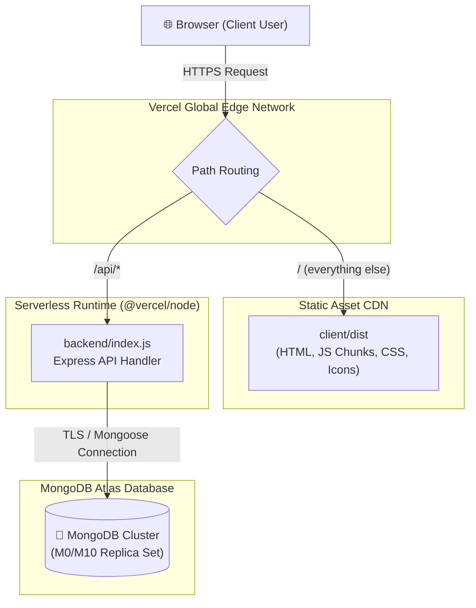
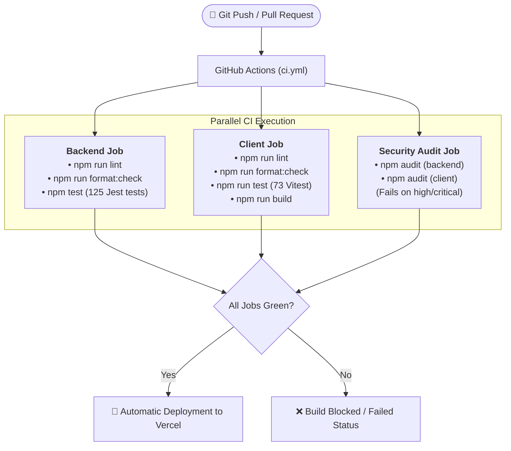

# Deployment and CI/CD

> **Scope:** how BlogHub is built and shipped — Vercel topology, routing, release procedure,
> rollback, and the automation pipeline that should gate it.
> **Excludes:** environment variables ([configuration.md](../reference/configuration.md)), production
> observability ([runbook.md](runbook.md)).

---

# Part 1 — Deployment

## Target

**Vercel**, hosting both halves from one repository, with **MongoDB Atlas** as the database.



## `vercel.json`

```jsonc
{
  "version": 2,
  "builds": [
    { "src": "backend/index.js", "use": "@vercel/node" },
    {
      "src": "client/package.json",
      "use": "@vercel/static-build",
      "config": { "distDir": "dist" },
    },
  ],
  "routes": [
    { "src": "/api/(.*)", "dest": "backend/index.js" },
    { "src": "/(.*)", "dest": "/client/$1", "continue": true },
    { "handle": "filesystem" },
    { "src": "/(.*)", "dest": "/client/index.html" },
  ],
}
```

Routes evaluate top to bottom:

| Order | Rule                                   | Effect                                                              |
| ----- | -------------------------------------- | ------------------------------------------------------------------- |
| 1     | `/api/(.*)`                            | Everything under `/api` reaches the function                        |
| 2     | `/(.*)` → `/client/$1`, `continue`     | Rewrites into the static build's output, then keeps matching        |
| 3     | `handle: filesystem`                   | Real static files are served directly                               |
| 4     | `/(.*)` → `/client/index.html`         | **SPA fallback** — the client router handles the path               |

The fallback closed [BUG-12](../product/roadmap.md#bug-12). Previously the last rule rewrote
to `client/$1` with no `continue`, so `/post/abc123` mapped to a file that does not exist and
every shared link, deep link and refresh on an inner route returned 404. The rewrite now
carries `continue: true` so the filesystem handler gets a chance first, and the terminal rule
serves the shell. A dead `/uploads/(.*)` route pointing at a directory that never exists in a
deployment was removed at the same time.

> `builds`/`routes` is the legacy v2 format. It works, but `buildCommand`, `outputDirectory`
> and `rewrites` are better supported and clearer. Worth migrating.

## Build

```
backend/index.js  → @vercel/node → bundled with dependencies → λ
client/           → npm install (client/.npmrc: legacy-peer-deps)
                  → npm run build → client/dist → CDN
```

No root `package.json`, so the two installs are independent.

**Vercel itself does not gate the build** — it builds and ships whatever is on `main`. The gate
is GitHub Actions ([Part 2](#part-2--cicd)), which runs lint, format, tests, build and a
dependency audit on every push and pull request. The two are independent: a red CI run does not
stop Vercel from deploying, so branch protection is what turns the check into a gate. That
remains the open item — see [Branch protection](#branch-protection).

## Serverless considerations

The API was written as a long-running Express server and adapted. Several assumptions no
longer hold.

### Connection handling

`connectDB()` runs at module load, so every cold start opens a new Atlas connection. Under
concurrency this produces one connection per warm instance and exhausts the connection limit
on a small tier. The standard remedy is a cached connection:

```js
let cached =
  global._mongoose ?? (global._mongoose = { conn: null, promise: null });

async function connectDB() {
  if (cached.conn) return cached.conn;
  if (!cached.promise)
    cached.promise = mongoose.connect(uri, { maxPoolSize: 10 });
  cached.conn = await cached.promise;
  return cached.conn;
}
```

`config/db.js` also registers a `SIGINT` handler — meaningful locally, irrelevant in a
function invocation.

### Rate limiting

`express-rate-limit`'s default store is in-memory and per-instance, so limits are approximate
across cold starts and concurrent instances. Still far better than nothing; a shared store
(Redis, or an Atlas collection) would make them exact.

### Filesystem

Read-only except `/tmp`, which does not persist between invocations. The multer disk-storage
configuration could not work in production ([BUG-07](../product/roadmap.md#bug-07)). The upload
middleware now keeps the file in memory and stores the bytes on the profile document, so nothing
touches the filesystem. That works on Vercel today; object storage remains the right destination
at any real volume ([GAP-17](../product/roadmap.md#gap-17)).

### Timeouts

The Hobby plan caps a function at 10 seconds. `GET /posts` is paginated and no longer populates
every comment, and the unscoped `GET /comments` was removed entirely — together those were the
most likely offenders. What remains unbounded is `GET /likes/post/:postId` and the unindexed
search regex ([SEC-11](../security/checklist.md#sec-11)).

---

## Release procedure

### First deployment

1. **Provision Atlas.** Create the cluster and a database user. Add `0.0.0.0/0` to the IP
   allowlist — Vercel functions have no static egress addresses on lower tiers.
2. **Import the repository** into Vercel. Framework preset **Other** — `vercel.json`
   describes the builds.
3. **Set the environment variables** from the production template in
   [configuration.md](../reference/configuration.md#production). Remember `JWT_REFRESH_SECRET`, distinct
   from `JWT_SECRET` — the deployment **will refuse to boot** if they match.
4. **Deploy** and wait for both builds.
5. **Verify** with the checklist below.
6. **Seed only if the site is a demo.** `npm run seed` wipes every collection.

### Subsequent deployments

```
push to a branch  → preview deployment at a unique URL
merge to main     → production deployment
```

Every pull request gets a preview. Use it alongside CI: the pipeline proves the code is sound,
the preview proves the deployment is.

### Verification checklist

```bash
BASE=https://<your-domain>

curl -s $BASE/api/health                       # {"status":"ok",...}
curl -s $BASE/api/ready                        # {"status":"ready"}
curl -s $BASE/api/posts | head -c 200          # paginated envelope
curl -sI $BASE/api/posts | grep -i strict-transport   # helmet is active

# security regressions
curl -o /dev/null -w "%{http_code}\n" -X POST $BASE/api/tags \
  -H 'Content-Type: application/json' -d '{"name":"x"}'       # expect 401
curl -o /dev/null -w "%{http_code}\n" $BASE/api/posts/507f1f77bcf86cd799439011  # expect 404
```

In a browser:

- [ ] Home loads and renders posts
- [ ] Sign in works and the session survives a reload
- [ ] **A direct load of `/post/<id>` works** — the [BUG-12](../product/roadmap.md#bug-12) check
- [ ] Publishing works and the post appears on the feed — the
      [BUG-01](../product/roadmap.md#bug-01) check
- [ ] A like survives a reload — the [BUG-03](../product/roadmap.md#bug-03) check
- [ ] No CORS error in the console
- [ ] Both themes render

## Rollback

**Immediate** — Vercel dashboard → Deployments → the last good one → _Promote to Production_.
Seconds, no rebuild.

**By revert** — `git revert <sha> && git push origin main`.

**Configuration only** — change the variable and redeploy; environment changes do not apply
to an existing deployment. `VITE_`-prefixed values are baked in at build time and need a
**rebuild**, not just a variable change.

**Database** — there is no migration tooling, so a schema change that breaks reads has no
automatic reverse. Take an Atlas snapshot before any deployment that alters document shape,
and note that **adding a unique index to a collection containing duplicates fails** — resolve
duplicates first ([database.md](../reference/database.md#migration-note)).

## Alternative topologies

Vercel's serverless model fits the client well and the API less well.

| Option            | API host                                                                         | Trade-off                                                                                                                                     |
| ----------------- | -------------------------------------------------------------------------------- | --------------------------------------------------------------------------------------------------------------------------------------------- |
| **Split hosting** | Render / Railway / Fly.io for a long-running Node process; Vercel for the client | Real connection pooling, no cold starts, a filesystem for uploads, exact rate limits. Costs an always-on instance and needs cross-origin CORS |
| **Containers**    | Docker on any orchestrator                                                       | Full control and parity; most operational overhead                                                                                            |

Splitting is the natural next step if uploads, background work or connection pressure become
real problems. It requires `VITE_API_URL` set to the API's absolute origin and `CLIENT_URL`
set to the client's.

---

# Part 2 — CI/CD



| Stage                          | Status                                            |
| ------------------------------ | ------------------------------------------------- |
| Lint (both workspaces)         | ✓ `npm run lint`                                  |
| Format check (both workspaces) | ✓ `npm run format:check`                          |
| Backend tests                  | ✓ 125 tests, `jest --runInBand`                   |
| Client tests & build           | ✓ 73 tests (Vitest) + `npm run build`             |
| Dependency audit               | ✓ `npm audit --audit-level=high`, both workspaces |
| Deploy                         | ✓ Automatic via Vercel                            |

Three jobs — `backend`, `client`, `audit` — run in parallel. `concurrency` with
`cancel-in-progress` means a new push to the same branch cancels the run it superseded.

**The test job needs no service container.** `mongodb-memory-server` starts MongoDB inside the
Jest process, and `tests/env.js` supplies the secrets, so there is no database to provision and
no secret to leak into a fork's pull-request build.

```yaml
- name: Test
  working-directory: backend
  # The suite starts its own MongoDB in-process, so no service container is needed.
  run: npm test
```

The audit job fails on **high and critical** advisories only. Moderate and below are reported by
`npm audit` locally but do not block a merge — the alternative is a pipeline that goes red
overnight for a transitive advisory in a build tool, which teaches people to ignore it.

## Quality gates

| Gate               | Blocks a merge         | Rationale                                                                |
| ------------------ | ---------------------- | ------------------------------------------------------------------------ |
| Lint               | Yes                    | Correctness rules, not style — it found two real bugs during remediation |
| Format check       | Yes                    | Cheap, keeps diffs clean                                                 |
| Backend tests      | Yes                    | Where this codebase's defects actually live                              |
| Client build       | Yes                    | A broken build must never reach deploy                                   |
| Dependency audit   | Yes, at high and above | Below that, advisory noise outweighs the signal                          |
| Client tests       | Yes                    | 73 Vitest tests; the editor and workspace are still uncovered ([GAP-11](../product/roadmap.md#gap-11)) |
| E2E                | Not yet                | No suite; would run post-merge when there is one                         |
| Coverage threshold | Not yet                | `npm run test:coverage` reports; ratchet before enforcing                |

**Line-ending note.** The repository carries a `.gitattributes` with `* text=auto eol=lf`.
Without it, a Windows checkout with `core.autocrlf=true` commits CRLF, and `format:check` fails
in CI with hundreds of `Delete ␍` errors on a change that touched nothing. Do not remove it.

## What is still missing

1. **Full client coverage.** The `client` job runs 73 Vitest tests and builds the bundle, but
   the editor and the creator workspace have none, so a render-time crash there still passes
   CI — which is exactly how several runtime crashes reached the deployed app
   ([GAP-11](../product/roadmap.md#gap-11)).
2. **Branch protection.** The checks run but nothing requires them to pass, so CI reports
   rather than gates.
3. **E2E on merge**, once a suite exists.
4. **Coverage reporting**, threshold a release later.

## Branch protection

- [ ] Require a pull request before merging
- [ ] Require the `backend` and `client` checks to pass
- [ ] Require branches to be up to date
- [ ] Require conversation resolution
- [ ] Dismiss stale approvals on new commits
- [ ] No force pushes or deletion

## Local parity

CI should never be the first place a failure appears:

```bash
cd backend && npm run lint && npm run format:check
cd ../client && npm run lint && npm run format:check && npm run build
```

Better still, run them via Husky and lint-staged before each commit —
[code-quality.md](../guides/code-quality.md#enforcement-plan).

## Secrets

Never place a production secret in a workflow used by pull-request builds — a fork's pull
request can read it. Vercel deployment needs no GitHub secret; the Git integration handles it.

---

## Outstanding deployment issues

| Issue                              | Impact                                                             | Reference                              |
| ---------------------------------- | ------------------------------------------------------------------ | -------------------------------------- |
| CI reports but does not gate       | Branch protection is not enabled, so a red run still deploys       | [above](#what-is-still-missing)        |
| Client coverage is partial         | A render-time crash in the editor or the workspace still passes CI | [GAP-11](../product/roadmap.md#gap-11) |
| No cached database connection      | Connection exhaustion under load                                   | [above](#connection-handling)          |
| Rate limits are per-instance       | Approximate enforcement on serverless                              | [above](#rate-limiting)                |
| Avatar bytes live in MongoDB       | Works on a read-only filesystem, but Mongo is not a CDN            | [GAP-17](../product/roadmap.md#gap-17) |
| Legacy `builds`/`routes` format    | Harder to maintain                                                 | [above](#verceljson)                   |
| Nothing polls the health endpoints | An outage is discovered by a user                                  | [runbook.md](runbook.md)               |
