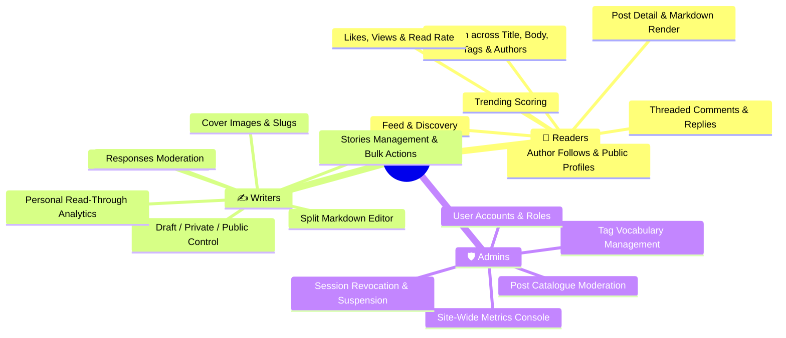

# Features

> **Scope:** the capability catalogue — what BlogHub does, for whom, and the implementation
> status of each capability.
> **Excludes:** journeys ([user-flows.md](user-flows.md)), planned work and defects
> ([roadmap.md](roadmap.md)), endpoint signatures
> ([reference/api.md](../reference/api.md)).

---

## Product summary

BlogHub is a full-stack blogging platform where writers publish Markdown articles, readers
discover and engage with them, and administrators moderate the catalogue. It ships three
experiences from one codebase: a public reading surface, an authenticated authoring and
analytics surface, and an admin console.

---

## Actors

| Actor             | Authentication                   | Capabilities                                                                                                     |
| ----------------- | -------------------------------- | ---------------------------------------------------------------------------------------------------------------- |
| **Visitor**       | None                             | Browse published posts, read a post, search, view public profiles                                                |
| **Member**        | JWT access token                 | Everything a visitor can, plus authoring, engagement, personal analytics, settings                               |
| **Administrator** | JWT, with `admin` on the account | Everything a member can, plus the admin console, site-wide analytics, user management and moderation of any post |

Roles live on `User.roles` (default `['user']`) and are **read from the database on each
request**, not from the token. A token minted before a demotion therefore carries no authority
after it — see [security/auth.md](../security/auth.md).

---

## Status legend

| Marker | Meaning                                          |
| ------ | ------------------------------------------------ |
| ✅     | Implemented and working end to end               |
| ⚠️     | Implemented but incomplete — see the linked ID   |
| ❌     | Not implemented                                  |
| ➖     | Deliberately removed — the reason is in the note |

---

## 1. Identity and accounts

| Capability                              | Status | Notes                                                                                                                 |
| --------------------------------------- | ------ | --------------------------------------------------------------------------------------------------------------------- |
| Register with username, email, password | ✅     | Validated by `express-validator`; confirmation enforced                                                               |
| Duplicate email/username rejection      | ✅     | Unique indexes at the database; duplicate-key errors return 409                                                       |
| Sign in with email **or** username      | ✅     | Single `credential` field accepts either                                                                              |
| Password hashing                        | ✅     | bcrypt, cost factor 12                                                                                                |
| Access + refresh token issuance         | ✅     | 15 minute / 7 day defaults, separate secrets, typed claims                                                            |
| Silent access-token refresh             | ✅     | Axios interceptor retries the failed request once                                                                     |
| Brute-force protection                  | ✅     | 10 failed attempts per 15 minutes per IP, with the sign-in path doing constant work whether or not the account exists |
| Sign out                                | ✅     | Increments `tokenVersion`, so every token already issued to the account stops working ([GAP-06](roadmap.md#gap-06))   |
| Password reset                          | ❌     | [GAP-01](roadmap.md#gap-01)                                                                                           |
| Email verification                      | ❌     | [GAP-02](roadmap.md#gap-02)                                                                                           |
| Account suspension                      | ✅     | An admin can suspend or restore; suspension revokes live sessions and blocks sign-in                                  |
| Two-factor authentication               | ❌     | The endpoint answers 501 rather than pretending to work                                                               |

## 2. Authoring

| Capability                          | Status | Notes                                                                                        |
| ----------------------------------- | ------ | -------------------------------------------------------------------------------------------- |
| Markdown editor with live preview   | ✅     | `@uiw/react-md-editor`                                                                       |
| Auto-generated URL slug             | ✅     | Client-side, editable                                                                        |
| Cover image by URL                  | ✅     | Optional, on both create and edit                                                            |
| Draft / private / public visibility | ✅     | Persisted and enforced server-side                                                           |
| Edit an existing post               | ✅     | Works with or without a cover image                                                          |
| Delete a post                       | ✅     | Cascades to comments and tag back-references                                                 |
| Ownership enforcement               | ✅     | Author or `admin` only, on edit and delete                                                   |
| Assign tags                         | ✅     | Up to 5 per story, set in the editor and persisted on the post ([GAP-04](roadmap.md#gap-04)) |
| Autosave / revision history         | ❌     | [GAP-03](roadmap.md#gap-03)                                                                  |

## 3. Reading and discovery

| Capability                                       | Status | Notes                                                                                                                                                                                                     |
| ------------------------------------------------ | ------ | --------------------------------------------------------------------------------------------------------------------------------------------------------------------------------------------------------- |
| Landing page with hero, feed and a trending list | ✅     | The category strip and creator widgets were removed — they repeated what the feed already showed                                                                                                          |
| Drafts and private posts hidden from the public  | ✅     | Enforced by the API, not the browser                                                                                                                                                                      |
| Author can preview their own unpublished post    | ✅     | Optional-auth on the detail endpoint                                                                                                                                                                      |
| Filter by tag                                    | ✅     | On `/search`, as a server-side query over the whole collection, with a per-tag count so no filter leads to an empty page. The landing page's topic pills link into it rather than filtering in place     |
| Trending                                         | ✅     | Views + likes×3 + comments×5 + reads×5 over 14 days, with a minimum-views floor; falls back to latest and says so                                                                                         |
| Post detail with rendered Markdown               | ✅     |                                                                                                                                                                                                           |
| Paginated feed                                   | ✅     | `?page` and `?limit`, default 20, capped at 50                                                                                                                                                            |
| Search stories, tags and authors                 | ⚠️     | Matches title, body, tag names and author username. Public-only, capped, metacharacters escaped — but still an unindexed regex rather than a text index ([GAP-05](roadmap.md#gap-05))                    |
| Infinite scroll                                  | ❌     | The API supports paging; the UI does not consume it yet                                                                                                                                                   |

## 4. Social engagement

| Capability                            | Status | Notes                                                              |
| ------------------------------------- | ------ | ------------------------------------------------------------------ |
| Like / unlike a post                  | ✅     | Persisted in both the collection and `Post.likes`; survives reload |
| One like per user per post            | ✅     | Unique index, not a racy application check                         |
| Comment on a post                     | ✅     | Author taken from the token                                        |
| Reply to a comment                    | ✅     | Reply carries its parent's post reference                          |
| Follow / unfollow an author           | ✅     | Maintains both sides plus counters                                 |
| Public author profile                 | ✅     | `/user/:userId`                                                    |
| Delete a comment                      | ✅     | The comment's author, the post's author, or an admin               |
| See responses across all your stories | ✅     | `/comments` in the workspace, per story                            |
| Comment likes / dislikes              | ❌     | Schema fields exist; no endpoint or UI                             |
| Edit a comment                        | ❌     | No endpoint                                                        |
| Notifications                         | ❌     | [GAP-08](roadmap.md#gap-08)                                        |

## 5. Analytics

| Capability                                            | Status | Notes                                                                                                                                      |
| ----------------------------------------------------- | ------ | ------------------------------------------------------------------------------------------------------------------------------------------ |
| Author dashboard — views, reads, read rate, top posts | ✅     | Computed live from the `views` and `reads` collections                                                                                     |
| Analytics scoped to their owner                       | ✅     | A member cannot read another member's figures                                                                                              |
| Site-wide admin analytics                             | ✅     | Totals, top posts, top authors, recent activity                                                                                            |
| Page-view tracking                                    | ✅     | Deduplicated per visitor per post in a 6-hour window, so refreshing does not inflate the count ([SEC-04](../security/checklist.md#sec-04)) |
| Read tracking                                         | ✅     | `useReading` records a read on real scroll depth and dwell; the endpoint had existed with nothing calling it                               |
| Reading activity for the signed-in member             | ✅     | `GET /analytics/me/reading`                                                                                                                |
| Per-post figures for the author                       | ✅     | Views, reads, likes, comments and read rate, counted live from the event collections; author and admin only. The pre-aggregated `Analytics` collection is gone ([BUG-06](roadmap.md#bug-06))               |

## 6. Profile and settings

| Capability                                                           | Status | Notes                                                                                                           |
| -------------------------------------------------------------------- | ------ | --------------------------------------------------------------------------------------------------------------- |
| View own profile with posts and counters                             | ✅     |                                                                                                                 |
| Edit username, email and bio                                         | ✅     |                                                                                                                 |
| Notification, privacy and appearance preferences                     | ✅     | Schema-backed; partial updates do not blank sibling fields                                                      |
| Extended profile fields — full name, location, website, social links | ✅     | Declared on `UserProfile`                                                                                       |
| Light / dark theme with system preference                            | ✅     | Persisted in local storage                                                                                      |
| Upload an avatar                                                     | ✅     | 2 MB cap, MIME allowlist, stored on the profile document and served from `GET /users/:id/avatar` with an `ETag` ([BUG-07](roadmap.md#bug-07), [BUG-27](roadmap.md#bug-27)) |
| Delete account                                                       | ✅     | `DELETE /users/me`, password-confirmed, purging posts, comments, likes, views, reads and both profile sides     |

## 7. Administration

| Capability                       | Status | Notes                                                                    |
| -------------------------------- | ------ | ------------------------------------------------------------------------ |
| Admin dashboard with site totals | ✅     |                                                                          |
| Post management including drafts | ✅     | `?all=true`, honoured only for administrators                            |
| Delete any post                  | ✅     | Counters adjust against the post's author                                |
| Tag vocabulary management        | ✅     | `/admin/tags`. Creation and deletion are admin-only; deletion refuses while stories still carry the tag |
| Paginated user listing           | ✅     |                                                                          |
| Suspend and restore an account   | ✅     | Revokes live sessions immediately                                        |
| Promote and demote               | ✅     | Demotion revokes live sessions; the last administrator cannot be removed |
| Delete any account               | ✅     | Same `purgeAccount` path as self-deletion                                |
| Admin settings page              | ➖     | Removed. It was a placeholder of switches wired to nothing               |
| Audit log                        | ⚠️     | Stories edited since publication, keyed off `Post.editedAt`. Administrative actions still leave no record of their own ([GAP-10](roadmap.md#gap-10)) |

## 8. Platform

| Capability                             | Status | Notes                                                                                                                                                                            |
| -------------------------------------- | ------ | -------------------------------------------------------------------------------------------------------------------------------------------------------------------------------- |
| Responsive layout                      | ✅     | 375px through 1440px                                                                                                                                                             |
| Light and dark themes                  | ✅     | Two complete token sets                                                                                                                                                          |
| Route-based code splitting             | ✅     | Every page lazily loaded                                                                                                                                                         |
| Vendor chunk splitting                 | ✅     | `vendor`, `radix`, `markdown-preview`, `syntax-highlight`, `editor`                                                                                                              |
| Client-side error boundary             | ✅     |                                                                                                                                                                                  |
| Deep links and refresh on inner routes | ✅     | SPA fallback in `vercel.json`                                                                                                                                                    |
| Health and readiness endpoints         | ✅     | `GET /health`, `GET /ready`                                                                                                                                                      |
| Security headers                       | ✅     | `helmet`                                                                                                                                                                         |
| Rate limiting                          | ⚠️     | A general and an auth-specific limiter, keyed to the real client address behind Vercel's proxy. The store is per-instance, so limits are approximate across serverless instances |
| Automated tests                        | ⚠️     | 125 backend integration tests and 73 client tests; the editor and the workspace are not covered yet ([GAP-11](roadmap.md#gap-11))                                                |
| CI pipeline                            | ✅     | Lint, format check, tests, build and a dependency audit on every push                                                                                                            |
| Server-side rendering / SEO metadata   | ❌     | SPA only, one static `<title>` ([GAP-16](roadmap.md#gap-16))                                                                                                                     |
| Internationalisation                   | ❌     | English strings inlined                                                                                                                                                          |

---

## Non-functional position

| Attribute         | Current state                                                                                                                                                                                                                                                                                       |
| ----------------- | --------------------------------------------------------------------------------------------------------------------------------------------------------------------------------------------------------------------------------------------------------------------------------------------------- |
| **Performance**   | Route-level code splitting, a 5-minute query cache, paginated feed, and 20 declared indexes across 9 collections. `GET /posts` no longer populates every comment — previously the most expensive query in the application                                                                          |
| **Scalability**   | Stateless API. Remaining bottlenecks: the unindexed search regex, the unbounded `GET /likes/post/:postId`, and rate-limit counters held in each instance's memory rather than a shared store                                                                                                        |
| **Availability**  | Health and readiness endpoints exist; nothing polls them yet ([runbook](../operations/runbook.md))                                                                                                                                                                                                  |
| **Security**      | All fifteen audit findings closed. Remaining work is defence in depth, not open holes: a Content-Security-Policy, a shared rate-limit store, email verification and password reset ([checklist](../security/checklist.md))                                                                          |
| **Accessibility** | Semantic markup and a global focus ring; no audit run ([GAP-18](roadmap.md#gap-18))                                                                                                                                                                                                                 |
| **Testability**   | 125 backend integration tests against an in-process MongoDB, plus 73 client tests under Vitest, run in CI. The client suite covers the service layer, the axios interceptors, the text helpers and the profile page; the editor and the workspace are still uncovered ([GAP-11](roadmap.md#gap-11)) |
