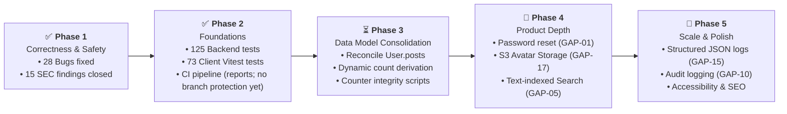

# Roadmap and Backlog

> **Scope:** the single backlog — known defects (`BUG-xx`), missing capabilities (`GAP-xx`)
> and the phased plan.
> **Excludes:** security findings, owned by
> [security/checklist.md](../security/checklist.md) as `SEC-xx` and referenced here by ID.

IDs are stable. Reference them from commits and pull requests rather than restating the
problem.

---

## Defect status

| ID                | Defect                                               | Priority | Status          |
| ----------------- | ---------------------------------------------------- | -------- | --------------- |
| [BUG-01](#bug-01) | Post visibility never persisted                      | P0       | ✅ **Fixed**    |
| [BUG-02](#bug-02) | Post without a cover image could not be edited       | P0       | ✅ **Fixed**    |
| [BUG-03](#bug-03) | `Post.likes` never maintained at runtime             | P0       | ✅ **Fixed**    |
| [BUG-04](#bug-04) | Comment replies lost their post reference            | P1       | ✅ **Fixed**    |
| [BUG-05](#bug-05) | Settings feature persisted nothing                   | P0       | ✅ **Fixed**    |
| [BUG-06](#bug-06) | `Analytics` documents never updated                  | P2       | ✅ **Fixed**    |
| [BUG-07](#bug-07) | Avatar upload broken                                 | P1       | ✅ **Fixed**    |
| [BUG-08](#bug-08) | Missing post returned 200 instead of 404             | P1       | ✅ **Fixed**    |
| [BUG-09](#bug-09) | Duplicate accounts possible                          | P1       | ✅ **Fixed**    |
| [BUG-10](#bug-10) | Post-count adjustment targeted the wrong profile     | P2       | ✅ **Fixed**    |
| [BUG-11](#bug-11) | Category attachment did not await its writes         | P2       | ✅ **Fixed**    |
| [BUG-12](#bug-12) | Deep links 404 in production                         | P1       | ✅ **Fixed**    |
| [BUG-13](#bug-13) | Two cache keys held the same data                    | P3       | ✅ **Resolved** |
| [BUG-14](#bug-14) | CORS wildcard origin with credentials                | P2       | ✅ **Fixed**    |
| [BUG-15](#bug-15) | `setState` inside an effect                          | P2       | ✅ **Fixed**    |
| [BUG-16](#bug-16) | Seeder wrote `posts` instead of `post` on every like | P0       | ✅ **Fixed**    |
| [BUG-17](#bug-17) | `PostDetail` referenced an undefined component       | P1       | ✅ **Fixed**    |
| [BUG-18](#bug-18) | Seeder could not find the root `.env`                | P1       | ✅ **Fixed**    |
| [BUG-19](#bug-19) | `/user/:id` rendered the viewer, not the writer      | P0       | ✅ **Fixed**    |
| [BUG-20](#bug-20) | Replies returned twice by the comment listing        | P1       | ✅ **Fixed**    |
| [BUG-21](#bug-21) | A repeated like answered 500                         | P1       | ✅ **Fixed**    |
| [BUG-22](#bug-22) | Author's per-post figures never rendered             | P1       | ✅ **Fixed**    |
| [BUG-23](#bug-23) | Active-user count read a field nothing writes        | P2       | ✅ **Fixed**    |
| [BUG-24](#bug-24) | Moderation log counted engagement as an edit         | P2       | ✅ **Fixed**    |
| [BUG-25](#bug-25) | Form labels pointed at nothing                       | P2       | ✅ **Fixed**    |
| [BUG-26](#bug-26) | Post page shipped the Markdown editor to read        | P1       | ✅ **Fixed**    |
| [BUG-27](#bug-27) | Avatars sent as base64 in JSON on every page         | P1       | ✅ **Fixed**    |
| [BUG-28](#bug-28) | `vendor` chunk missed React's renderer               | P2       | ✅ **Fixed**    |

**All 28 closed.** BUG-16 to BUG-18 were found during remediation, two of them by tooling
that was fixed along the way. BUG-19 to BUG-24 came out of the full frontend-to-backend audit
that closed the last two, BUG-25 out of writing the admin console tests, and BUG-26 to BUG-28 out of measuring the production bundle.

Everything closed here that a request can reach now has a regression test in
[the backend suite](../guides/testing.md#current-state), and the client half of the audit is
covered by [the client suite](../guides/testing.md#client).

---

## Fixed

### BUG-01

**Post visibility never persisted.** ✅ `backend/services/postService.js`

`createPost` built the document from `user, imageURL, title, slug, content` and `updatePost`
wrote only `imageURL, title, slug, content`, so the editor's `visibility` was discarded and
every post stayed a draft. Because `Home.jsx` filters the feed to `visibility === 'public'`,
**no post authored through the running application ever reached the home page** — only
seeded content appeared. The most damaging defect in the repository.

_Fix:_ both service functions accept `visibility`, normalised against the enum with a
`draft` fallback. On update the field is only written when the caller actually sent one, so
a partial update cannot silently unpublish a live post.

_Verified:_ published a post through the API, read back `visibility: "public"`, confirmed it
appears in `GET /posts`.

### BUG-02

**A post without a cover image could not be edited.** ✅ `backend/services/postService.js`

`updatePost` required `imageURL` to be non-empty, but the editor sends `''` when no cover
image is set, so every update on such a post failed with 400 — inconsistent with create,
where the field is optional.

_Fix:_ `imageURL` dropped from the required set and normalised to `''`.
_Verified:_ `PUT /posts/:id` with `imageURL: ''` → 200.

### BUG-03

**`Post.likes` never maintained at runtime.** ✅ `backend/controllers/like.controllers.js`

`createLike` wrote to the `likes` collection but never pushed onto `Post.likes`; `deleteLike`
never pulled. Only the seeder populated the array, so `PostDetail`'s liked state reset on
every reload.

_Fix:_ both handlers keep the array in step with `$addToSet` / `$pull`. `getSinglePost`
populates `likes` with their user reference, and the client compares by string so a populated
or bare id both work.
_Verified:_ liked a post, `Post.likes.length` → 1.

### BUG-04

**Comment replies lost their post reference.** ✅ `backend/controllers/comment.controllers.js`

Replies were created with `{ user, message }` only, so every post-scoped query missed them,
and an unvalidated `repliedCommentId` could attach a reply to nothing.

_Fix:_ the parent is loaded, 404 when absent, and its `post` is copied onto the reply. The
handler now returns 201 with the created comment.
_Verified:_ reply carries the parent's post id; unknown parent → 404.

### BUG-05

**The settings feature persisted nothing.** ✅ `backend/models/user-settings.model.js`

`UserSetting` was `new mongoose.Schema({})` — an empty schema. Strict mode silently dropped
every field the controller wrote, including the `user` link, so the endpoints returned 200
and stored nothing. `PUT /settings/profile` had the same problem against `UserProfile`.

_Fix:_

- `UserSetting` declares `user`, `theme`, `emailNotifications`, `privacySettings` and
  `appearance`, with defaults and a unique index.
- `UserProfile` gained `fullName`, `location`, `website` and `socialLinks`.
- Updates apply only the keys the caller sent, so a partial update cannot blank a sibling
  field; appearance uses dot-notation for the same reason.
- `PUT /settings/security` now returns **501 Not Implemented**. Two-factor authentication
  does not exist, and answering 200 for work that never happened was the underlying problem.
- Dead `backend/models/settings.model.js` deleted.

_Verified:_ wrote `theme: dark`, read it back.

### BUG-07

**Avatar upload broken.** P1 · ✅ **Fixed**

Three faults: multer wrote to a relative path that was never created and is read-only on
serverless; the controller stored `file.path` (a string) into `image.data` (typed `Buffer`);
and the reader base64-encoded that string back, producing a data URI containing the text of a
filename rather than an image.

_Fix:_ `multer.memoryStorage()` with a 2 MB cap and a MIME allowlist
([SEC-05](../security/checklist.md#sec-05)) and the **bytes** written to
`UserProfile.image = { data: Buffer, contentType }`. No filesystem is involved, so it works on
Vercel unchanged. The read path was later moved off base64-in-JSON and onto its own cacheable
endpoint, `GET /users/:id/avatar` ([BUG-27](#bug-27)).

_Verified:_ uploaded through the settings page, the avatar renders after a reload.

_Remaining trade-off:_ image bytes live in the document, so they inflate every read that
populates a profile, and MongoDB is not a CDN. Object storage is the right destination at any
real volume — that is [GAP-17](#gap-17), no longer a defect.

### BUG-08

**A missing post returned 200 instead of 404.** ✅

`Post.findById` resolved to `null` and the controller wrapped it in
`{ success: true, data: null }`, so the client dereferenced a null post.

_Fix:_ 404 when the lookup yields nothing.
_Verified:_ `GET /posts/507f1f77bcf86cd799439011` → 404.

### BUG-09

**Duplicate accounts possible.** ✅ `backend/models/user.model.js`

`username` and `email` were required but not unique, and signup relied on a `findOne` two
concurrent requests could both pass.

_Fix:_ unique indexes on both, plus `lowercase` and `trim` on the schema so normalisation no
longer depends on the controller. Duplicate-key errors are translated to the existing 409
rather than surfacing as a 500.
_Verified:_ duplicate email signup → 409.

### BUG-10

**Post-count adjustment targeted the wrong profile.** ✅

`deletePost` decremented `UserProfile.postCount` for `req.user`, so an administrator
moderating someone else's post lost their own count while the author's stayed high.

_Fix:_ counters and the `User.posts` pull both target `post.user`.

### BUG-11

**Category attachment did not await its writes.** ✅

`categories.map(async …)` discarded its promises, so the handler responded 200 before any
write completed and threw an unhandled `TypeError` on an unknown category name.

_Fix:_ rewritten around `Promise.all` with bulk `updateMany` / `updateOne`. Unknown names are
reported back in the response rather than crashing. Ownership is enforced
([SEC-02](../security/checklist.md#sec-02)).

### BUG-12

**Deep links 404 in production.** ✅ `vercel.json`

The catch-all rewrote `/(.*)` to `client/$1`, so `/post/abc123` mapped to a file that does
not exist and the SPA shell was never served. Every shared link and every refresh on an
inner route failed.

_Fix:_ the rewrite into the static build carries `continue: true` so the filesystem handler
still gets a chance, and the terminal rule serves `/client/index.html`. The dead
`/uploads/(.*)` route — pointing at a directory that never exists in a deployment — was
removed.

### BUG-13

**Two cache keys held the same data.** ✅ Resolved

`['posts']` and `['allPosts']` were both filled by `postService.getPosts()`.

_Resolution:_ they now hold genuinely different data. `['posts']` is the public feed;
`['allPosts']` is the moderation view via `getAllPosts()`, which passes `?all=true` and
includes drafts. Distinct keys for distinct data is correct — deduplicating them would have
been wrong.

### BUG-14

**CORS wildcard origin with credentials.** ✅

`origin: CLIENT_URL || '*'` with `credentials: true` is rejected by browsers when the
fallback applies.

_Fix:_ credentials are only enabled when `CLIENT_URL` is set; otherwise the origin is open
without credentials. Production refuses to boot without `CLIENT_URL`
([SEC-10](../security/checklist.md#sec-10)).

### BUG-16

**Seeder wrote `posts` instead of `post` on every like.** ✅ `backend/scripts/seed.js`

`new Like({ user, posts: post._id })` — the plural is not a schema field, so every seeded
like stored `post: null` and was unqueryable by post. This is why like counts appeared broken
even with seed data, and it had been silently wrong for the life of the seeder.

Found by the unique index added in [BUG-09](#bug-09), which rejected the second
`{ post: null, user: … }` document. A good illustration of a constraint earning its keep
immediately.

### BUG-17

**`PostDetail` referenced an undefined component.** ✅ `client/src/pages/PostDetail.jsx`

The post-not-found branch rendered `<SubmitBtn>`, which is defined nowhere in the file — so
the error page itself crashed. Latent until [BUG-08](#bug-08) made that branch reachable.

Found by enabling `react/jsx-no-undef`, one of the rules registered but never turned on. See
[code-quality.md](../guides/code-quality.md).

### BUG-18

**Seeder could not find the root `.env`.** ✅ `backend/scripts/seed.js`

`require('dotenv').config()` with no path resolves against `backend/`, where no `.env`
exists, so `npm run seed` exited on a missing database URI.

_Fix:_ resolves `../.env` explicitly, matching `index.js`.

---

## Fixed — found in the later audits

BUG-06 and BUG-15 were open when the register was first written; BUG-19 onward came out of the
full frontend-to-backend audit, the admin console tests and the bundle measurement. All are
closed.

### BUG-06

**`Analytics` documents never updated.** P2 · ✅ **Fixed**

The schema referenced `ref: 'Blog'` — a model that does not exist. That reference was
repointed at `Post` in an earlier pass, but the real problem was that nothing except the
seeder ever wrote an `Analytics` document, so `GET /analytics/post/:id` answered 404 for
every post created through the API, and where a seeded document did exist its counters were
frozen at whatever the seed wrote.

_Fix:_ the collection is gone, along with the seeder's writes to it. `GET /analytics/post/:id`
counts `View`, `Read`, `Like` and `Comment` on demand, the way `getUserAnalytics` already
did — one source of truth instead of two that could disagree. The endpoint now requires a
session and is restricted to the post's author and administrators, since per-post figures are
the author's business; the public number remains `GET /page-views/post/:postId/count`.

### BUG-15

**`setState` inside an effect.** P2 · ✅ **Fixed**

`WritePost`, `Settings`, `UserProfile`, `Search`, `PostDetail` and `useDraftRecovery` hydrated
local state from a query or a URL parameter inside `useEffect`. The pattern works, but it
paints one frame with the stale value before correcting it — on Settings and the editor that
reads as "your work is gone", and `PostDetail`'s version also left the like button stuck on
its previous state when the reader signed out or moved to another story.

_Fix:_ each one adjusts state during render instead, keyed on the fetched payload itself, so
the corrected value is there on the first paint and re-seeds only when a refetch produces a
new object. `useDraftRecovery` reads its stored draft in a lazy state initialiser, which also
closes a real gap: the effect ran after the first autosave could already have overwritten what
it was about to offer back. `react-hooks/set-state-in-effect` is an `error` again.

### BUG-19

**`/user/:id` rendered the viewer, not the writer.** P0 · ✅ **Fixed**

The public profile route is linked from every author byline, the account menu, the workspace
sidebar, the dashboard and two admin screens — six entry points — and nothing served it. The
page called `userService.getUser(userId)`; that function takes no argument, so the id was
dropped and the token-scoped endpoint returned whoever was signed in. Every writer's page
therefore showed the _viewer's_ own account, and a signed-out reader clicking a byline took a 401. The stories beneath came from the global feed filtered by author in the browser, which
only ever saw the first page of the whole site, so most authors appeared to have written
nothing and the counts derived from that list were wrong for the same reason.

_Fix:_ `GET /users/:id/profile`, public, returning the person's name, avatar, bio, links and
counts — with the email included only when that account turned it on in its privacy settings.
Stories come from `GET /posts?author=<id>`, filtered and paged on the server. Covered by
`backend/tests/profile.test.js` and `client/src/pages/UserProfile.test.jsx`.

### BUG-20

**Replies returned twice by the comment listing.** P1 · ✅ **Fixed**

A reply carries its parent's `post` so that post-scoped queries reach it at all
([BUG-04](#bug-04)). `GET /comments/post/:postId` had no other filter, so every reply came
back nested inside its parent _and_ again as a top-level comment of its own — each one shown
twice on the Responses screen, and counted twice in the total beside it.

_Fix:_ `Comment.parent`, set when a reply is created, and the listing filters on
`parent: null`. `scripts/migrate.js` backfills the field for replies already stored, reading
each parent's `replies` array. `PostDetail` was unaffected — it renders `post.comments`, which
replies were never added to — which is why the two screens disagreed about the same thread.

### BUG-21

**A repeated like answered 500.** P1 · ✅ **Fixed**

`createLike` checked for an existing like and then created one. Two concurrent requests could
both pass that check before either wrote, and the unique index then rejected the second with a
duplicate-key error that surfaced as a 500. Every handler in the module also answered with a
bare `{ error: '…' }`, which is not the envelope the rest of the API uses and not where the
client reads a message from — so the UI showed its generic fallback whatever went wrong.

_Fix:_ the index decides it; a duplicate key becomes a 409 with a message. The whole module
moved onto `asyncHandler` and the standard envelope, and the two read endpoints now apply the
same visibility rule as the rest of the API, so the likes on an unpublished story are no
longer readable by anyone who guesses its id.

### BUG-22

**Author's per-post figures never rendered.** P1 · ✅ **Fixed**

`PostDetail` read `analytics?.postsAnalytics`, but `GET /analytics/user/:userId` answers
`{ success, data: { postsAnalytics, … } }`. The lookup found `undefined` on every render, so
an author viewing their own story saw no figures however much traffic it had.

_Fix:_ read through `.data`, as the dashboard already did.

### BUG-23

**Active-user count read a field nothing writes.** P2 · ✅ **Fixed**

`GET /user-activity/all` counted `User.lastActive` against a thirty-day window. No schema
declares `lastActive` and nothing ever wrote it, so the query matched no documents and the
console reported zero active users on every site, however busy.

_Fix:_ counted from distinct `View.user` values inside the window — rows that actually
accumulate.

### BUG-24

**Moderation log counted engagement as an edit.** P2 · ✅ **Fixed**

The log filtered on `{ updatedAt: { $ne: null } }`, true of every post ever created, so it
listed the whole collection as though all of it had been moderated. The obvious correction —
`updatedAt > createdAt` — is also wrong, and less visibly: recording a comment, a like or a
view pushes an id onto an array on the post, so Mongoose bumps `updatedAt` and a story nobody
had edited but several people had replied to appeared as an edit. The unit test written for
the first fix passed; the end-to-end smoke run against a live server is what caught it.

_Fix:_ `Post.editedAt`, stamped only by `postService.updatePost`, so the field carries the
meaning the screen claims. Posts edited before it existed have none and will appear the next
time they change.

### BUG-25

**Form labels pointed at nothing.** P2 · ✅ **Fixed**

`Input` and `TextArea` derived the field's id as `id ?? props.name`. Where a caller passed
neither — seventeen fields across Settings, the editor and the admin console, including every
password box — that is `undefined`, so `htmlFor={undefined}` rendered no `for` attribute at
all. The label was visible text sitting beside a control that assistive technology announced
as unlabelled, and clicking it did not move focus into the field.

Found by writing the admin console tests: `getByLabelText` could not find the tag-name input,
which is the same lookup a screen reader performs.

_Fix:_ a `useId` fallback in both components, so every instance has an association whether or
not the caller supplies an id. Hints and validation messages are wired through
`aria-describedby` at the same time, so a format rule or an error is announced with the field
rather than being left to sighted readers.

### BUG-26

**Post page shipped the Markdown editor to read an article.** P1 · ✅ **Fixed**

`PostDetail` imported `@uiw/react-md-editor` for its `Markdown` export. That package re-exports
the renderer, so importing it pulled the toolbar, the command set, the textarea and the syntax
highlighter into one 1.1 MB chunk — 376 kB over the wire, on the single action the site exists
for, to display a page with no editing on it.

_Fix:_ `@uiw/react-markdown-preview/nohighlight`, with `rehype-prism-plus` fetched separately
and only when the post actually contains a fenced code block. Reading a post costs 126 kB
gzipped instead of 376 kB; the editor chunk is 75 kB and loads only where writing happens.

### BUG-27

**Avatars sent as base64 in JSON on every page.** P1 · ✅ **Fixed**

`getUser` base64-encoded the stored avatar into a data URI inside its response, and the header
calls `getUser` on every page. A 2 MB picture became roughly 2.7 MB of JSON — re-fetched on
every cold load, in a response the browser has no way to cache, ahead of the data the rest of
the page needs.

_Fix:_ `GET /users/:id/avatar` serves the bytes with an ETag and `Cache-Control`, so a repeat
visit is a 304 with no body. The JSON carries `hasAvatar` and `avatarUpdatedAt`; the client
builds the URL and the version from those. The image buffer is not read from the database on
that path at all now.

A defect in the first version of that endpoint was caught by its own test: `.lean()` returns the
driver's `Binary` wrapper rather than a Node `Buffer`, and `Buffer.from()` on it produces an
empty result — a 200 with the right content type and no image in it.

### BUG-28

**`vendor` chunk missed React's renderer.** P2 · ✅ **Fixed**

`manualChunks` listed `react-dom`, but the application imports `react-dom/client`, a different
module id that the entry did not match. React's ~130 kB renderer therefore lived in the main
chunk and was re-downloaded on every deploy that touched any application code.

_Fix:_ the real entry points are named. The main chunk fell from 720 kB to 344 kB, and what a
returning visitor re-fetches after a deploy went from 207 kB gzipped to 98 kB.

---

## Capability gaps

| ID                            | Gap                                 | Priority | Status                                                                                                                                                                                                                                     |
| ----------------------------- | ----------------------------------- | -------- | ------------------------------------------------------------------------------------------------------------------------------------------------------------------------------------------------------------------------------------------ |
| **GAP-01** | Password reset                      | P1       | ❌ Open                                                                                                                                                                                                                                    |
| **GAP-02** | Email verification                  | P2       | ❌ Open                                                                                                                                                                                                                                    |
| **GAP-03** | Draft autosave and revision history | P2       | ❌ Open                                                                                                                                                                                                                                    |
| **GAP-04** | Tags wired into the editor          | P2       | ✅ **Done** — up to 5 per story, set in the editor and persisted                                                                                                                                                                           |
| **GAP-05** | Real search                         | P1       | ⚠️ Partial — now matches title, body, tag names and author names, and returns enough of each story for a card; still an unindexed regex rather than a text index                                                                           |
| **GAP-06** | Server-side session revocation      | P1       | ✅ **Done** — `tokenVersion` on the account, compared on every request                                                                                                                                                                     |
| **GAP-07** | Pagination on list endpoints        | P0       | ⚠️ Partial — `/posts` (feed and moderation), `/search`, `/comments`, `/users`, `/user-activity/*` and the author's own list done; `/page-views/post/:id` is capped at 200 rather than paged; `GET /likes/post/:postId` is still unbounded  |
| **GAP-08** | Notifications                       | P3       | ❌ Open                                                                                                                                                                                                                                    |
| **GAP-09** | Account deletion                    | P2       | ✅ **Done** — `DELETE /users/me`, sharing `purgeAccount` with the admin path                                                                                                                                                               |
| **GAP-10** | Real audit log                      | P2       | ⚠️ Partial — the moderation log now keys off `Post.editedAt` and is surfaced in the console ([BUG-24](#bug-24)); administrative actions still leave no record of their own                                                                 |
| **GAP-11** | Automated tests                     | P0       | ⚠️ Partial — 125 backend integration tests and 73 client tests (Vitest); the client suite covers the service layer, the axios interceptors, the text helpers, the profile page and every admin screen, not yet the editor or the workspace |
| **GAP-12** | CI pipeline                         | P0       | ✅ **Done** — lint, format check, tests, build and a dependency audit on every push and pull request                                                                                                                                       |
| **GAP-13** | Database indexes                    | P0       | ✅ **Done** — 20 declared indexes across 9 collections (29 counting the automatic `_id`)                                                                                                                                                   |
| **GAP-14** | Health and readiness endpoints      | P1       | ✅ **Done** — `GET /health`, `GET /ready`                                                                                                                                                                                                  |
| **GAP-15** | Structured logging                  | P2       | ❌ Open — morgan plus `console.*`                                                                                                                                                                                                          |
| **GAP-16** | SEO and social metadata             | P2       | ❌ Open                                                                                                                                                                                                                                    |
| **GAP-17** | Image upload pipeline               | P2       | ❌ Open — upload works, but the bytes live in MongoDB rather than object storage                                                                                                                                                           |
| **GAP-18** | Accessibility audit                 | P2       | ❌ Open                                                                                                                                                                                                                                    |

---

## Plan

### ✅ Phase 1 — Correctness and safety _(complete)_

All 28 defects and all 15 security findings closed, each verified against a running server.
The application now does what it claims: posts publish, drafts stay private, edits succeed,
likes persist, settings save, and deep links resolve.

### ✅ Phase 2 — Foundations _(largely complete)_

Every defect in Phase 1 was one a modest test suite would have caught before merge, so this
phase built the thing that stops them coming back.

- [x] [GAP-11](#gap-11) a backend suite — 125 integration tests over auth, authorisation,
      posts, comments, replies, likes, following, search, tracking, the workspace, trending,
      moderation and the admin console, plus a regression test for each closed `BUG-xx` and
      `SEC-xx` a request can reach
- [x] [GAP-12](#gap-12) CI running lint, format check, tests, build and a dependency audit on
      every push and pull request
- [x] [SEC-12](../security/checklist.md#sec-12) dependency audit in CI, failing on high and
      critical advisories
- [x] [GAP-06](#gap-06) session revocation via `tokenVersion`
- [x] [GAP-09](#gap-09) account deletion
- [x] **Client tests** — the other half of [GAP-11](#gap-11). 73 Vitest tests over the service
      layer, the axios refresh interceptor, the text helpers, the profile page and every screen
      in the admin console. CI proved the client compiled; it now proves some of it behaves
- [x] [BUG-15](#bug-15) form hydration refactored, and the lint rule promoted back to `error`
- [ ] [GAP-07](#gap-07) page `GET /likes/post/:postId`, the last unbounded list
- [ ] Extend the client suite to the editor and the workspace

### Phase 3 — Data model consolidation

- [x] [BUG-06](#bug-06) retire the `Analytics` collection — done; per-post figures are
      computed from the event collections
- [ ] Reconcile `User.posts` against `Post.user` and keep one
- [ ] Derive like and view counts from their collections rather than the denormalised arrays
- [ ] Add a counter reconciliation script

### Phase 4 — Product depth

- [ ] [GAP-01](#gap-01) password reset
- [ ] [GAP-05](#gap-05) text-index search with paging
- [ ] [GAP-17](#gap-17) move avatar bytes out of MongoDB and into object storage
- [ ] [GAP-08](#gap-08) notifications
- [ ] [GAP-16](#gap-16) SEO metadata

### Phase 5 — Scale and polish

- [ ] [GAP-15](#gap-15) structured logging
- [ ] [GAP-10](#gap-10) real audit log
- [ ] [GAP-18](#gap-18) accessibility audit
- [ ] Response caching and ETags on public reads
- [ ] Split the oversized page components — `Home.jsx` is still the largest
- [ ] Decide on TypeScript — see [code-quality.md](../guides/code-quality.md)

---

## Working agreement

- One ID per pull request where possible; reference it in the title —
  `fix(posts): persist visibility on create and update (BUG-01)`.
- Closing an item means updating its status in [features.md](features.md) and here, in the
  same pull request.
- New findings take the next free ID in the relevant series and are added to the owning
  register — never to an ad-hoc list elsewhere.
