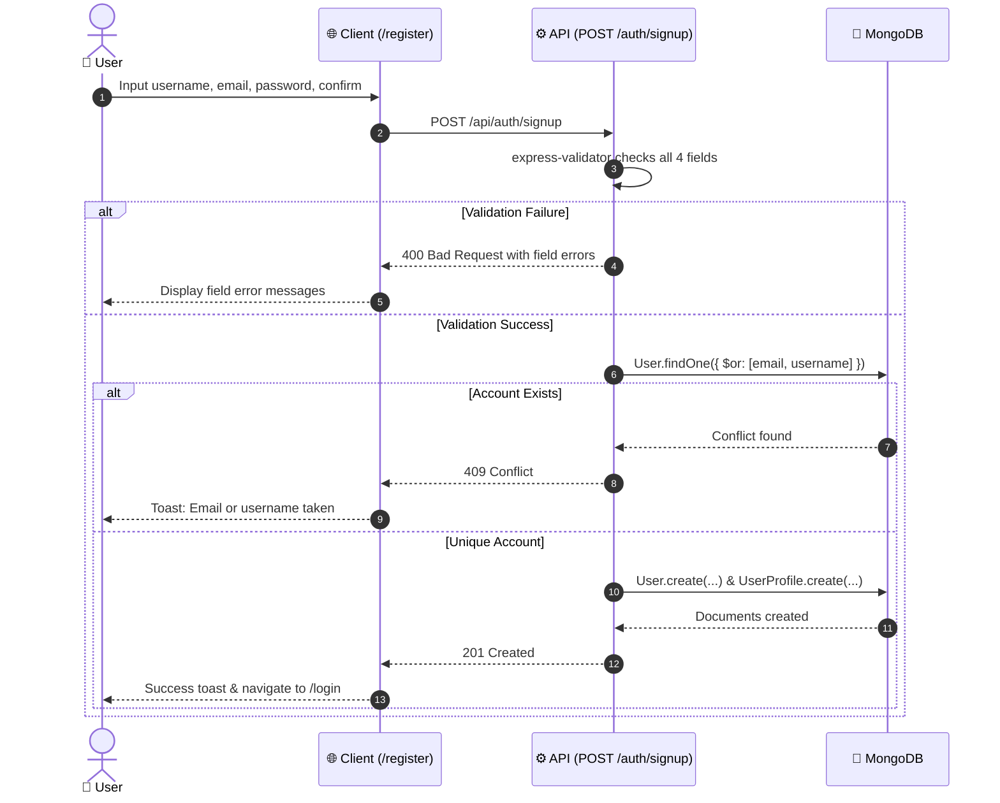
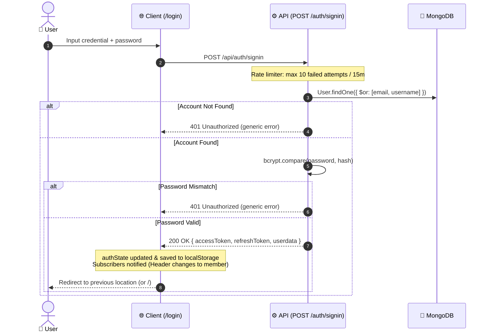
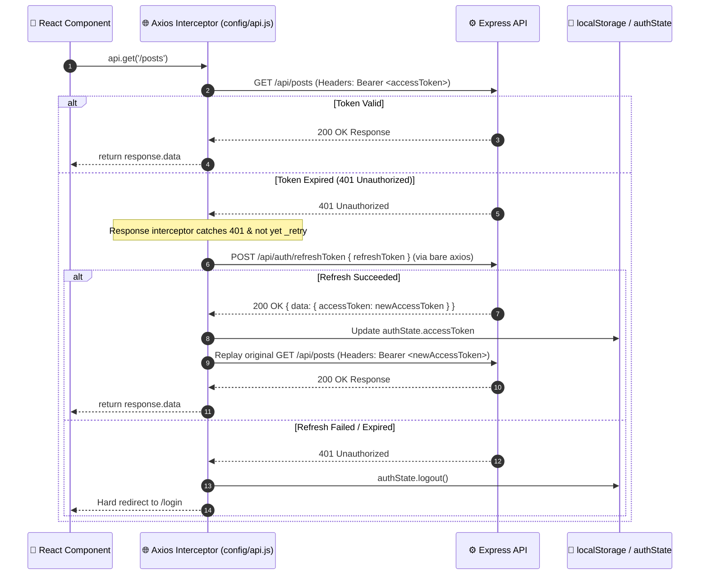
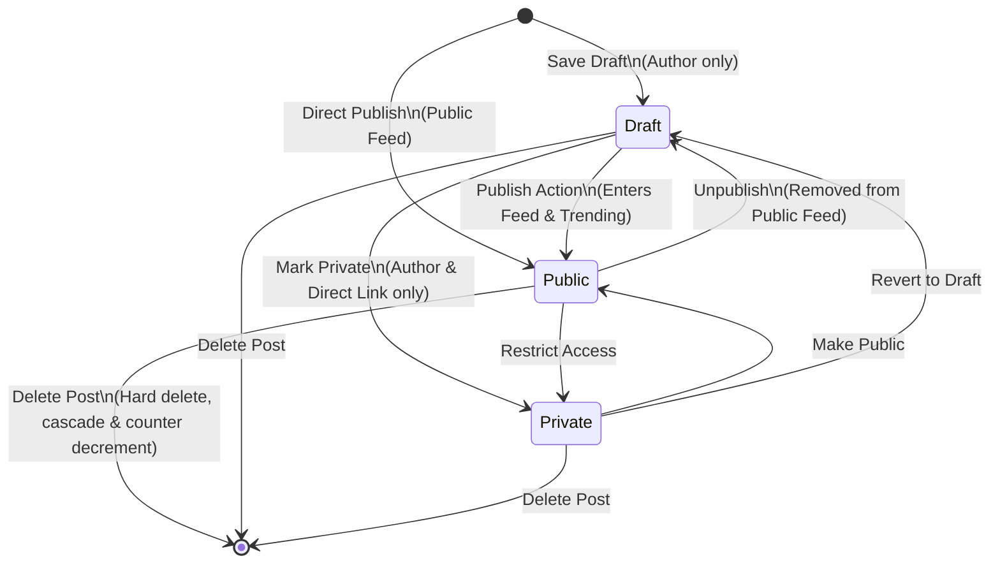
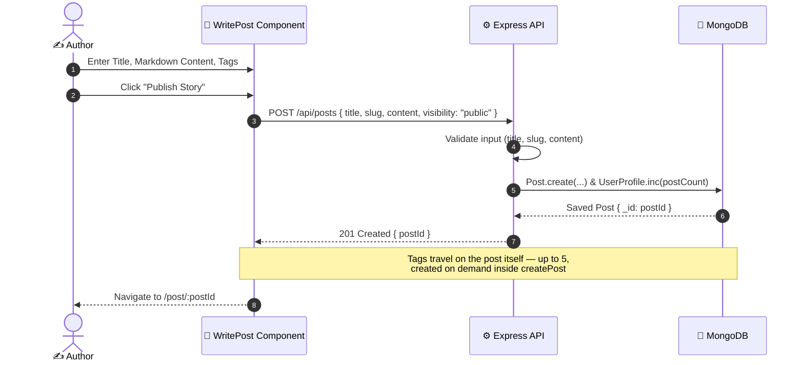

# User Flows

> **Scope:** end-to-end journeys — what the user does, what the client does, what the API
> does, and where each flow can fail.
> **Excludes:** capability status ([features.md](features.md)), endpoint signatures
> ([reference/api.md](../reference/api.md)).

Notation: `→` step transition, `⇢` network call, `✗` failure branch.

---

## Route map

| Route                 | Access | Page                                                  |
| --------------------- | ------ | ----------------------------------------------------- |
| `/`                   | Public | `Home`                                                |
| `/login`, `/register` | Public | `Login`, `Register`                                   |
| `/post/:id`           | Public | `PostDetail`                                          |
| `/user/:userId`       | Public | `UserProfile`                                         |
| `/search`             | Public | `Search`                                              |
| `/dashboard`          | Member | `Dashboard` — how the work performed                  |
| `/stories`            | Member | `Stories` — what has been written, and its management |
| `/comments`           | Member | `Responses` — what readers said back                  |
| `/write`, `/edit/:id` | Member | `WritePost`                                           |
| `/settings`           | Member | `Settings`                                            |
| `/admin`              | Admin  | `AdminDashboard`                                      |
| `/admin/posts`        | Admin  | `AdminPosts`                                          |
| `/admin/tags`         | Admin  | `AdminTags`                                           |
| `/admin/users`        | Admin  | `AdminUsers`                                          |
| `/admin/activity`     | Admin  | `AdminActivity`                                       |
| `/admin/users/:userId/activity` | Admin | `AdminPersonActivity`                        |
| `*`                   | Public | `NotFound`                                            |

Member routes are wrapped in `ProtectedRoute`, admin routes in `AdminRoute`. Both redirect to
`/login` and preserve the attempted location in router state, so the user lands where they
started after signing in.

### Redirects

The workspace used to be one page that mixed statistics with post management, which meant
neither was good at its job. It is now three pages split by the question each answers, and the
old paths redirect rather than 404:

| Old route           | Redirects to  |
| ------------------- | ------------- |
| `/profile`          | `/dashboard`  |
| `/my-posts`         | `/stories`    |
| `/analytics`        | `/dashboard`  |
| `/admin/categories` | `/admin/tags` |

There is no `/admin/settings`. It was a page of toggles wired to nothing, so it was removed
rather than left to imply that the switches did something.

---

## 1. Registration



Registration does not sign the user in. Uniqueness is enforced by the database, so two
concurrent registrations cannot both succeed.

---

## 2. Sign in



`authState` is a plain object outside React so the Axios interceptor can read the current
token without a hook — see
[architecture/frontend.md](../architecture/frontend.md#authentication-state).

---

## 3. Authenticated request and silent refresh



A refresh token presented as an access token is rejected with 401 — different secret and a
mismatched `type` claim.

---

## 4. Browsing the feed

```
/ → Home mounts
  ⇢ GET /posts           → queryKey ["posts"]     (published only, paginated)
  ⇢ GET /posts/trending  → queryKey ["trending"]
  → hero, feed, trending sidebar
  → clicking a card → /post/:id
```

The API returns only `visibility: 'public'` posts, so no browser-side filter is required.
Responses are cached for five minutes and are not refetched on window focus.

The landing page has **no in-page topic filter**. It had one, and it was removed: it
filtered only the posts already in memory, so it looked like a search of the platform while
actually searching one page, and it competed with the ranking the page exists to present.

What remains in the hero is a row of popular-topic shortcuts, which **navigate** to
`/search?topic=<name>` rather than filtering in place. The distinction matters: the landing
page presents, `/search` filters, and the filtering is done by the server against the whole
collection.

**Known limitation:** the feed requests one page and does not paginate further, so only the
most recent page is reachable from the landing page ([GAP-07](roadmap.md#gap-07)). `/search`
is the way to reach the rest.

---

## 5. Reading a post

```
/post/:id → PostDetail mounts
  ⇢ GET /posts/:id     → queryKey ["post", id]
       ├─ ✗ unknown id → 404 → "Post not found" screen
       ├─ non-public and viewer is not the author or an admin → 404
       └─ author, likes, comments, replies, tags populated
  ⇢ POST /analytics/view/:id   (fire and forget)
  → cover image, title, author card, Markdown body, comment thread
  → author sees Edit and Delete
```

An author opening their own draft gets 200 — the route carries optional authentication.

### 5a. Commenting

```
type → Submit
  ⇢ POST /comments { postId, message }     author taken from the token
  → invalidate ["post", id]
```

### 5b. Replying

```
Reply → type → Submit
  ⇢ POST /comments/replies { repliedCommentId, message }
       ├─ ✗ unknown parent → 404
       ├─ reply stores the parent's post reference
       └─ parent.replies.addToSet(child), replyCount += 1
  → 201 → invalidate ["post", id]
```

### 5c. Liking

```
click like
  ⇢ POST /likes { postId }     or DELETE /likes/post/:postId
       ├─ ✗ already liked → 409 (the unique index is what actually enforces it)
       └─ Like document written and Post.likes kept in step
  → invalidate ["post", id]
```

Like state survives a reload because `Post.likes` is maintained and populated on read.

---

## 6. Publishing and Post Lifecycle





Publishing with `visibility: 'public'` puts the post on the home feed immediately.

Tags are written by the same request that creates the post. `postService.createPost` resolves
each name to a `Tag` document, creating it when it does not exist, and keeps `Tag.posts` in
step. There is no second request to fail halfway.

---

## 7. Editing

```
/edit/:id → WritePost in edit mode
  ⇢ GET /posts/:id   (enabled only when editing)
  → form hydrates from the fetched post, including its tags
  → Save
  ⇢ PUT /posts/:id
       ├─ ✗ missing → 404
       ├─ ✗ not author and not admin → 403
       ├─ title, content and imageURL fall back to their stored values when omitted
       ├─ `visibility` and `tags` are written only when the caller sent them, so a
       │    partial save cannot unpublish a live post or clear its tags
       ├─ the slug is re-derived only when one was sent or the title changed
       └─ `editedAt` is stamped on every successful update — that is what makes it
            mean "the author changed this" rather than "the document was written to"
  → navigate to /post/:id
```

A post without a cover image edits normally.

---

## 8. Managing your stories

`/stories` answers "what have I written, and what do I want to do with it". Every control on
it — the filter, the search, the sort, the page — is a query parameter, so the server does the
work and a reload or a shared link reproduces the same view.

```
/stories → ⇢ GET /users/getUserPosts?page&limit&visibility&sort&q → ["myPosts", params]
         → ⇢ GET /analytics/me                                    → ["myAnalytics"]
  → tabs count all / public / draft / private from `counts` in the response
  → per row: View · Edit · Publish or Unpublish · Delete
  → Publish/Unpublish ⇢ PUT /posts/:id { visibility }
  → Delete → confirmation modal → ⇢ DELETE /posts/:id
       ├─ 404 missing, 403 not owner or admin
       ├─ pull the id from referencing tags
       ├─ delete attached comments
       ├─ pull from User.posts (the author's)
       ├─ delete the post
       └─ decrement the **author's** postCount
  → selection → ⇢ POST /posts/bulk { ids, action }
       └─ action is delete | public | draft | private; ownership is checked per id,
          so a mixed selection cannot be used to reach someone else's post
  → invalidate ["myPosts"], ["myAnalytics"], ["posts"]
```

`counts` is computed server-side over the whole collection, not over the current page —
otherwise the tab labels would change every time you paged.

Deletion leaves orphaned likes, views and reads — see
[reference/database.md](../reference/database.md#integrity).

---

## 9. The workspace dashboard

`/dashboard` answers "how is the work doing". It reads only; every action on it is a link to
somewhere that writes.

```
/dashboard → ⇢ GET /analytics/me         → ["myAnalytics"]
                  ├─ ✗ not signed in → 401
                  ├─ count views and reads over the caller's own posts
                  └─ totals, per-post rates, a top-five ranking
           → ⇢ GET /users/getUserPosts?visibility=draft&limit=4&sort=updated
                  └─ the drafts to pick back up
           → ⇢ GET /analytics/me/reading → ["readingActivity"]
                  └─ what this account has been reading
  → summary tiles, top stories, unfinished drafts
```

`GET /analytics/me` derives the author from the token rather than taking a user id in the
path. The older `GET /analytics/user/:userId` still exists for the admin console and checks
`authorizeSelfOrAdmin`; the workspace does not use it, because an endpoint that cannot name
anyone else's data cannot leak anyone else's data.

---

## 10. Responses

`/comments` answers "what did readers say back", which was previously answerable only by
opening each post in turn.

```
/comments → ⇢ GET /users/getUserPosts?limit=50&sort=newest → ["myPosts", params]
          → select a story
          → ⇢ GET /comments/post/:postId?limit=50          → ["postComments", id]
  → Delete a response ⇢ DELETE /comments/:id
       └─ allowed for the comment's author, the post's author, or an admin
  → invalidate ["postComments", id]
```

---

## 11. Following

```
/user/:userId → ⇢ GET /users/:userId/profile   (public; no token needed)
              → ⇢ GET /posts?author=:userId&page  (server-side, paged)
              → ⇢ GET /users/isFollowing/:userId  (only when signed in)
  → Follow   ⇢ POST /users/followUser { toFollowId }
       ├─ ✗ self-follow → 400
       ├─ ✗ target account missing → 404
       └─ both sides and both counters updated, each with a guarded $addToSet
  → Unfollow ⇢ POST /users/unfollowUser — mirror
```

The two profile updates are separate writes with no transaction; a failure between them
leaves the relationship one-sided.

---

## 12. Search

```
header search → /search → type
  ⇢ GET /search/:query
       ├─ regex metacharacters escaped
       ├─ match public posts on title, body, tag names and author username;
       │    title matches first, then newest; capped at 50
       └─ project the author, tags, cover, a 200-character excerpt with markup
            stripped, and the full body length for a reading-time estimate
  → results → /post/:id
```

Content, tags and authors are all searched now. What remains is that the regex cannot use
an index ([GAP-05](roadmap.md#gap-05)).

---

## 13. Theme switching

```
ThemeToggle → toggleTheme()
  → localStorage["theme"] = mode
  → <html data-theme="mode">
  → <meta name="theme-color"> updated
  → styled-components re-renders with the new token set
```

A stored preference wins on load; otherwise `prefers-color-scheme` decides. The system
listener only auto-switches while no explicit choice is stored.

---

## 14. Administration

```
/admin (AdminRoute: authenticated AND roles contains "admin")
  ├─ Dashboard   ⇢ GET /posts?all=true → ["allPosts"], GET /analytics/admin
  ├─ Posts       ⇢ GET /posts?all=true — includes drafts and private posts
  ├─ Tags        ⇢ GET /tags; create via POST /tags, remove via DELETE /tags/:id (admin-only)
  └─ Users       ⇢ GET /users?page=n → ["admin-users", page]
                 ⇢ PATCH /users/:id/suspension { suspended }
                 ⇢ PATCH /users/:id/role       { admin: true | false }
                 ⇢ DELETE /users/:id
```

The user actions are the reason the console exists. Suspension and demotion both increment the
target's `tokenVersion`, so an account loses its existing sessions the moment it is acted on
rather than whenever its access token happens to expire. Deletion goes through the same
`purgeAccount` service the member-facing "delete my account" uses, so there is one definition
of what removing an account means.

There is no admin Settings page. It was a screen of switches wired to nothing, and a control
that does not control anything is worse than an absent one.

`?all=true` is honoured only for an admin token; for anyone else the flag is ignored and the
public list is returned. `AdminRoute` is a convenience — every admin resource is independently
enforced server-side ([security/auth.md](../security/auth.md)).

---

## Cross-cutting failure handling

| Layer                | Mechanism                                  |
| -------------------- | ------------------------------------------ |
| Render errors        | `ErrorBoundary` wraps the tree             |
| Route not found      | Catch-all renders `NotFound`               |
| Expired access token | Interceptor refreshes once and replays     |
| Refresh failure      | Session cleared, hard redirect to `/login` |
| Rate limited         | 429 with a retry message                   |
| Mutation failure     | Error toast from `onError`                 |
| Query failure        | One retry, then the page's error branch    |
