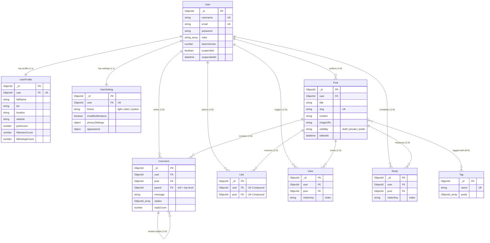

# Database

> **Scope:** the MongoDB data model — collections, fields, relationships, indexes, query
> patterns and remaining integrity issues.
> **Excludes:** how the API reads and writes it ([backend.md](../architecture/backend.md)), endpoint payloads
> ([reference/api.md](api.md)), connection configuration
> ([reference/configuration.md](configuration.md)).

---

## Engine

MongoDB via **Mongoose 8**. Connection handling is in `backend/config/db.js`; the URI is
read from `MONGODB_URI`, `MONGO_DB_URI` or `DB_URI`, in that order.

Every schema uses `{ timestamps: true }`, so documents carry `createdAt` and `updatedAt`
automatically.

---

## Collections

Nine active Mongoose models and collections.

| Model         | Collection     | Purpose                             | Status                 |
| ------------- | -------------- | ----------------------------------- | ---------------------- |
| `User`        | `users`        | Account and credentials             | Active                 |
| `UserProfile` | `userprofiles` | Bio, avatar, social graph, counters | Active                 |
| `UserSetting` | `usersettings` | Preferences                         | Active                 |
| `Post`        | `posts`        | Article content                     | Active                 |
| `Comment`     | `comments`     | Comments and nested replies         | Active                 |
| `Tag`         | `tags`         | Topic and keyword taxonomy          | Active                 |
| `Like`        | `likes`        | One like event                      | Active                 |
| `View`        | `views`        | One page-view event                 | Active                 |
| `Read`        | `reads`        | One read-completion event           | Active, rarely written |

---

## Entity relationships



Several relationships are stored on **both** sides — see
[denormalisation](#denormalisation-and-drift).

---

## Schemas

### `User`

| Field          | Type                     | Constraints                                                   |
| -------------- | ------------------------ | ------------------------------------------------------------- |
| `username`     | String                   | required, trim, **unique index**                              |
| `email`        | String                   | required, trim, lowercase, **unique index**                   |
| `password`     | String                   | required, bcrypt hash (cost 12)                               |
| `roles`        | [String]                 | enum `user \| admin`, default `['user']`                      |
| `tokenVersion` | Number                   | default 0 — see below                                         |
| `suspended`    | Boolean                  | default false; blocks sign-in and every authenticated request |
| `suspendedAt`  | Date                     | set when suspended, cleared when restored                     |
| `profile`      | ObjectId → `UserProfile` | 1:1                                                           |
| `settings`     | ObjectId → `UserSetting` | 1:1                                                           |
| `posts`        | [ObjectId → `Post`]      | denormalised authorship list                                  |

Email normalisation is a **schema** concern (`lowercase`, `trim`), not a controller concern,
so every write path is consistent.

**`tokenVersion` is what makes sessions revocable.** Both tokens carry the value they were
minted with and authentication compares it against the stored one, so incrementing the field
invalidates everything already issued to that account. Sign-out, a password change, a
suspension and a demotion all increment it. Without it the tokens were stateless in the
unhelpful sense: nothing could be taken back before it expired.

### `UserProfile`

| Field                                            | Type                            | Notes                                                                 |
| ------------------------------------------------ | ------------------------------- | --------------------------------------------------------------------- |
| `user`                                           | ObjectId → `User`               | required, **unique index**                                            |
| `image.data` / `image.contentType`               | Buffer / String                 | The avatar bytes; served by `GET /users/:id/avatar` ([BUG-07](../product/roadmap.md#bug-07)) |
| `bio`, `fullName`, `location`, `website`         | String                          | trimmed                                                               |
| `socialLinks`                                    | `{ twitter, github, linkedin }` |                                                                       |
| `followers` / `followings`                       | [ObjectId → `User`]             |                                                                       |
| `postCount`, `followersCount`, `followingsCount` | Number                          | default 0                                                             |

The extended profile fields were added during remediation — the settings controller had been
writing them to a schema that did not declare them, so Mongoose discarded every one
([BUG-05](../product/roadmap.md#bug-05)).

### `UserSetting`

| Field                          | Type                      | Default          |
| ------------------------------ | ------------------------- | ---------------- |
| `user`                         | ObjectId → `User`         | required, unique |
| `theme`                        | `light \| dark \| system` | `system`         |
| `emailNotifications`           | Boolean                   | `true`           |
| `privacySettings.showEmail`    | Boolean                   | `false`          |
| `privacySettings.showActivity` | Boolean                   | `true`           |
| `appearance.fontSize`          | `sm \| md \| lg`          | `md`             |
| `appearance.colorScheme`       | String                    | `default`        |

Previously `new mongoose.Schema({})` — an empty schema that silently discarded every write.

### `Post`

| Field        | Type                         | Notes                                   |
| ------------ | ---------------------------- | --------------------------------------- |
| `user`       | ObjectId → `User`            | author                                  |
| `title`      | String                       | required                                |
| `slug`       | String                       | required, **unique index**              |
| `content`    | String                       | required, Markdown, max 100,000 chars   |
| `imageURL`   | String                       | optional cover image                    |
| `visibility` | `draft \| private \| public` | default `draft`, **written by the API** |
| `tags`       | [ObjectId → `Tag`]           | up to 5, set in the editor              |
| `views`      | [ObjectId → `View`]          | seeder only                             |
| `likes`      | [ObjectId → `Like`]          | maintained at runtime                   |
| `comments`   | [ObjectId → `Comment`]       | maintained at runtime                   |
| `editedAt`   | Date                         | stamped only by `postService.updatePost`, so "edited" means edited rather than engaged with ([BUG-24](../product/roadmap.md#bug-24)) |

### `Comment`

| Field                | Type                   | Notes                               |
| -------------------- | ---------------------- | ----------------------------------- |
| `user`               | ObjectId → `User`      | author                              |
| `post`               | ObjectId → `Post`      | set on replies too                  |
| `message`            | String                 | max 5,000 characters                |
| `parent`             | ObjectId → `Comment`   | the comment this replies to, `null` for a top-level comment. Listing filters on it, which is what stopped replies coming back twice ([BUG-20](../product/roadmap.md#bug-20)) |
| `replies`            | [ObjectId → `Comment`] | self-reference, one level in the UI |
| `replyCount`         | Number                 | default 0                           |
| `likes` / `dislikes` | [ObjectId → `User`]    | no endpoint writes these            |
| `date`               | Date                   | redundant with `createdAt`          |

### `Tag`

`name` (String, required, lowercased, max 30, **unique index**) and `posts` (array of
references), plus timestamps.

There is no `Category` model. Categories were folded into tags;
`backend/scripts/migrate.js` drops the legacy collection and unsets `Post.categories`.

### `Like`, `View`, `Read`

Event documents: `user` → `User`, `post` → `Post`, plus timestamps. `Like` carries a
**unique compound index on `(post, user)`**, so one like per user per post is enforced by the
database rather than by a racy `findOne`.

`View` and `Read` additionally carry **`visitorKey`** (String, indexed with `post` and
`createdAt`). Tracking is open to anonymous readers by design, so without something to group
requests by, one client could inflate any post's numbers by holding down refresh. The key is
the account id when signed in (`u:<id>`) and otherwise a salted HMAC of the address and user
agent (`a:<hash>`) — hashed rather than stored, since the analytics only need to know that two
requests came from the same place. One row per key per post per 6-hour window.

`View` and `Read` are also what the trending ranking counts; see
[api.md](api.md#how-trending-is-ranked).

### The removed `Analytics` collection

There was an `Analytics` model holding pre-aggregated totals. Nothing in the running
application ever wrote one — only the seeder did — so on any real database
`GET /analytics/post/:id` answered 404 for every post. It has been deleted; the figures are
now counted from `View`, `Read`, `Like` and `Comment`, which are the rows that actually
accumulate ([BUG-06](../product/roadmap.md#bug-06)).

---

## Indexes

**Twenty** declared indexes across nine collections (29 counting the automatic `_id` on each),
all declared in the schema files so they travel with the model.

| Collection     | Index                                       | Purpose                                              |
| -------------- | ------------------------------------------- | ---------------------------------------------------- |
| `users`        | `{ email: 1 }` unique                       | Sign-in lookup; prevents duplicate accounts          |
| `users`        | `{ username: 1 }` unique                    | Same                                                 |
| `posts`        | `{ visibility: 1, createdAt: -1 }`          | The public feed                                      |
| `posts`        | `{ user: 1, createdAt: -1 }`                | Author feeds and My Posts                            |
| `posts`        | `{ editedAt: -1 }`                          | The moderation log                                   |
| `posts`        | `{ slug: 1 }` **unique**                    | Slug lookups; a repeatable slug cannot identify a post |
| `comments`     | `{ post: 1, parent: 1, createdAt: -1 }`     | The top-level listing, which filters on `parent`     |
| `comments`     | `{ post: 1, createdAt: -1 }`                | Comment threads                                      |
| `comments`     | `{ user: 1, createdAt: -1 }`                | Activity and timeline                                |
| `likes`        | `{ post: 1, user: 1 }` unique               | Prevents duplicate likes                             |
| `likes`        | `{ user: 1, createdAt: -1 }`                | Activity feed                                        |
| `views`        | `{ post: 1, createdAt: -1 }`                | Analytics counts                                     |
| `views`        | `{ post: 1, visitorKey: 1, createdAt: -1 }` | The per-visitor de-duplication check                 |
| `views`        | `{ user: 1, createdAt: -1 }`                | Activity feed                                        |
| `reads`        | `{ post: 1, createdAt: -1 }`                | Read-rate calculation                                |
| `reads`        | `{ post: 1, visitorKey: 1, createdAt: -1 }` | The per-visitor de-duplication check                 |
| `reads`        | `{ user: 1, createdAt: -1 }`                | Reading history                                      |
| `userprofiles` | `{ user: 1 }` unique                        | Looked up on nearly every authenticated request      |
| `usersettings` | `{ user: 1 }` unique                        | One settings document per account                    |
| `tags`         | `{ name: 1 }` unique                        | Lookups are by name                                  |

**Not indexed:** the search regex. `GET /search/:query` still performs a collection scan over
titles and bodies — adding a text index would change matching from substring to whole-word,
which is a UX decision, not a mechanical one ([GAP-05](../product/roadmap.md#gap-05)).

### Migration note

Adding unique indexes to a database with existing duplicates fails. Resolve duplicates first:

```js
db.users.aggregate([
  { $group: { _id: "$email", count: { $sum: 1 }, ids: { $push: "$_id" } } },
  { $match: { count: { $gt: 1 } } },
]);
```

The `likes` unique index in particular rejected pre-existing `{ post: null }` documents
produced by a seeder bug ([BUG-16](../product/roadmap.md#bug-16)) — a constraint earning its
keep on the day it was added.

---

## Query patterns

### Population

`GET /posts/:id` performs the deepest population — author, likes, comments, each comment's
author, each comment's replies and their authors, plus tags. Always pass a projection
(`'username'`) so password hashes and email addresses never leave the database.

`GET /posts` populates only `user` and `tags`, and is paginated. It previously populated all
comments for every post in the collection — the most expensive query in the application.

### Aggregation

- **Trending** — four `$lookup` sub-pipelines counting views, reads, likes and comments inside
  a 14-day window, a `$match` floor on views, then the weighted `$addFields` score and `$sort`.
- **Tag counts** — `$lookup` from `posts` filtered to `visibility: 'public'`, then `$size`.
- **Admin analytics** — `$lookup` from `views` into `posts` and from `posts` into `users`,
  then `$addFields`, `$sort`, `$limit`, `$project`.
- **Visibility counts** — `$group` on `visibility`, so the moderation and workspace tab counts
  reflect the whole collection rather than the page being shown.

Search is a `Post.find()` rather than an aggregation: a `$or` over the title and body regexes
plus tag and author ids resolved in two prior queries.

### Counting

`getUserAnalytics` counts views and reads with one grouped aggregation per collection
(`countByPost`). It used to issue `countDocuments` per post, so an author with 50 posts
triggered 100 queries on every dashboard load.

---

## Denormalisation and drift

Several relationships are stored twice, maintained by separate writes with no transaction.

| Pair                                           | Maintained by                  | Risk                                                                                     |
| ---------------------------------------------- | ------------------------------ | ---------------------------------------------------------------------------------------- |
| `Post.comments` ↔ `Comment.post`              | `createComment`, reply handler | Both sides now written, including replies                                                |
| `Post.likes` ↔ `likes` collection             | `createLike`, `deleteLike`     | Both sides now written                                                                   |
| `Post.views` ↔ `views` collection             | **Nothing at runtime**         | Array stays empty outside seed data                                                      |
| `User.posts` ↔ `Post.user`                    | `createPost`, `deletePost`     | Two sources of truth for authorship; the story list reads one, analytics reads the other |
| `Tag.posts` ↔ `Post.tags`                     | `postService`, `deletePost`    | Both sides written; deleting a post pulls its id from every tag                          |
| `UserProfile.followers/followings` ↔ counters | `followUser`, `unfollowUser`   | Array and counter can disagree if one write fails                                        |
| `UserProfile.postCount` ↔ actual count        | `postBlogs`, `deletePost`      | Now targets the post's author, not the requester                                         |

**Recommended direction:** keep the child-to-parent reference (`Comment.post`, `Post.user`,
`Like.post`) as the single source of truth, drop the parent-side arrays, and derive counts
with indexed `countDocuments` or a `$group`. Where a counter is genuinely needed, maintain it
with an atomic `$inc` in the same operation that writes the child, plus a reconciliation
script. Tracked in [Phase 3](../product/roadmap.md#phase-3--data-model-consolidation).

---

## Integrity

No referential integrity at the database level; the only cascade is manual.

| Operation        | Cascade behaviour                                                                                                                                                                       |
| ---------------- | --------------------------------------------------------------------------------------------------------------------------------------------------------------------------------------- |
| Delete a post    | Pulls the id from referencing tags, deletes attached comments, pulls from the author's `User.posts`, decrements the author's `postCount`. **Leaves orphaned** likes, views and reads    |
| Delete a user    | Implemented — `accountService.purgeAccount`, shared by `DELETE /users/me` and the administrator's `DELETE /users/:id` ([GAP-09](../product/roadmap.md#gap-09))                          |
| Delete a tag     | `DELETE /tags/:id` **refuses with 409** while any story still carries the tag, rather than leaving dangling ids in `Post.tags`                                                          |
| Delete a comment | Removed with its replies by `DELETE /comments/:id`, and in bulk as part of post deletion                                                                                                |

No multi-document transactions are used, although MongoDB Atlas replica sets support them.
`createPost` and `createComment` approximate one with a compensating delete.

---

## Seed data

`backend/scripts/seed.js` (`npm run seed`) **clears every collection** and rebuilds a demo
dataset: 15 users (14 creators and 1 administrator) and 99 stories — 84 public, 10 drafts and
5 private — spread over 10 topic groups whose names become tags. Each public story then gets
2–6 comments, 2–9 likes and 15–54 views, with a share of those views marked as completed
reads. The counts vary per run because they are randomised.

| Role          | Email               | Password      |
| ------------- | ------------------- | ------------- |
| Member        | `john@example.com`  | `password123` |
| Administrator | `admin@bloghub.com` | `admin123`    |

Two things to know:

1. It is **destructive**. Never point it at a database you care about.
2. It resolves the root `.env` explicitly — a bare `dotenv.config()` looked in `backend/` and
   found nothing ([BUG-18](../product/roadmap.md#bug-18)).
3. It refuses a non-local target unless `SEED_ALLOW_REMOTE=yes` is set. The guard tests the
   URI for `localhost` or `127.0.0.1`, not the database name.

---

## Schema conventions

- One model per file, `<resource>.model.js`.
- Singular PascalCase model name; Mongoose derives the lowercase plural collection.
- Always `{ timestamps: true }` — never hand-roll `createdAt`.
- References use `mongoose.Schema.Types.ObjectId` with a `ref` naming a model that **exists**.
- **Declare every field the application writes.** Strict mode discards undeclared fields
  silently, which is the single most expensive mistake made in this codebase
  ([BUG-05](../product/roadmap.md#bug-05)).
- Declare every index the model's queries need, in the schema file.
- Put `required`, `enum`, `unique`, `trim` and `lowercase` at the schema level rather than
  relying on controller checks.
- Never return a hash in a default projection — `.select('-password')` or `select: false`.
