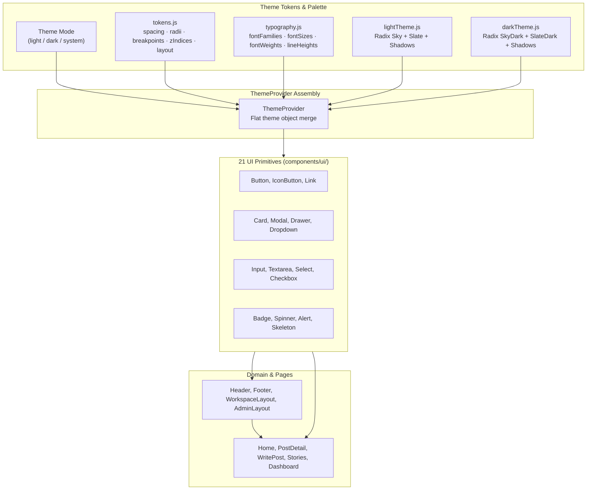

# Design System

> **Scope:** the visual vocabulary — tokens, themes, primitives, typography, colour, layout,
> interaction, feedback and iconography. This is what you look something up in.
> **Excludes:** the rules for applying it — how to add a token or a primitive, the review
> checklist, the current drift, and the guidance for agents — all of which live in
> [guides/development.md](../guides/development.md#design-language), because a rule belongs
> beside the other rules rather than in a catalogue. Also excludes component file organisation
> ([architecture/frontend.md](../architecture/frontend.md)) and journeys
> ([product/user-flows.md](../product/user-flows.md)).
>
> Rendered screenshots of the shipped UI are in
> [`client/public/screenshots/`](../../client/public/screenshots/) and referenced from the
> [README](../../README.md). They are the visual reference; this document is the specification.

---

## Principles

1. **Reading comes first.** The article is the product. Chrome recedes; typography and
   whitespace carry the experience.
2. **One accent.** A single sky-blue ramp — Radix `sky` in light, `skyDark` in dark. Colour
   marks the primary action and nothing else; status colours only signal status. (This read
   "indigo in light, violet in dark" until the accent was changed in the code and the
   sentence was not.)
3. **Depth through space, not lines.** Prefer spacing and subtle elevation over rules.
4. **Every state is designed.** Loading, empty, error and success are part of the screen.
5. **Both themes are first class.** Dark mode is a peer implementation, not a filter.

---

# Foundation

Styling is CSS-in-JS via **styled-components v6**. No utility framework, no global stylesheet
beyond `GlobalStyles`. Every value a component needs comes from the theme object.



The theme handed to styled-components is a flat merge:

```js
{ ...(mode === 'light' ? lightTheme : darkTheme), ...tokens, ...typography }
```

So a component reaches every value from one object:

```js
const Card = styled.div`
  background: ${({ theme }) => theme.colors.cardBg};
  padding: ${({ theme }) => theme.spacing.lg};
  border-radius: ${({ theme }) => theme.radii.lg};
  box-shadow: ${({ theme }) => theme.shadows.card};
`;
```

---

## Tokens

### Spacing — `theme.spacing`

8px rhythm with a 4px half-step: `xs` 4 · `sm` 8 · `md` 16 · `lg` 24 · `xl` 32 · `xxl` 48.

### Radii — `theme.radii`

| Token  | Value  | Use                 |
| ------ | ------ | ------------------- |
| `sm`   | 6px    | Badges, inline code |
| `md`   | 8px    | Buttons, inputs     |
| `lg`   | 12px   | Cards, images       |
| `xl`   | 16px   | Modals              |
| `2xl`  | 20px   | Hero surfaces       |
| `full` | 9999px | Avatars, pills      |

### Breakpoints — `theme.breakpoints`

`sm` 640 · `md` 768 · `lg` 1024 · `xl` 1280 · `2xl` 1440px. Written mobile-first with
`max-width` queries against these values.

### Z-index — `theme.zIndices`

`base` 0 · `dropdown` 100 · `sticky` 200 · `overlay` 300 · `modal` 400 · `toast` 500.

Never write a raw z-index. Add a rung to the ladder if one is missing.

### Layout — `theme.layout`

| Token             | Value  | Meaning                            |
| ----------------- | ------ | ---------------------------------- |
| `headerHeight`    | 60px   | Fixed header offset                |
| `sidebarWidth`    | 260px  | Admin sidebar                      |
| `maxContentWidth` | 1200px | Page container ceiling             |
| `contentWidth`    | 680px  | Reading measure for article bodies |

### Transitions — `theme.transitions`

`fast` 150ms (colour, opacity) · `normal` 200ms (most state changes) · `slow` 300ms (layout) ·
`spring` 300ms cubic-bezier (playful entrances).

---

## Typography

System font stacks — no web fonts, so no font-loading shift.

| Role            | Stack                                                                        |
| --------------- | ---------------------------------------------------------------------------- |
| `fonts.body`    | `-apple-system, BlinkMacSystemFont, "SF Pro Text", "Segoe UI", Roboto, …`    |
| `fonts.heading` | `-apple-system, BlinkMacSystemFont, "SF Pro Display", "Segoe UI", Roboto, …` |
| `fonts.mono`    | `"SF Mono", "Fira Code", Menlo, Monaco, Consolas, monospace`                 |

> `index.html` still preconnects to `fonts.googleapis.com` although no Google font is
> requested. Dead markup, safe to remove.

### Scale — `theme.fontSizes`

| Token  | rem / px    |     | Token | rem / px   |
| ------ | ----------- | --- | ----- | ---------- |
| `xs`   | 0.75 / 12   |     | `2xl` | 1.5 / 24   |
| `sm`   | 0.8125 / 13 |     | `3xl` | 1.875 / 30 |
| `md`   | 0.9375 / 15 |     | `4xl` | 2.25 / 36  |
| `base` | 1 / 16      |     | `5xl` | 2.75 / 44  |
| `lg`   | 1.125 / 18  |     |       |            |
| `xl`   | 1.25 / 20   |     |       |            |

Body copy defaults to `md` (15px); article bodies step up to `lg` (18px).

**Weights** `normal` 400 · `medium` 500 · `semibold` 600 · `bold` 700.
**Line heights** `none` 1 · `tight` 1.2 · `snug` 1.35 · `normal` 1.5 · `relaxed` 1.65 ·
`loose` 1.8.
**Tracking** `tighter` −0.03em through `wider` 0.03em.

Headings default to `semibold` with `tight` tracking; article bodies use `loose` line height.

---

## Colour

Both themes expose an identical key set, so a component written against `theme.colors.<name>`
works in either mode without a conditional. **Never inline a hex value.**

The two themes are not two hand-written palettes. `lightTheme.js` and `darkTheme.js` each pick
a set of **Radix colour ramps** and hand them to `createTheme(ramps, mode)`, which derives every
token from them. One definition of what "accent solid" means, two modes.

| Ramp      | Light   | Dark        |
| --------- | ------- | ----------- |
| `neutral` | `slate` | `slateDark` |
| `accent`  | `sky`   | `skyDark`   |
| `success` | `grass` | `grassDark` |
| `warning` | `amber` | `amberDark` |
| `danger`  | `red`   | `redDark`   |
| `info`    | `blue`  | `blueDark`  |

### Reading a Radix ramp

Each ramp is twelve steps with fixed meanings. Getting these wrong is the single easiest way
to ship unreadable UI:

| Steps | Role                                             |
| ----- | ------------------------------------------------ |
| 1–2   | Page and subtle backgrounds                      |
| 3–5   | Component backgrounds — normal, hover, active    |
| 6–8   | Borders — subtle, normal, focus                  |
| 9–10  | Solid fills — the accent itself, and its hover   |
| 11–12 | **Text.** Only these two are contrast-guaranteed |

### Foreground on a solid fill is derived, not assumed

Step 9 is a _fill_, and nothing about the scale promises white text will be readable on it. On
a bright ramp — sky, amber, grass — it is not. White on `sky-9` measures **1.48:1**, so a
primary button's label was effectively invisible.

So the theme measures instead of guessing. `createTheme.js` implements WCAG 2.1 relative
luminance and contrast ratio, and picks whichever of white or near-black actually wins:

```js
const INK = '#0f172a';
const readableOn = (background) =>
  contrast(background, '#ffffff') >= contrast(background, INK) ? '#ffffff' : INK;

textOnAccent:  readableOn(step(a, 9)),   // sky-9  → ink,  12.04:1
textOnDanger:  readableOn(step(d, 9)),   // red-9  → white
textOnSuccess: readableOn(step(s, 9)),
```

Change the accent ramp to something dark and the foreground flips to white on its own. That is
the point: the rule is stated once, so a palette change cannot quietly break legibility.

### Token groups

| Group    | Keys                                                                                                                                                       |
| -------- | ---------------------------------------------------------------------------------------------------------------------------------------------------------- |
| Surfaces | `surfacePage`, `surfaceContainerLow \| Container \| ContainerHigh \| ContainerHighest`, `surfaceElevated`, `surfaceHover`, `surfaceActive`, `surfaceScrim` |
| Text     | `textPrimary`, `textSecondary`, `textMuted`, `textDisabled`, `textOnAccent`, `textOnDanger`, `textOnSuccess`, `textLink`, `textLinkHover`                  |
| Lines    | `lineSubtle`, `lineDefault`, `lineStrong`, `lineFocus`                                                                                                     |
| Accent   | `accentContainer`, `accentContainerHover`, `accentLine`, `accentSolid`, `accentSolidHover`, `accentText`                                                   |
| Status   | `success`, `warning`, `danger`, `info` — each with `…Container`, `…Line`, `…Solid`, `…Text`                                                                |

Older names (`bgPrimary`, `border`, `cardBg`, `buttonPrimaryBg`, `accentSubtle` …) still
resolve — `createTheme` aliases them onto the tokens above so nothing broke during the rename.
**Write new code against the names in the table**; the aliases exist to be deleted.

### Gradients — `theme.gradients`

| Token       | Steps              | Use                                      |
| ----------- | ------------------ | ---------------------------------------- |
| `brand`     | 10 → 8             | Solid surfaces: buttons, banners         |
| `brandSoft` | 4 → 6              | Tinted backgrounds behind content        |
| `brandBar`  | 10 → 8, horizontal | Thin progress and accent bars            |
| `brandDeep` | 10 → 11            | Large surfaces that carry their own text |
| `brandText` | 11 → 12            | **Gradient text only**                   |

`brandText` exists because of a real regression: `gradient` + `background-clip: text` on a
headline used `brand`, whose steps are fills, and the result measured **1.6:1** against the page.
Text sits _on_ the background rather than being a surface, so it needs the text steps. If you
are clipping a gradient to text, it is `brandText` — there is no case where `brand` is right for
that.

### Elevation — `theme.shadows`

`none`, `xs`–`xl`, plus intent-named `card`, `cardHover`, `focus` and `focusRing`. Dark-mode
shadows are deeper to stay visible. `focusRing` is a two-layer ring applied globally to
`*:focus-visible`.

---

## Theme switching

Owned by `ThemeProvider`.

| Concern            | Behaviour                                                                                      |
| ------------------ | ---------------------------------------------------------------------------------------------- |
| Initial mode       | `localStorage["theme"]` if valid, else `prefers-color-scheme`, else light                      |
| Explicit vs system | Three states, not two: `light`, `dark`, or no stored preference. Only the third follows the OS |
| Persistence        | Written on every change                                                                        |
| DOM signal         | `<html data-theme="light\|dark">`                                                              |
| Mobile chrome      | `<meta name="theme-color">` updated                                                            |
| System changes     | A `matchMedia` listener switches only while no explicit choice is stored                       |

Consumers use `useTheme()` for `{ mode, isDark, isLight, toggleTheme, setTheme }`. Prefer
reading `theme.colors.*` over branching on `isDark`.

> The `theme-color` update in `ThemeProvider.jsx` writes a literal `#0d1117` in dark mode,
> which is not a theme token — `surfacePage` is `#070b13`. It is only the mobile browser
> chrome, so nothing is broken, but it is the one place a colour escaped the token system and
> is worth aligning.

---

## Primitives

`client/src/components/ui/`, all re-exported from `index.js`:

```js
import { Button, Input, Card, Modal, Alert } from "../components/ui";
```

**Five of them wrap Radix**, and that is deliberate. A dropdown, a dialog, a select, a tab set
and an avatar all have keyboard, focus and screen-reader behaviour that is tedious to get right
and easy to get subtly wrong — focus trapping, Escape, arrow-key roving, `aria-expanded`,
returning focus to the trigger. Radix owns that; the wrapper owns only how it looks. Anything
hand-rolled here would be an approximation of accessibility rather than the real thing.

| Component      | Exports                        | Radix        | Notes                                                                                                                                                                                                     |
| -------------- | ------------------------------ | ------------ | --------------------------------------------------------------------------------------------------------------------------------------------------------------------------------------------------------- |
| `Button`       | `Button`, `IconButton`         | —            | `variant`: primary \| secondary \| outline \| ghost \| danger; `size`: sm \| md \| lg; `fullWidth`, `isLoading`. Foreground comes from `textOnAccent` / `textOnDanger`, so it is readable by construction |
| `Input`        | `Input`, `TextArea`, `Eyebrow` | —            | Label, field and error render as one unit; the error is wired with `aria-describedby`                                                                                                                     |
| `Select`       | `Select`                       | Select       | `options`, `label`, `error`. Keyboard type-ahead and positioning come from Radix                                                                                                                          |
| `Surface`      | `Surface`, `Card`              | —            | `Surface` is the primitive — a panel with a background, a border and a radius. `Card` is `Surface` with the card preset                                                                                   |
| `Badge`        | `Badge`                        | —            | Static status pill                                                                                                                                                                                        |
| `Chip`         | `Chip`                         | —            | Badge-shaped but _selectable_ — it takes `interactive` and `selected` and renders as a button. A badge labels; a chip is a control                                                                        |
| `Container`    | `Container`, `Box`, `Flex`     | —            | Layout primitives                                                                                                                                                                                         |
| `Modal`        | `Modal`                        | Dialog       | `open`, `onOpenChange`, `title`. Focus trap, Escape and scroll lock from Radix                                                                                                                            |
| `DropdownMenu` | `DropdownMenu`                 | DropdownMenu | Takes a `trigger` prop and **`children`** — see the note below                                                                                                                                            |
| `Tabs`         | `Tabs`                         | Tabs         | Roving focus and `aria-selected` from Radix                                                                                                                                                               |
| `Avatar`       | `Avatar`                       | Avatar       | Falls back to the first initial when the image fails                                                                                                                                                      |
| `Table`        | `Table`                        | —            | `columns` and `rows`, with a horizontal scroll container so a wide table never widens the page                                                                                                            |
| `Pagination`   | `Pagination`                   | —            | `page`, `pages`, `onChange`. Used by `/stories`                                                                                                                                                           |
| `StatTile`     | `StatTile`                     | —            | Label, value, optional trend. Knows nothing about what is being counted                                                                                                                                   |
| `Alert`        | `Alert`                        | —            | `variant`: success \| warning \| danger \| info                                                                                                                                                           |
| `EmptyState`   | `EmptyState`                   | —            | Icon, headline, explanation, one action                                                                                                                                                                   |
| `ErrorState`   | `ErrorState`                   | —            | The failure counterpart of `EmptyState`, with a retry                                                                                                                                                     |
| `Loading`      | `Loading`                      | —            | Centred spinner with a caption — the standard page loading state                                                                                                                                          |
| `Spinner`      | `Spinner`                      | —            | The route-level Suspense fallback                                                                                                                                                                         |
| `Skeleton`     | `Skeleton`, `SkeletonText`     | —            | Shape-level placeholders                                                                                                                                                                                  |
| `BrandMark`    | `BrandMark`                    | —            | The wordmark and logo, defined once                                                                                                                                                                       |

> **`DropdownMenu` takes `children`, not an `items` array.** Passing `items` renders an empty
> menu that opens onto nothing — which is exactly how post editing and deletion silently
> stopped working, since the controls existed but the menu was blank. There is no prop-type
> check to catch it, so it is written down here.

### Rules for primitives

1. **Transient props only** — styling props are `$`-prefixed so they are not forwarded to the
   DOM.
2. **No business logic** — a primitive renders and reports events; it never calls a service.
3. **No domain knowledge.** A primitive may not know what a post, an author or a read rate is.
   The moment it needs to, it belongs in a domain folder — see
   [architecture/frontend.md](../architecture/frontend.md#the-line-between-ui-and-a-domain-component).
4. **Native props pass through** — spread `...props` so callers keep `type`, `aria-*`,
   `onBlur`.
5. **Token-only values.** No literal hex. `textOnAccent` and friends exist so a foreground is
   never guessed.
6. **Reach for it before writing one.** The duplicated card, badge, table and dropdown that
   these replaced had each drifted apart — different padding, different disabled state,
   different focus ring, and in two cases no keyboard support at all.

---

# Composition

## Layout

| Shell           | Component     | Structure                                       |
| --------------- | ------------- | ----------------------------------------------- |
| Public / member | `Layout`      | Fixed `Header` (60px) → `<Outlet />` → `Footer` |
| Admin           | `AdminLayout` | Fixed 260px sidebar → content area              |

```
┌──────────────────────────────────────────────┐   ┌───────────┬──────────────┐
│ HEADER  BlogHub [search] [Write] (avatar ▾)  │   │ Admin     │              │
├──────────────────────────────────────────────┤   │ Dashboard │              │
│                                              │   │ Posts     │  <Outlet />  │
│                 <Outlet />                   │   │ Categories│              │
│                                              │   │ Users     │              │
├──────────────────────────────────────────────┤   │ Settings  │              │
│ FOOTER                                       │   └───────────┴──────────────┘
└──────────────────────────────────────────────┘
```

The avatar menu holds Profile, My posts, Analytics, Settings and Sign out, plus an Admin entry
for admin accounts. Signed-out visitors see `Sign in` and `Get started` instead.

### Widths

| Content        | Width  | Token                    |
| -------------- | ------ | ------------------------ |
| Article body   | 680px  | `layout.contentWidth`    |
| Page container | 1200px | `layout.maxContentWidth` |

Never let a paragraph exceed `contentWidth` — 680px is roughly 70–80 characters, the readable
band.

### Spacing

Vertical rhythm is a multiple of 8px. Section separation `xl` or `xxl`; card padding `lg`,
dropping to `md` on mobile; related controls `sm` apart, unrelated groups `lg` apart.

### Responsive

Mobile-first; add `max-width` queries only where the layout genuinely breaks.

| Range      | Expectation                                                               |
| ---------- | ------------------------------------------------------------------------- |
| < 640px    | Single column, full-bleed cards, collapsed nav, no hover-only affordances |
| 640–1024px | Two-column grids, sidebars stack below content                            |
| > 1024px   | Full layout, sidebars beside content                                      |

`GlobalStyles` provides `.hide-mobile` and `.hide-desktop`. Use sparingly — reflowing beats
hiding.

## Interaction states

Every interactive element defines all five.

| State    | Convention                                                                   |
| -------- | ---------------------------------------------------------------------------- |
| Default  | Token colours at rest                                                        |
| Hover    | `bgHover` / `…Hover` token; `transitions.fast`                               |
| Focus    | Global `*:focus-visible` ring from `shadows.focusRing` — **never remove it** |
| Active   | `bgActive` or `…Active`                                                      |
| Disabled | `opacity: 0.6`, `cursor: not-allowed`, no transform                          |

Hover transforms (`translateY(-1px)`) are reserved for buttons and cards, and must be reverted
on `:disabled`.

## Feedback

| Situation                 | Mechanism                                                            |
| ------------------------- | -------------------------------------------------------------------- |
| Mutation succeeded        | `toast.success('Post created')`                                      |
| Mutation failed           | `toast.error(err.response?.data?.message ?? 'Something went wrong')` |
| Field invalid             | Inline `error` prop on `Input` / `TextArea`                          |
| Whole form or page failed | `Alert variant="error"` above the form                               |
| Page data loading         | `Loading` with a caption                                             |
| In-place work             | Inline `Spinner`, or the button's `isLoading`                        |
| Destructive confirmation  | `Modal` with an explicitly named action                              |

Toasts appear top-right. Do not use them for validation — validation belongs next to the field.

**Loading:** route transitions use the `Suspense` fallback; pages render `<Loading />`; buttons
carry `isLoading`. Never leave a blank frame.

**Empty states** always explain and offer a next action:

```
No posts yet
Share your first story with the community.
[ Write a post ]
```

**Errors** keep the user on the page and say what to do. Missing resources render a dedicated
block with a route home. Never surface a raw exception or stack trace.

## Forms

1. Every field has a visible label — placeholders illustrate format, never replace a label.
2. Validate on submit, not every keystroke; re-validate once a field is corrected.
3. Errors name the fix: "Password must be at least 6 characters".
4. The submit button carries the mutation's pending state.
5. Set `autoComplete` correctly — `username`, `current-password`, `new-password`, `email`.
6. Destructive submits are confirmed through a `Modal`, with the action named on the button
   ("Delete post", not "OK").

## Content and voice

| Rule                   | Yes                       | No                                |
| ---------------------- | ------------------------- | --------------------------------- |
| Sentence case          | "Write a post"            | "Write A Post"                    |
| Verb-first buttons     | "Publish", "Save draft"   | "Submit", "OK"                    |
| Plain, specific errors | "Post not found"          | "Error 404: resource unavailable" |
| Second person          | "Your posts"              | "User's posts"                    |
| No jargon in user copy | "Couldn't save your post" | "Mutation failed with status 500" |

Dates use `date-fns` as `MMM d, yyyy`. Relative time is reserved for activity feeds.

## Iconography

`lucide-react` is the icon set. (`@radix-ui/react-icons` ships as a dependency of the Radix
themes package and should not be introduced in new code.)

Sizes come from `theme.iconSize.*` — `xs` 12, `sm` 14, `md` 16, `lg` 20, `xl` 32. Pair the
icon with the text beside it: `sm` text takes an `sm` icon.

Two spellings, one source. `theme.iconSize.*` gives a CSS length for a styled block;
`iconPx.*` (exported from `styles/theme`) gives the number lucide's `size` prop takes for an
icon dropped straight into JSX. `iconSize` is derived from `iconPx`, so they cannot drift.

Prefer CSS when the icon sits inside a styled component, so the size lives with the rest of
that component's appearance:

```js
svg {
  width: ${({ theme }) => theme.iconSize.sm};
  height: ${({ theme }) => theme.iconSize.sm};
}
```

Icons inherit `currentColor`; an icon-only control needs an `aria-label`; icons decorate and
never carry meaning alone.

This section used to say "16–20px inline, 24px standalone", which nothing followed — the
codebase had icons at 10, 12, 13, 14, 15, 16, 17, 18 and 24px, set two different ways. Nobody
picks 13 over 14 over 15 deliberately; those are the fingerprints of each control being sized
by eye. The scale exists so that decision is made once.

---

## Accessibility

Semantic markup and a global focus ring are in place; **no audit has been run**
([GAP-18](../product/roadmap.md#gap-18)).

| Area         | Requirement                                                                                                                                                                                                                  |
| ------------ | ---------------------------------------------------------------------------------------------------------------------------------------------------------------------------------------------------------------------------- |
| Structure    | One `<h1>` per page; heading levels descend without skipping                                                                                                                                                                 |
| Landmarks    | `<header>`, `<nav>`, `<main>`, `<footer>` used for their purpose                                                                                                                                                             |
| Focus        | Visible on every interactive element; never `outline: none` without a replacement                                                                                                                                            |
| Keyboard     | Every action reachable; modals trap focus and close on Escape (Radix handles this)                                                                                                                                           |
| Contrast     | 4.5:1 body, 3:1 large text and UI boundaries, **in both themes**                                                                                                                                                             |
| Images       | Meaningful images carry `alt`; decorative use `alt=""`                                                                                                                                                                       |
| Controls     | Icon-only buttons carry `aria-label`; toggles expose `aria-pressed`                                                                                                                                                          |
| Forms        | Labels programmatically associated; errors linked with `aria-describedby`. Enforced in `Input`/`TextArea` via a `useId` fallback — this was a requirement the code did not meet until [BUG-25](../product/roadmap.md#bug-25) |
| Motion       | Respect `prefers-reduced-motion` beyond a colour fade                                                                                                                                                                        |
| Live regions | Toasts announce through `aria-live`                                                                                                                                                                                          |

**Before merging a UI change:** tab through with no mouse, toggle both themes, check contrast
on any new pairing, resize to 375px.

---

## Performance conventions

| Practice       | Detail                                                       |
| -------------- | ------------------------------------------------------------ |
| Code splitting | Every page lazily loaded via `lazyPage`                      |
| Vendor chunks  | `vendor`, `radix`, `editor` split in `vite.config.js`        |
| Images         | Always set `alt`; `GlobalStyles` applies `max-width: 100%`   |
| Lists          | Stable entity-id keys, never an array index                  |
| Memoisation    | Only for measured problems                                   |
| Fonts          | System stacks only — do not add a web font without measuring |

---
