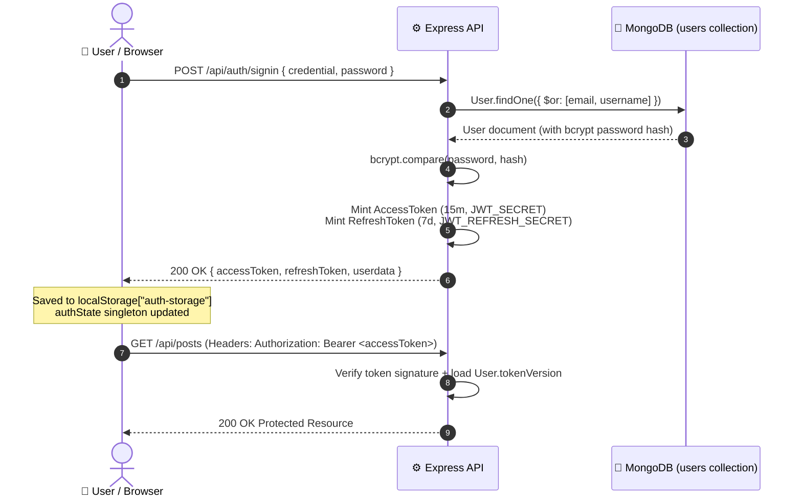
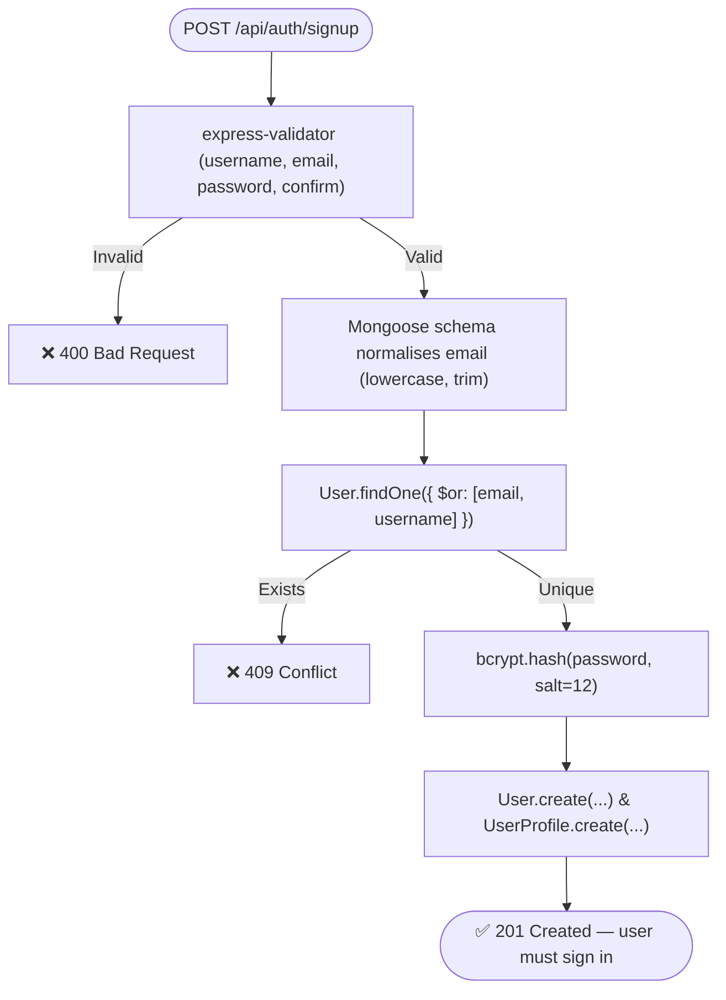
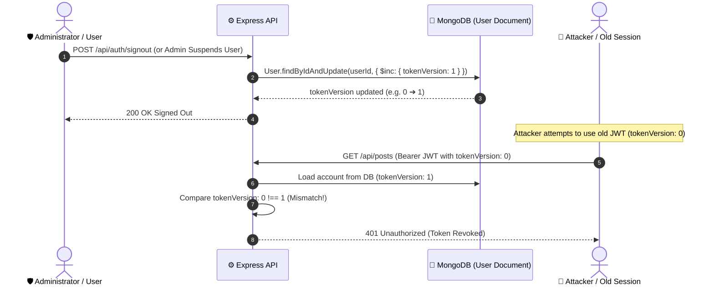
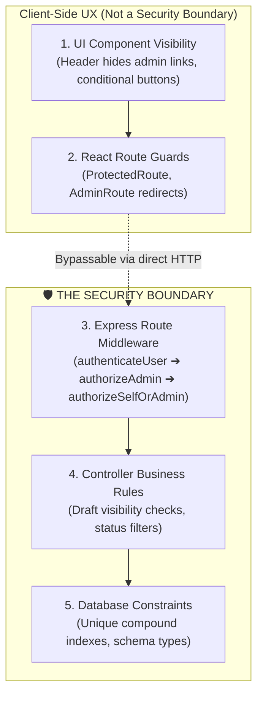

# Authentication and Authorization

> **Scope:** how identity is established (credentials, tokens, storage, refresh) and what an
> identity is permitted to do (roles, enforcement layers, the permission matrix).
> **Excludes:** the finding register ([checklist.md](checklist.md)), endpoint signatures
> ([reference/api.md](../reference/api.md)).

---

# Part 1 — Authentication

## Model

Stateless **JWT bearer authentication** with an access/refresh pair. No session store, no
server-side token registry, no cookies.



## Registration



Uniqueness is enforced by **unique indexes on `email` and `username`**, not by the
application check alone — two concurrent registrations cannot both succeed. A duplicate-key
error is translated to the same 409 the pre-check returns.

## Sign in

```mermaid
flowchart TD
    LoginReq([POST /api/auth/signin]) --> Rate{"authLimiter (max 10 failed / 15m)"}
    Rate -- Exceeded --> E429[❌ 429 Too Many Requests]
    Rate -- Allowed --> Find["User.findOne({ $or: [email, username] })"]
    Find -- Not Found --> Dummy["bcrypt.compare against a dummy hash<br/>(constant work, no timing oracle)"]
    Dummy --> E401[❌ 401 Invalid email/username or password]
    Find -- Found --> Compare["bcrypt.compare(password, hash)"]
    Compare -- No Match --> E401
    Compare -- Matches --> SuspCheck{account.suspended?}
    SuspCheck -- Yes --> E403Susp[❌ 403 AccountSuspended]
    SuspCheck -- No --> Issue["issueTokens(user)<br/>(AccessToken 15m, RefreshToken 7d)"]
    Issue --> S200([✅ 200 { accessToken, refreshToken, userdata }])
```

`userdata` carries `user_id`, `username`, `email` and `roles` — never the hash.

The identical 401 for both failure modes is deliberate: the endpoint cannot be used to
enumerate accounts. When no account matches, the handler still runs a bcrypt comparison
against a fixed dummy hash at the same cost, so response timing does not answer "is this
address registered?" either.

**Suspension is checked after the password, not before.** A 403 returned before the password
was verified would let anyone discover which addresses belong to suspended accounts without
knowing the credential.

## Token contract

| Property  | Access token                                       | Refresh token                                       |
| --------- | -------------------------------------------------- | --------------------------------------------------- |
| Lifetime  | `JWT_ACCESS_EXPIRES_IN`, default 15m               | `JWT_REFRESH_EXPIRES_IN`, default 7d                |
| Secret    | `JWT_SECRET`                                       | **`JWT_REFRESH_SECRET`**                            |
| Algorithm | HS256                                              | HS256                                               |
| Payload   | `{ user, tokenVersion, type: 'access', iat, exp }` | `{ user, tokenVersion, type: 'refresh', iat, exp }` |
| Sent on   | Every API request                                  | Only `POST /auth/refreshToken`                      |
| Storage   | `localStorage`                                     | `localStorage`                                      |
| Revocable | Yes — `tokenVersion`                               | Yes — `tokenVersion`                                |

```js
const issueTokens = (user) => {
  const claims = { user: user.id, tokenVersion: user.tokenVersion ?? 0 };

  return {
    accessToken: jwt.sign(
      { ...claims, type: "access" },
      process.env.JWT_SECRET,
      { expiresIn: process.env.JWT_ACCESS_EXPIRES_IN || "15m" },
    ),
    refreshToken: jwt.sign({ ...claims, type: "refresh" }, refreshSecret(), {
      expiresIn: process.env.JWT_REFRESH_EXPIRES_IN || "7d",
    }),
  };
};
```

**The two types are cryptographically distinct.** Presenting a refresh token as an access
token fails signature verification, and the `type` claim is checked independently. This
closed [SEC-06](checklist.md#sec-06), which had made the 15-minute access lifetime
meaningless.

`JWT_REFRESH_SECRET` falls back to `JWT_SECRET` when unset — accepted in development, warned
about at boot, and a hard failure in production if the two are equal.

## Verification

`backend/middlewares/authenticateUser.js`:

```js
if (!authHeader?.startsWith('Bearer ')) return res.status(401)...

const decoded = jwt.verify(token, process.env.JWT_SECRET);
if (decoded.type && decoded.type !== 'access') return null;   // → 401

// The signature alone is not enough. The account is loaded so that a deletion, a
// suspension, a demotion or a sign-out takes effect on this request rather than whenever
// the token happens to expire.
const account = await User.findById(userId).select('roles tokenVersion suspended').lean();
if (!account) return null;                                     // deleted
if ((decoded.tokenVersion ?? 0) !== (account.tokenVersion ?? 0)) return null;  // revoked
if (account.suspended) return null;                            // suspended

req.user = { id: userId, _id: userId, roles: account.roles ?? ['user'] };
```

Both `id` and `_id` are populated because the payload shape varied across earlier versions.
Roles fall back to `['user']` when the record has none — a safe default granting least
privilege. The cost is one indexed read per authenticated request, which is the price of
revocation taking effect immediately.

**The acting user always comes from the verified token.** No handler may read a user id from
the request body to decide who is acting.

### Optional authentication

`attachUserIfPresent` populates `req.user` when a valid token is present but never rejects.
It is used on public routes whose response varies for a signed-in viewer — an author reading
their own draft, or an administrator requesting `?all=true`.

**Roles are not in the token.** They were, and `refreshToken` copied them from the presented
payload into each new access token — so demoting an administrator changed nothing for the
refresh token's full 7-day life, and the holder could keep minting access tokens the whole
time. `authenticateUser` now loads the account and reads `roles` from the record, which costs
one indexed lookup per request and is what makes a demotion take effect on the very next one.
See [SEC-15](checklist.md#sec-15).

## Refresh

```
{ refreshToken }        ✗ absent → 400
        ▼
jwt.verify(refreshToken, JWT_REFRESH_SECRET)    ✗ → 401
        ▼
type must be 'refresh'                          ✗ → 401
        ▼
sign a new access token
        ▼
200 { data: { accessToken } }
```

The refresh token is **not rotated** — the same one stays valid for its full 7 days.
Rotation would allow theft detection but needs server-side state.

### Client side

`client/src/config/api.js`:

```
401 and not yet retried
   ├─ set _retry
   ├─ POST /auth/refreshToken via bare axios (not `api`, so no recursion)
   ├─ success → store the new token → replay the original request
   └─ failure → authState.logout() → window.location.href = '/login'
```

Concurrent 401s each trigger their own refresh; a shared in-flight promise would coalesce
them.

## Client session

`authState` is a module-scope object plus a React provider that mirrors it — the design
rationale is in
[architecture/frontend.md](../architecture/frontend.md#authentication-state). The whole
session is JSON-serialised into `localStorage["auth-storage"]` and read at module load, so a
refresh restores the session before first paint.

### Storage trade-off

|                     | `localStorage` (current)                  | httpOnly cookie                       |
| ------------------- | ----------------------------------------- | ------------------------------------- |
| XSS exposure        | **Readable by any script on the origin**  | Not readable by script                |
| CSRF exposure       | Immune — the token is attached explicitly | Needs SameSite plus a CSRF token      |
| Cross-origin API    | Works trivially                           | Needs `credentials` and matching CORS |
| Mobile client reuse | Works                                     | Awkward                               |

An accepted trade-off for a bearer-token SPA. The honest statement of the risk: a successful
XSS yields account takeover. Since [SEC-06](checklist.md#sec-06), a stolen _access_ token is
genuinely limited to 15 minutes, and both token types can now be revoked outright — see
[Revocation](#revocation) below.

## Sign out

`POST /auth/signout` increments `tokenVersion` on the account, which invalidates every token
already issued to it — this browser's and every other device's. `authState.logout()` then
clears the local copy.

The client calls the endpoint first but never lets a failure keep somebody signed in: an
expired session or an offline browser must still be able to sign out locally.

This used to be client-side only. Nothing was sent, and the tokens stayed valid until they
expired, so "sign out" meant only that this browser forgot them.

### Revocation

One integer does all of it. Both tokens carry the `tokenVersion` they were minted with;
`authenticateUser` compares that against the stored value and rejects a mismatch. Bumping the
field is therefore a revocation of everything outstanding.



| Event                             | Effect                                            |
| --------------------------------- | ------------------------------------------------- |
| `POST /auth/signout`              | Ends every session for the account                |
| `PUT /auth/password`              | Same, including the session that made the request |
| Administrator suspends an account | Same, and sign-in is refused while suspended      |
| Administrator revokes `admin`     | Same, so the demoted session stops immediately    |

No extra collection and no TTL index — the check rides along with the account lookup that
authentication already performs.

---

# Part 2 — Authorization

## Roles

| Role          | Granted by                         | Capabilities                                                                                  |
| ------------- | ---------------------------------- | --------------------------------------------------------------------------------------------- |
| _(anonymous)_ | No token                           | Read published content, register, sign in                                                     |
| `user`        | Default on registration            | Author, engage, manage own content, view own analytics                                        |
| `admin`       | The seeder, `PATCH /users/:id/role`, or a manual database edit | Everything above, plus the console, site-wide analytics, user listing, moderation of any post |

An administrator can promote and demote from the admin console's Users screen. The route
refuses to act on the caller's own account, and a demotion bumps `tokenVersion`, so the
demoted session stops immediately rather than at expiry.

## Enforcement layers



Layers 1 and 2 exist so users are not shown actions they cannot perform. **Every protected
resource is independently enforced at layer 3 or 4.** Relying on a guard for protection is a
security defect.

### Middleware

```js
// authorizeAdmin — requires the admin role
if (!req.user) return res.status(401)...
if (!(req.user.roles || []).includes('admin')) return res.status(403)...

// authorizeSelfOrAdmin(param) — the caller may only address their own id
const isSelf  = req.params[param] === req.user.id;
const isAdmin = (req.user.roles || []).includes('admin');
if (!isSelf && !isAdmin) return res.status(403)...
```

An absent optional parameter means "me" and passes through.

### Ownership

```js
if (
  post.user &&
  post.user.toString() !== userId.toString() &&
  !req.user.roles?.includes("admin")
) {
  return res
    .status(403)
    .json({ success: false, message: "Unauthorized to edit this post" });
}
```

String-to-string comparison (ObjectId equality is not reference equality); administrators
bypass, enabling moderation; and the check runs **after** the existence check, so a missing
resource returns 404 rather than leaking existence through a 403.

Applied to `PUT /posts/:id` and `DELETE /posts/:id`. `POST /posts/bulk` enforces the same rule
through the query rather than per document: the filter is scoped to the caller unless they are
an administrator, so an id belonging to somebody else simply matches nothing.

---

## Permission matrix

**A** anonymous · **U** member · **O** owner · **X** admin. `✓` permitted · `✗` denied ·
`⚠` permitted but should not be.

### Posts

| Endpoint            | A   | U   | O   | X   | Enforcement                                           |
| ------------------- | --- | --- | --- | --- | ----------------------------------------------------- |
| `GET /posts`        | ✓   | ✓   | ✓   | ✓   | Published only. `?all=true` honoured for admins alone |
| `GET /posts/:id`    | ✓   | ✓   | ✓   | ✓   | Non-public → 404 unless author or admin               |
| `POST /posts`       | ✗   | ✓   | —   | ✓   | `authenticateUser`                                    |
| `PUT /posts/:id`    | ✗   | ✗   | ✓   | ✓   | + ownership                                           |
| `DELETE /posts/:id` | ✗   | ✗   | ✓   | ✓   | + ownership                                           |

### Users

| Endpoint                      | A   | U   | O   | X   | Enforcement                              |
| ----------------------------- | --- | --- | --- | --- | ---------------------------------------- |
| `GET /users`                  | ✗   | ✗   | —   | ✓   | `authorizeAdmin`                         |
| `GET /users/getUser`          | ✗   | ✓   | —   | ✓   | Scoped to the token subject              |
| `PUT /users/setUser`          | ✗   | ✓   | —   | ✓   | Scoped                                   |
| `GET /users/getUserPosts`     | ✗   | ✓   | —   | ✓   | Scoped                                   |
| `GET /users/getUserProfile`   | ✗   | ✓   | —   | ✓   | Scoped                                   |
| `POST /users/followUser`      | ✗   | ✓   | —   | ✓   | Actor from the token; 400 on self-follow |
| `POST /users/unfollowUser`    | ✗   | ✓   | —   | ✓   | Actor from the token                     |
| `GET /users/isFollowing/:id`  | ✗   | ✓   | —   | ✓   | Scoped                                   |
| `DELETE /users/me`            | ✗   | ✓   | —   | ✓   | Scoped; password re-confirmed. Refused for the last administrator |
| `GET /users/:id/profile`      | ✓   | ✓   | ✓   | ✓   | Public by design. Email only when that account opted in |
| `GET /users/:id/avatar`       | ✓   | ✓   | ✓   | ✓   | Public — an `` cannot send an Authorization header |
| `PATCH /users/:id/suspension` | ✗   | ✗   | —   | ✓   | `authorizeAdmin`; never the caller's own account |
| `PATCH /users/:id/role`       | ✗   | ✗   | —   | ✓   | `authorizeAdmin`; never the caller's own account |
| `DELETE /users/:id`           | ✗   | ✗   | —   | ✓   | `authorizeAdmin` + the administrator's own password; never their own account |

### Tags

There is no `/categories` router; categories were folded into tags.

| Endpoint           | A   | U   | O   | X   | Enforcement                                      |
| ------------------ | --- | --- | --- | --- | ------------------------------------------------ |
| `GET /tags`        | ✓   | ✓   | —   | ✓   | Public read is intended                          |
| `POST /tags`       | ✗   | ✗   | —   | ✓   | `authorizeAdmin`                                 |
| `DELETE /tags/:id` | ✗   | ✗   | —   | ✓   | `authorizeAdmin`; 409 while any story carries it |

A writer attaches tags on the story itself, so the authorisation is the post's own ownership
check on `POST` / `PUT /posts`.

### Comments

| Endpoint                     | A   | U        | O   | X   | Enforcement                              |
| ---------------------------- | --- | -------- | --- | --- | ---------------------------------------- |
| `GET /comments/post/:postId` | ✓   | optional | —   | ✓   | Optional auth; paginated; follows the post's visibility |
| `POST /comments`             | ✗   | ✓        | —   | ✓   | Author from the token                                  |
| `POST /comments/replies`     | ✗   | ✓        | —   | ✓   | Author from the token; parent validated                |
| `DELETE /comments/:id`       | ✗   | ✗        | ✓   | ✓   | Comment author, post author, or admin                  |

There is no comment **edit** endpoint, so there is nothing to authorise there. Deletion
exists and is owner-scoped.

### Likes and page views

| Endpoint                             | A   | U        | O   | X   | Enforcement                                                |
| ------------------------------------ | --- | -------- | --- | --- | ---------------------------------------------------------- |
| `POST /likes`                        | ✗   | ✓        | —   | ✓   | Actor from the token; unique index; 404 for a post the caller cannot see |
| `DELETE /likes/post/:postId`         | ✗   | ✓        | —   | ✓   | Deletes only the caller's own like                                       |
| `GET /likes/post/:postId`            | ✓   | ✓        | —   | ✓   | Optional auth; follows the post's visibility. Usernames only, no emails  |
| `GET /page-views/post/:postId`       | ✗   | ✗        | ✓   | ✓   | Author or admin — the rows carry reader ids                              |
| `GET /page-views/post/:postId/count` | ✓   | ✓        | —   | ✓   | The public open count                                                    |

### Analytics and activity

| Endpoint                              | A   | U   | O   | X   | Enforcement            |
| ------------------------------------- | --- | --- | --- | --- | ---------------------- |
| `GET /analytics/post/:id`             | ✗   | ✗   | ✓   | ✓   | Post author or admin, checked in the handler |
| `GET /analytics/user/:userId`         | ✗   | ✗   | ✓   | ✓   | `authorizeSelfOrAdmin`                       |
| `GET /analytics/me`                   | ✗   | ✓   | —   | ✓   | Scoped to the token, takes no id             |
| `GET /analytics/me/reading`           | ✗   | ✓   | —   | ✓   | Scoped to the token, takes no id             |
| `GET /analytics/admin`                | ✗   | ✗   | —   | ✓   | `authorizeAdmin`                             |
| `POST /analytics/view/:postId`        | ✓   | ✓   | —   | ✓   | Open by design — a reader does not sign in to be counted. Rate-limited, and de-duplicated per visitor per post over 6h ([SEC-04](checklist.md#sec-04)) |
| `POST /analytics/read/:postId`        | ✓   | ✓   | —   | ✓   | Same                                         |
| `GET /user-activity/all`              | ✗   | ✗   | —   | ✓   | `authorizeAdmin`       |
| `GET /user-activity/user/:userId`     | ✗   | ✗   | ✓   | ✓   | `authorizeSelfOrAdmin` |
| `GET /user-activity/timeline/:userId` | ✗   | ✗   | ✓   | ✓   | `authorizeSelfOrAdmin` |
| `GET /user-activity/moderation-log`   | ✗   | ✗   | —   | ✓   | `authorizeAdmin`       |

### Settings

All behind `router.use(authenticateUser)`.

| Endpoint                         | A   | U   | O   | X   | Enforcement            |
| -------------------------------- | --- | --- | --- | --- | ---------------------- |
| `GET`/`PUT /settings/user`       | ✗   | ✓   | —   | ✓   | Scoped                 |
| `GET /settings/profile/:userId?` | ✗   | ✗   | ✓   | ✓   | `authorizeSelfOrAdmin` |
| `PUT /settings/profile`          | ✗   | ✓   | —   | ✓   | Scoped                 |
| `PUT /settings/security`         | ✗   | ✓   | —   | ✓   | Returns 501            |
| `PUT /settings/privacy`          | ✗   | ✓   | —   | ✓   | Scoped                 |
| `PUT /settings/appearance`       | ✗   | ✓   | —   | ✓   | Scoped                 |

---

## Remaining gaps

| Pattern                                    | Endpoints               | Finding                                                 |
| ------------------------------------------ | ----------------------- | ------------------------------------------------------- |
| ~~Unauthenticated, undeduplicated writes~~ | Closed — visitor-keyed  | [SEC-04](checklist.md#sec-04)                           |
| ~~Unpaginated public reads~~               | Closed                  | [SEC-11](checklist.md#sec-11)                           |
| No edit model                              | comments                | Deletable by author, post author or admin; not editable |
| ~~No session revocation~~                  | Closed — `tokenVersion` | [SEC-08](checklist.md#sec-08)                           |

---

## Rules for new endpoints

1. **Authenticated by default.** Public needs a written reason.
2. **Authenticate, then authorise.** A valid token answers _who_, never _whether_.
3. **Scope by the token, not the parameter.** Use `authorizeSelfOrAdmin(param)`.
4. **Check existence before permission.** 404 before 403; 404 for non-public content.
5. **Filter reads by visibility**, not only writes by ownership.
6. **Project the query.** Authorisation controls record access; projection controls which
   fields leave the server.
7. **Never trust a client-side guard.**
8. **Update this matrix** in the same pull request.

---

## Proposed model

The two-role scheme is adequate today. If moderation grows, promote it to explicit
permissions rather than adding roles:

| Role        | Permissions                                                                        |
| ----------- | ---------------------------------------------------------------------------------- |
| `user`      | `post:create`, `post:edit:own`, `post:delete:own`, `comment:create`, `like:toggle` |
| `moderator` | + `post:delete:any`, `comment:delete:any`                                          |
| `admin`     | + `user:list`, `user:role:assign`, `analytics:read:site`                           |

Then `requirePermission('post:delete:any')` replaces `authorizeAdmin`. Make this refactor
when the third role appears, not before.

---

## Hardening priority

| #   | Action                                      | Effort | Status                                               |
| --- | ------------------------------------------- | ------ | ---------------------------------------------------- |
| 1   | Separate refresh secret + type claim        | Low    | ✅ Done                                              |
| 2   | Rate-limit `/auth`                          | Low    | ✅ Done                                              |
| 3   | Unique indexes on identity fields           | Low    | ✅ Done                                              |
| 4   | Scope `:userId` routes to the caller        | Low    | ✅ Done                                              |
| 5   | ~~Server-side revocation~~                  | Medium | ✅ Done — `tokenVersion`, no extra collection needed |
| 6   | Refresh-token rotation with reuse detection | Medium | ❌ Open                                              |
| 7   | Password strength                           | Low    | ✅ Done — minimum 10 characters, maximum 128, no leading or trailing space |
| 8   | Content-Security-Policy on the **app** HTML | Medium | ❌ Open — `helmet()` sets a CSP on API responses, but the SPA shell is served by Vercel's static build and carries none |
